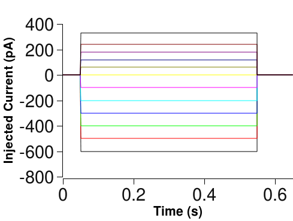

<!-- 
## [University of Sheffield](https://www.sheffield.ac.uk/)

### PhD in Computational Biology
### 2005 - 2009

My PhD was concerned with building computational models of a class of neurons found within the basal ganglia.

Key skills acquired and achievements from this position

* Implemented a parameter fitting algorithm in *MATLAB* to generate biologically accurate model neurons.
* Use of *Linux* and of a computer cluster.
* LaTeX typesetting.
* Version control software (*Mercurial*, *Subversion*).
* Time management and organisational skills.

 -->

## Electrophysiology and Computational Neuronal Modelling

My PhD project involved constructing accurate computational models of a particular type of neuron. It used an integrated approach (where I undertook both the biological experiments and the computational modelling, which is quite unusual).

<!-- ## Information Needed To Accurately Model A Cell

### PASSIVE PARAMETERS

Properties of the cell membrane

xx -->

# Integrated Data Collection And Automated Parameter Estimation In The Construction Of Conductance-Based Neostriatal Neurons

## Introduction

Computational modelling of single neurons often encounters a severe limitation in that the modelling enterprise is divorced from the gathering of physiological data. As a result, most models tend to be fundamentally flawed because, while they are based upon data which has been accurately recorded from electrophysiological experiments, they are also based on assumptions regarding the passive behaviour of the cell membrane (the membrane capacitance, Cm, membrane resistance, Rm, and axial resistance, Ra) .

Here we present an **integrated** approach where we have determined the passive parameters by fitting to short current pulse voltage responses, and used these to determine the active parameters (the maximal conductances, Gmaxes, of the ion channels).

To accomplish this, we used the 'GmaxSearch'  algorithm: an **automated** fitting tool used to determine the relative contribution of each species of ionic channel present in the cell by constructing, testing and refining neuronal models until the target voltage behaviour is achieved[1].

## Data Acquisition

Electrophysiological recordings taken in the whole cell patch clamp configuration.

Neostriatal brain slices (250 -400μm) of Wistar and Hooded-Lister rats (P14-19).

Data obtained for Medium Spiny Neurons (MSNs) and Fast Spiking Interneurons (FSIs)

Biocytin also injected into cell whilst recording to enable morphological reconstruction.

## Short Current Pulses

Current pulses (480μs / 1-2 Hz) so short that membrane-bound voltage activated ion channels do not have time to respond injected.

## Long Current Pulses
A series of half-second current pulses injected into each cell. Cells can be identified by their voltage response as different ion channels will result in different voltage response patterns.

### Example of a Fast Spiking Interneuron

### Example of a Medium Spiny Neuron

## Morphology

Immunohistochemical staining of biocytin filled cells.  3 of the Medium Spiny Neurons were successfully stained (left) and 2 of the Fast Spiking Interneurons (right).

## Gmax Search Algorithm

### Short Current Pulse Response Fitting

Exponentials fitted to the mean of the short current pulse response data [2] using the fminsearch routine in Matlab.

6 free parameters: the 3 passive parameters and 3 morphological parameters (soma diameter, electrotonic dendritic diameter and electrotonic dendritic length).

## Morphological Reconstruction

Neurolucida was used to measure the 3D structure of the cells. By using this instead of an electrotonic equivalent, we hope to further constrain the short current pulse fitting exercise.

## Analysis

...

## Discussion

We have demonstrated that the GmaxSearch is a generic tool that can be used on multiple cell types. By taking advantage of this automated method, we were able to conduct analyses which would otherwise be so time consuming that they would be practically impossible.

A sensitivity analysis was undertaken which revealed that the algorithm was better able to produce more accurate fits to the data when using the predicted passive parameter values. This shows that in order to build a realistic model, it is vital to obtain the true value for the passive parameters, extracted from the data of each individual cell, as opposed to using generic values. Otherwise, the active parameters will have to compensate for inaccurate passive parameter values and so will be incorrectly reported.

For this reason, we believe that the integrated approach taken here leads to much more accurate models being constructed, in addition, this approach allows us to acquire values for the passive parameters without resorting to more invasive methods such as using toxins to block all of the membrane channels [2].

We also conducted an ion channel permutation analysis and we show that the search produced better fits when more channels are available to capture the dynamics of the real neuronal membrane. However, they do need to be the right channels! The existing suite of ion channels attributed to Fast Spiking Interneurons in the literature is inadequate to fully capture the properties of this cell type.

Improvements to this method are currently taking place which include using the morphological data also recorded from these neurons to further constrain the passive parameter fitting and this should yield even more accurate models.

## References

[1] Wood R, Gurney KN, Wilson CJ - “A Novel Parameter Optimisation Technique for Compartmental Models Applied to a Model of a Striatal Medium Spiny Neuron” - Neurocomputing, 2004, 58-60:1109-1116
[2] Thurbon D, Luscher HR, Hofstetter T, Redman SJ - “Passive electrical properties of ventral horn neurons in rat spinal cord slices” - J Neurophysiol. 1998 Jul;80(1):2485-502.

