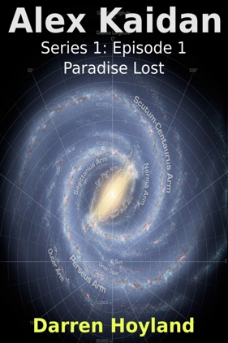

# Writing

<FeedSearch />

## Novels

## [Alex Kaidan](/writing/novels/alex-kaidan/)

### Episodic Light Hearted Space Opera

 

 

Being completely unable to think of a sensible name for your space ship tends to be less of a problem when there's only one ship in the whole Human 'fleet', besides Alex Kaidan only ever really borrowed it. What could be more of a problem is Earth having been paved and only a few Humans surviving, and that was only thanks to the actions of a benevolent alien race known as the Un. Alex and his crew have made it their mission to find and rescue however many Humans they can that are being held captive by any of the alien races. A mission made all the more difficult by the sad truth that a catastrophically decimated population is not an employers' market.

---

## Creative Writing

<FeedItems
  itemsFormat="compact"
  filterByTags={['short story', 'novel', 'book', 'writing', 'creative_writing', 'Creative_Writing']}
/>

&nbsp;

