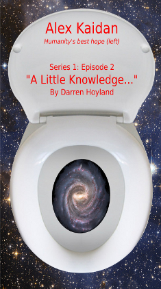

### Episode 2 of Alex Kaidan (Series 1)
# A LITTLE KNOWLEDGE...
## By Darren Hoyland
### Copyright © 2014 by Darren Hoyland

*****

For Ethan.

*****

*This is a work of fiction. Persons, living or dead, places or events are productions of the author’s imagination. Any resemblance is purely coincidental, which is probably for the best as it is set in the future, on several other planets and is about aliens trying to wipe out humanity. Your support and respect for the copyright of the author is appreciated.*

*****
###Previously in Alex Kaidan:

Being completely unable to think of a sensible name for your space ship tends to be less of a problem when there's only one ship in the whole Human 'fleet', besides Alex Kaidan only ever really borrowed it. What could be more of a problem is Earth having been paved and only a few Humans surviving, and that was only thanks to the actions of a benevolent alien race known as the Un. Alex and his crew have made it their mission to find and rescue however many Humans they can that are being held captive by any of the alien races. A mission made all the more difficult by the sad truth that a catastrophically decimated population is not an employers' market.

Their last mission, to save a large group of Nedic-imprisoned Humans from being slightly too comfortable went horribly wrong when Sara Heath, a member of his crew, shot and killed a man. Aided by another crew member, Matthias Cho, she escaped before she could face trial. While not actually managing to rescue anyone from anything, and destroying a rather nice space station in the process, Alex did manage to recruit a new crew member called Reza, so it was not all bad...

*****

"What kind of a name is 'Wikipedia'?" asked Alex.

"It's a cross between something called a 'Wiki' and an encyclopedia," replied the scientist.

"Well, thanks for clearing that one up for me."

Juliana, the only other person at the table, leaned forward to explain, "An encyclopedia was a book containing facts and information in alphabetical order."

"Book!" exclaimed Alex, "I know that one: Words drawn onto sheets of stuff made from plants."

"That's it, only this one wasn't really a book. It was displayed on a console."

Alex was astounded, "We used to have consoles too? I thought we got those from the Un?"

"Yes," he replied, "They were called 'computers'. Lots of rich people owned one. Our society was actually pretty far along, considering. The technology was there and we'd just started to get them communicating with each other. We called this network of computers 'the interweb'."

"And Christian here -" said Juliana, gesturing overzealously at the man who had just spoken, "- believes that he's managed to crack the code."

She blatantly had assumed that Alex would have forgotten his name already, despite them only having been introduced a matter of minutes ago. She knew him too well.

Juliana was Alex's link to the Human government and the joint Human-Un scientific establishment. It was she who had been slipping him information on rumoured locations of alien scientific facilities that kept and/or experimented on Humans. It was also Juliana who had first introduced him to Yona Stevs, the Un Significant who had helped him borrow the ship. It would be safe to say that they went way back.

Alex felt that he may have missed something in the conversation, "What code?"

"Hypertext Transfer Mark-up Language."

"Eh?"

"HTML. The code used to transfer data around the interweb."

"Code as in secret code?"

"No, code as in program code."

"Oh," said Alex, suddenly far less impressed.

"I'm sure it was still quite difficult, Alex," chided Juliana.

"Actually, reverse engineering the HTML it was surprisingly simple really once I had managed to understand the underlying protocols and emulate them on Un hardware," said Christian. There was no hint of pride in his voice, just a straightforward summary of what has been done.

Alex was a little taken back by the man’s total lack of arrogance for what he would most likely consider to be an incredible accomplishment, had he understood a word of it. He still managed to slip in a dig at Juliana, however, "See? Told you."

Juliana stuck her tongue out at him in reply while Christian was talking to him and not looking at her, "The tricky part was reconstructing the data into a meaningful format. You see, the interweb was a collection of pages requested by each person who accessed it, and so we can only ever see what they asked for - we have no access to the databases that generated those pages.”

“I have no idea what any of that means, but it sounds nice.”

Juliana intervened, “Think of it like this: It’s like eavesdropping on a conversation - you can’t learn everything that that person knows, only what they happen to be talking about at the time. There’s no way of steering the conversation to what you want to hear.”

“Good analogy, Juliana,” said Christian.

“Thank you,” she said, followed with a broad smile that made Alex suddenly very jealous of the scientist.

“Fortunately, I then came across Wikipedia. These pages were frequently accessed and in a structured format that made it easy to automate data recovery, enabling me to populate a new Un-console compatible database that we can interrogate any time we want to.”

“Oh. Good. Well done,” said Alex, "Um, but why are you telling me all of this?"

The scientist narrowed his eyes, "Well, we thought you'd be interested."

Alex tilted his head and looked at him, then over at Juliana who said nothing, and then back to Christian. He was having difficulty ascertaining whether they were being deliberately obtuse, or if he was just being dumb. Either way, he still had no idea why Juliana had asked him to meet them in this café on New Earth.

Small-talk, he felt, would be the best way out of his predicament, "So, er, where did this data you have come from?"

"Well, Earth of course, originally," said Christian.

"Yes, but you said it was eavesdropped, so who did the eavesdropping?"

"The Nedic, we assume. Who else?"

Alex had heard rumours that back on Earth, there were certain stones that bled. He imagined obtaining the blood from one of them would be easier than this.

"No, I meant how did you get your hands on this data? Where did you find it?"

The two scientists looked at each other, then Juliana said, "From you."

Christian did not actually use the word "Duh!" but he looked as though he wanted to.

Noting Alex's complete bewilderment, Juliana finally explained, "This was obtained from the data that you kindly provided us following your last raid." Just to hammer home the point, she then added, "The one on Eden."

“Do you have to call it that?!” reacted Alex.

She smiled in mock innocence, "The Nedic institute, then."

Alex scratched his head, his earlier confusion now having been addressed and replaced in its entirety with a whole new thing to be confused about.

"To be honest, I wasn't aware that I'd gathered any data," he admitted, before suddenly recalling, "Oh, unless you mean that batch of test data I took when I hacked in, but I only downloaded that to try my virus code out on."

Now it was Christian's turn to look confused and once again Juliana stepped in to explain, “Alex had me set up the ship's system to periodically upload all of the its sensory data to us every time he brings it back to The Village or as a burst transmission in case of emergency. His thinking was that if the ship gets destroyed, we'll at least have a backup of the data they were trying to get."

"No," said Alex, slowly, "I think you'll find that I said I wanted the sensory logs to be uploaded so that you can work out who killed us so that you may avenge my death."

"Or so we know who to send the thank you card to," she teased, brushing the hair from her face.

Alex stared into her eyes and held his chest in an exaggerated manner, "No need, you've already buried a knife straight into my heart."

Christian coughed politely, and they both snapped out of it. Although Alex did not quite manage to suppress a smirk as she regained her air of formality and continued, "Yes so, as I was saying, this must have just been sent along with everything else."

“So you got this data by accident?”

“The Nedic is must have had it in their system," Alex replied, "I didn’t think about it at the time, but they probably had access to all sorts of data that any of the Nedic had collected on us. I suppose it makes sense, I got the impression that the whole institute was geared up solely for research into Humans. They'd even adjusted the gravity and atmosphere to our physiology, I think."

"Are you sure? The Nedic do breathe Oxygen-Nitrogen too, you know," she said.

"I'm sure," said Alex, "I looked into my suit data when I got back. The temperature and pressure were more tailored to us than them - well, it was before I took a chunk out of the side of the hull - and they certainly didn't seem to mind a lack of gravity. My feeling is that they'd spent a lot of time and energy to make the Humans there feel comfortable. No wonder the prisoners didn't want to leave."

Christian seemed to ponder this for a moment, "I wonder why they seem to value us so highly, but not highly enough to see our species fully reunited. If they'd wanted Humanity to stand any chance of recovery, one would think that they would have contributed the Humans they had to help form this colony when the Un asked."

"Fear of the Pathfinders probably," said Alex, "We are now officially banned, remember?!"

"As if I could forget," said Christian, "but that wasn't always the case. Besides, if that were true then you'd think that they would just euthanase all the Humans they have."

They each took a moment. Christian and Juliana dwelled on the ramifications of this, while Alex tried to remember what euthanase meant.

It was Juliana broke the silence, "Do you think they have more?"

"Humans?" asked Alex

"Well yes, but I meant other institutes."

"I hope so for the sake of Reza's people. They'd have to put them somewhere after we returned them," suddenly an unpleasant thought struck him, "Unless you think they... er..." He stopped mid sentence and asked Juliana, "What's that word for killing people after you've finished doing science on them?"

"Euthanase," they both replied in unison.

"Oh. Right. Yeah..." he took a brief moment to mentally kick himself before soldiering on, "Anyway, I can't see that institute being salvaged after what we did to it."

Christian became visibly agitated, "But from where else do you intend to get the data?"

Alex thought about this for a second before it finally dawned on him that he had no idea what he was talking about. Had he drifted off while they were explaining something to him again?

They both looked at him expectantly.

It had to be that thing again. As Alex spent more and more time with Juliana, he was beginning to find these moments happening at an increasing frequency. When it was just the two of them, it was fine. In fact, he had never met anyone to whom he could communicate with so effortlessly. It was, however, a completely different story when there was someone else whose intellect was more closely aligned with her own, then he always seemed to have difficulty keeping up.

"I'm sorry, what data would that be?" he said almost defiantly, hoping the misunderstanding arose from them neglecting to tell him something and not him having completely missed it.

"Oh, did we not tell you that part?" Christian asked, genuinely.

'No, you didn't...' said Alex who, while relieved, was now starting to get that feeling of dread that he usually got just before someone asked him to do something that would probably involve getting shot at.

"We need to ask you to do something," said Christian.

"It might involve you getting shot at" added Juliana.

"Great."

"We need more data from the interweb."

"Why?"

"You didn't get enough. It just stops. I managed to get about fifty pages from it, but there must be thousands."

"What about the non-Wikipedia pages?"

"Well, as I mentioned earlier, getting that information was initially difficult, but once I had established the basics of HTML it was a lot easier."

"But...?"

"Unfortunately, from what I can ascertain, the rest of the interweb was mainly pictures of small furry creatures called kittens and naked women."

"Really?" asked Alex, his eyes nearly falling out his sockets. Then he noticed the way Juliana was looking at him and quickly added, "I've always wanted to see a picture of a kitten."

"We must have more data, Captain. The pages I have hint to others covering an entire civilisation's worth of science, technology, medical compounds, literature, even art if you like that kind of thing."

"Well I can't just pop over to the nearest Nedic ship and ask them for it."

"I might be able to help with that," said Juliana, "We have managed to work out from where Eden... Sorry, 'the institute' was being supplied."

"How?" asked Alex.

"Well, we did some analysis of the sensory information from your shuttle after you left the institute and from that we managed to estimate the direction from which the Nedic rescue ships came."

"Right..."

"Then we isolated the ships that matched the design of freight vessels from our existing intel on the Nedic and cross referenced with similar ships recorded from your earlier logs when you were staking the place out prior to the raid."

"Okay..."

"So based on their inertia and apparent mass, we estimated which ships were full and which were empty, and we noted that all of the full ships seemed to be coming from the same Strachan current. We also determined the streams that the empty ships were using. As these streams are unidirectional, we calculated where both emanated -"

"-Good word."

"Thank you - and, while there wasn't a second location in real space-time where they intersected, there was a third current that could link the two. This was near a planet which suggests a common supply route."

After he had managed to process all of that, Alex simply said, "Clever."

"Why, thank you," once again her smile beamed and this time if was all for him.

The moment was ruined by Christian's request, "So can you go there and get it?"

Alex did not have to think about his response, "No."

"Oh," said Christian, dejectedly.

"Look, I'm sorry, but raiding a planet is vastly more difficult than raiding a space-station. Planets tend to have a high population. In cities. With large sensor arrays and orbital defences. Not to mention a practically limitless supply of backup security forces - things like armies and police forces. Oh, and it's not like you can breach the hull of a planet. You have a nasty little thing called gravity to contend with, so you have to land, which is quite difficult to do without anyone noticing the large fireball in the sky. And all for a book? No. Too risky. No. Absolutely not. No."

Christian's lower lip began to wobble slightly.

"No," said Alex once more for good measure.

"So that's a definite no then is it?" asked Juliana sarcastically.

"It's a no."

"And there's nothing that will change your mind?" she asked.

"Nothing."

"Even if Un long range reconnaissance suggests that the planet has a very low population with no cities or industry of any kind?"

"Still no."

"And no detectable sensor arrays or orbital defence structures?"

"Not listening."

"In fact, they say it's an agricultural planet -"

"La la la."

"- undoubtedly to grow Human food, so lots of fields to quietly land in unnoticed."

Alex lowered his arms that he had started to raise so that he could plug his ears with his fingers to block out her voice, and said, "They what?"

"What?"

"Did you say that they farm Earth plants there?"

"Er, well yes, I guess so. It makes no sense to grow crops on a station. Real estate is too expensive."

Excitement cautiously began to grow inside of Alex, "I must admit, I didn't notice any hydroponics facilities inside the institute..."

"To feed that many Humans, long term?" said Christian, "Such facilities would no doubt be large enough to be obvious."

"Okay, I'll do it," said Alex.

For the second time in the space of a minute, Christian said, "Oh", only this time with far more enthusiasm.

Juliana was taken aback, "Just like that?"

"Yeah, you made a convincing argument. You're right," said Alex, "They're bound to have a networked console system or something, with back-ups - and where else would they keep it but in the place they supplied the station from? Obvious."

"Well, there's no guarantee. In all honesty, it's a bit of a long shot..." cautioned Christian, but Juliana, who was clearly still shocked by Alex's instant U-turn, fired him a look that made him stop talking. Instead he said, "Well, now that that's agreed, we need to start making plans. How exciting! Unfortunately, in the meanwhile, I'm afraid that I need to urinate."

With that, Christian quickly stood and proceeded towards the wrong toilet at the opposite end of the café. Juliana tried to say something but she could not make herself heard over the din from the other patrons. Instead they both watched him as he weaved his way through the crowded establishment. To be fair, it was difficult to see the sign from where they were seated, but Alex began to wonder not only whether he had been here before, but also if he made the same mistake every time.

"I thought you said he had the greatest mind in all of Humanity," said Alex.

"He does. The man is a polymath. Mainly self-taught. A genuine genius. A little unpredictable perhaps, but the governing council sees fit to give him free rein."

"Free rain? What for?"

"It's a saying, it means they trust him enough to let him do whatever he likes. I don't know what it originally meant, but I do know that he seems to revel in the challenges others shy away from. I'd go so far as to say that Dr Islam is possibly the best hope for Humanity since Hans Strachan."

Alex raised his eyebrows. Two thoughts struck him as interesting about that sentence. The first was that Hans Strachan was regarded as a hero throughout the colony, and to be compared to one of such stature was a praise seldom given by anyone.

That Strachan was amongst the initial survivors was the probably the single deciding factor that changed Humanity's status with the Un from a band of hopeless refugees into equals. During the first few months of displacement, most Humans just battled to survive in the alien environment. In addition to having to confront the news that their home planet and all they had ever known was now gone, they also had to face up to the fact that not only were they not alone in the universe, but that those that remained were now pariahs. There were also more tangible concerns, like what they were going to eat. While sharing these problems and helping where he could, such as in the planning and layout of the colony, Hans Strachan immersed himself in the study of any piece of Un technology he could find. The Un had left plenty lying around on their moon so that they could artificially foster the right pressure, gravity and atmospheric conditions within the dome required to keep the Humans alive. Strachan thrived under the desperate conditions and applied his talents wherever they were needed. Once the initial problems were overcome, Strachan began his work in earnest and managed to deduce the mechanism and functions of most of the Un equipment that generated the dome around the colony. Initially the Un did not wish to divulge the workings of any but the most basic of their technologies, but after a few years, he had managed to negotiate a treaty of scientific cooperation with the Un. The Un saw the potential of all Humans in him, and he repaid their trust by improving the algorithms they used to identify the currents that were later named in his honour in the Human-English vernacular.

The Un used the same word for river or stream in their single, unified language when referring to the Strachan currents, and had used them for centuries to explore the local region of the galaxy and trade with the other races. At their peak, the Un were the most powerful of the known races and had colonised many worlds. However, in the few centuries following the arrival of the Pathfinders into this part of space, a series of accidents, scandals and disasters forced them to bow to political pressure of the other races to abandon many of these worlds and the Un civilisation had slowly regressed to the point where they now had official claims to only three other planets in addition to their home-world.

Despite their long history of interstellar travel, the Un had never mastered the complexities of the streams. Like all of the other races, with the notable exception of the Pathfinders, they had always had to take their chances on where they were headed every time one of their ships entered a stream. This had meant that a round trip often took ten times longer than it did now and was fraught with danger as the ships could exit the stream anywhere. Many of their ships did not return for years having been unable to plot a return journey and they certainly had never been able to form their own direct Strachan currents as the Pathfinders were able to.

It was rumoured to have only taken Hans Strachan five weeks to understand their theories of stream formation and build upon them to be able to predict with great certainty when and where the next stream would occur in an Un generated three dimensional map of the known galaxy, as well as predicting in which direction it could take them. With that, Hans Strachan became a legend. His death was many years before the routine cloning of colonists had begun and now his genius only lived on in his work, his legacy. In essence, anyone being compared to him had some rather large shoes to fill.

The second thought that hit Alex, he said out loud, “His name is Christian Islam?!”

“Yes.”

“I’m not big on this stuff, but weren’t the Christanics and Islamity two separate religions?”

“Were they? Someone’s been studying,” she said, without paying much attention. Instead, she was looking up to check where Christian was. By now, he had noticed the sign, realised that the male toilets were back the way he had just come from and had reversed his direction.

“We have a new crew-mate who’s quite fond of telling us things. Our own little Wikipedia, if you will.”

Juliana looked back at Alex, “Ah yes, Reza. We genotyped the samples Rhyna sent us last week. I look forward to meeting him in person.”

As she said this, Christian walked back passed the table towards the male toilets. He smiled politely as he did so.

Once he was out of earshot, Alex said, "Christian Islam, eh? At least it’s a name I won’t forget.”

She gave him one of those looks that only women are ever capable of giving.

“Probably,” he added, quietly.

“So what you think?"

"Well, he's a bit odd, but he seems likeable enough."

"I meant about the mission.”

“Oh, yeah. We’ll do it.”

“Why? I thought you’d need much more convincing - I’m still not exactly sure about the whole thing myself."

"Is there any loftier goal than the pursuit of knowledge?"

Her eyes narrowed, suspiciously, “What else are you up to, Kaidan?”

Alex laughed and leaned back into his chair, “Juliana, why did you choose this café?”

"We come here all the time."

"I know, but why."

The question confused her, but she answered as plainly as she could, "Well, because it's the best café in The Village.”

“A pessimist could just as accurately describe it as the fifth worst café in The Village."

"Yes, Alex, very clever. That's because there are only five cafés in this micro-metropolis we call New Earth, as you well know."

"My point is that there are only a limited number of ways to cook the few alien plants that are both palatable and edible, and there's only a limited number of ways a dash of selected amino acids can enhance the taste. This café just happens to do it better than the others but it's still not..." he looked at his finished plate and poked at the leftovers with a spoon as he searched for the word, "...food. Not like it's supposed to be. What is this we ordered anyway?"

"I dunno, some kind of, um, goo."

"Its depressing."

"Hang on, so you suddenly want to do this because you're bored of the food here? It's never bothered you before."

"Before I didn't know any better. Now Dann won't shut up about how good the Nedic prisoners had it and I can't seem to get the thought out of my mind. Its like every time I sit down to eat, I look at what's on offer and I think about what Humans used to eat. Before. Back on Earth. What Humans are supposed to eat. I want that, I want to take it for granted."

"So you want to raid a planet owned by hostile aliens who are not only known to keep Humans captive, but who are already quite narked at you for knocking one of their space stations out of orbit - just to steal some plants."

He nodded vigorously.

"Alex, you can't put your life on the line just so that you can for a tastier lunch."

"Let's not forget breakfast and dinner."

"More to the point, you'll have a tough time convincing your crew to risk their lives so you can have a non-goo snack."

"I think I know my crew, Jules," he said, shortly followed by, "Why are you giving me that look again?"

She forcefully exhaled through her lips in exasperation.

"Look," he pleaded, "It's worth a raid for morale purposes alone. Not just us, but the whole colony. Only the other day, I overheard someone suggest that we start eating Human. Human?! They wanted to clone a leg or something. For meat; made from us. Malnutrition is always a threat and we need to start thinking about being more self-sufficient. Besides think of the psychological boost it'll give us all. It'll all be worth it, I promise."

"Christian will want to go with you to look for the rest of his data."

"That's fine, he's welcome to come along too. And if he finds his book, then that will be a welcome, if er... unexpected, bonus."

"Remember what I said. Humanity needs him, so don't get him killed."

"Why so little faith in me?"

"Because I've met you."

Alex shrugged, "Okay, fair enough."

"Keep him safe. Oh, and Alex? That goes for you too."

He smiled, prompting her to say, "You shouldn't hide your face behind that thing so much."

She was referring to the collar he always wore as part of his suit. It contained the microphone for his galactic translator as well as housing the suit's gas conversion device, which catalysed the conversion of the carbon dioxide he exhaled back into oxygen, which it recycled, and carbon, which it removed. It was always essential to have it up during missions and was fairly sensible to have it handy while on the ship, but he never really thought of himself as hiding behind it. Maybe he was? There really was not any need for it to be up whilst he was in The Village. Juliana had a way of seeing things that he felt that he never knew about. It was like she knew him better than he did.

He tapped a couple of commands into his wrist console and the collar dropped down into his suit, fully revealing his face. It was around that time that Christian returned to the table, "Right. Shall we get started then?"

*****

Reza finally emerged from one of the many automated buses that ferried the inhabitants of The Village to wherever they wished to go. Despite being the only way to get around, the auto-bus system had so much redundancy built into it that it was always massively underutilised. The one that Reza had arrived in was completely empty once he had disembarked, but that was also the main reason Alex had selected this as the rendezvous point.

This spot was one of several that they used on a rotating basis. It was close to the edge of the dome, but away from residential areas and, at this hour of the morning, was devoid of any prying eyes. Such measures probably were not necessary, the crew's presence in the colony was always a poorly kept secret, especially once Dann started drinking. With the steadily increasing number of Humans that they had liberated and brought here, they were slowly becoming famous. However, technically they were fugitives from Un law enforcement, having stolen one of their ships, although it was doubtful that any member of The Village would turn them in, or if the Un would do anything even if they did. Still, Alex felt that it was important to keep up appearances at the very least.

"Good morning, Reza. You look terrible," he chirped once Reza was close enough to hear. Alex was not concerned, he had seen this as many times as people he had returned to The Village.

Reza plodded slowly towards him with a truly miserable look on his face. He had big bags under his eyes, even more pronounced in the dim, pre-dawn illumination provided by the light reflected off the Un home-world.

"I didn't sign up for this," he said, wiping his nose.

"Of course you did."

"I think I might be dying."

"Nonsense, it's just a cold. Well, several colds probably. Ooh, and maybe the flu too? How are you bones?"

"They ache. Everything aches. I'm either too cold or too hot. My head hurts, my throat feels like its on fire, my nose keeps leaking and I've been violently sick almost every other day for the last two weeks."

"Sounds perfectly normal, welcome to The Village!"

"Why is this happening? I called Rhyna a couple of times-"

"-She said seven."

"Oh, I don't think it was that many," his eyes darted to one side as he tried to estimate the number of calls he had made from memory.

Alex raised his eyebrows in expectation of an answer, but the number was only confirmed by Reza swiftly changing the subject back, "However many times it was, she told me it was probably something called man-flu and that I should come back when I had at least chicken pox."

"Man-flu, eh?"

"It turns out that man-flu isn't even a real disease! I'm beginning to think Rhyna doesn't like me," the final three words were interspersed with some severe nose wiping.

"Don't get her wrong. The second you have anything worth worrying about, she'll be there for you, same as everybody else. Rhyna's one of the best doctors The Village has... well, had. She's ours now. She still does some stuff at the hospital whenever she's back though. I'd imagine that she was just a bit too busy for house calls when you only had the usual."

"The usual?

"Sure, everyone gets everything The Village has to offer the first few times they come here. I wouldn't be surprised if you gave them something in return as well."

"I hope so. I've been bed-ridden. And the beds aren't even particularly comfortable here."

"So I take it that means they set you up with an apartment okay?"

"Yeah, it's alright. Nice," he said, "spacious, even."

"Good. Did you get the chance to get out at all? In between your fatal illnesses, of course."

"A couple of times. The last day or two especially, yeah."

"Glad to hear it. What do you think to The Village?"

"It has a certain je ne sais quoi."

"Sais what?"

"Oh sorry," said Reza, "it's French - a language of old Earth."

Alex checked his wrist console, "My translator doesn't recognise it at all. Not surprising if it came from Earth. What does it mean?"

"I do not know what."

"Oh well, you can't be expected to know everything. Oh look," he exclaimed, only without much enthusiasm, "here's Ava."

Reza, who normally would never have let such a point slip, had suddenly become distracted as he looked up to see Ava Mbombo walk over from the same direction from which he had arrived moments before. Alex noted how his eyes lingered on her for longer than was strictly necessary.

Ava was one of two engineers on the ship, both of whom Alex regarded as highly competent. Unfortunately, he also regarded her as highly abrasive, overconfident and far too used to getting her way. He could see why a hormonal teenager would find the tall, slim, dark-skinned and full-chested woman attractive. Alex had quite successfully managed to convince himself that she was not really his type, but if he was honest, it may have had more to do with her attitude towards him than her looks. He had also still not forgiven her for being so open to Sara's talk of mutiny on their last mission.

As she walked towards them, she greeted them, "Gentlemen."

Alex nodded formally and Reza said, "Hello," directly to her breasts.

Ava also had about ten years on Reza. The poor kid did not stand a chance.

“You remember Reza, of course,” said Alex.

“Of course," she said, "So you decided to keep him?”

“Yes, he’s one of the crew now.”

She turned to Reza, "No offence. You’re just strike me as a little...” she paused as she looked him up and down. She smiled slyly as she finished her sentence, “...young, for this kind of thing?"

“Very... and naive too," he said, before adding eagerly, “I’ll definitely need someone more experienced to teach me a thing or two.”

Her eyes narrowed as her smile broadened, "Oh, second thoughts, you can stay."

Alex rolled his eyes, and said, “Right come on then, this way.”

As he led them towards the edge of the dome, he muttered quietly, “She'll eat you alive, Rez.”

"Maybe, but I'm feeling much better already."

"Helmets on, people!" ordered Alex.

With that, all three of them reached behind their necks to grab the hoods that were attached to their space suits and pulled them over their heads. Following an instruction entered into their wrist consoles, the hoods contracted slightly to hug their heads better without restricting movement and a thin transparent film formed from its edges. The film also formed from the suit collars upwards until seamlessly meeting in the middle to form an airtight seal across the opening. Reza had to fumble with the console for a few seconds to do this, while Alex and Ava did so instinctively, barely even looking down.

The suits bore very little resemblance to the heavy, cumbersome space suits worn by Humanity's first extraterrestrial explorers, instead being made of a thin, light fabric. Ironically, they looked more out of place in The Village than they ever would have done back on Earth. Most fashion-conscious Humans currently sported a disposable one-piece garment which was applied each morning by painting a polymer-containing solution directly onto the skin. The polymer would then expand so as to protect one's modesty. At the end of the day, it was simply torn off and thrown away, and with it, the top layer of dead skin, sweat and dirt. This effectively made it both a garment and a cleaning regime all in one (although showers never went out of fashion either). A change of clothes was always just a spray can away.

The suits meanwhile, consisted of several layers of woven, super-strong, super-light fabric with each layer treated with a different cocktail of chemicals. This allowed the suits to withstand and protect the occupant from being in a vacuum while still allowing complete freedom of movement. In fact, Alex was rarely seen without his trademark dark-green trousers, long sleeved sweater and shoes that made up his suit, along with the accompanying gloves - Individual items that all fused together on contact, only to be released with a command from his wrist console. Fortunately, he also still painted a non-expanding version of the polymer garment onto his skin each morning, after removing the previous day’s. Nobody wanted a smelly captain; the risk of mutiny was high enough already.

This style of clothing initially garnered some odd looks back at The Village, but people soon got used to it. He had heard that one or two had even started copying it. For Alex, it was simply about always being ready, a necessary habit for someone who’s time is mostly spent on board a space ship. It also helped that it was projectile proof, especially in light of recent events.

"What's that?" asked Reza pointing to a hand-held device that Alex had just detached from his belt. Then he remembered that no one could hear him through the newly created helmet, and so he set his transmitter to general conference mode via his wrist console and repeated the question.

"Bubble generator," came the reply. Noting Reza's blank look, Alex helpfully added, "it generates bubbles."

"Oh, right."

While the dome itself was not visible, barring a slight shimmer in the air, the edge of the colony could clearly be identified by the sudden disappearance of any form of plant life on the ground. A particularly virulent weed native to the Un home-world had somehow reached The Village and grew surprisingly well within the dome, considering that the simulated Earth atmosphere was a totally alien environment for it. In this remote corner of the colony, the weed formed a dense, blue lawn which ended abruptly when it reached the edge of the dome. It was here, where the dome intersected with the ground, that Alex set the device down and activated it. He looked up at Reza and wondered how long it would take him to work out what he had just done.

Initially, the only thing that Reza noticed was the sudden appearance of a semicircular arc directly above where they stood. This arc was more like an absence of the shimmer, but was quite obvious. Reza then looked around and noticed that the arc lined up with a new circular depression on the lawn. This must have continued on outside of the dome, he assumed, but there was no way to be sure just by looking as there was no lawn there to show it. The device was in the perfect centre.

"We're in a new dome, aren't we?" he said as he simultaneously tried to wipe his nose. Instead he just ended up hitting the film part of his helmet with his hand.

"Yup. It's a mini-dome, merged with the colony dome."

"What's it for?"

"It lets us pass through," said Alex, who then proceeded to do so.

"Come on, else you get stuck on the wrong side," said Ava.

"Oh, right," he flustered, half-running to catch them up. As he crossed the line where the blue lawn ended, he suddenly felt much lighter.

Before he could pose the question, Alex answered it, "Gravs. The Village is built on lots of them to mimic Earth's gravitation. But there's no need for them out here."

"Couldn't they find a similar sized planet to put us on?"

"They've only got four"

"Well why not just use a space station, like Eden?"

"Who knows? I never asked. Maybe they just wanted us to live on their moon."

Once all three were together, Alex moved the the bubble generator across the line before deactivating it. This reformed the dome with both them and the bubble generator on the outside. Had they not been wearing their helmets, they would have noticed a sudden change in pressure and an eerie silence descend. Of course, had they not been wearing their helmets, they would have also suffocated fairly quickly.

Alex looked around, "Where is he?"

"Late," said Ava, merely confirming the obvious, "Gino's always late."

Gino Estefan worked alongside Ava in the engine room. While neither he nor Ava had been given any formal rank, Gino tended to do what Ava told him, and so the crew regarded him as the ship's second engineer. Currently, he was on transport duty, ferrying the crew between the ship and The Village.

Alex had allowed a couple of weeks for shore-leave at The Village to boost morale, and had split the crew into two groups. Jacques, Ava and himself took the first shift on board while Dann, Liam and Gino enjoyed a week to relax, then they swapped. In reality, Alex found it difficult to leave the ship and had only come down two days ago, and that was only because Dann had said that it was beginning to look like he did not trust them with his ship and then threatened to carry him if he did not go himself. Reza or Rhyna had not been included in these groups as Reza was given the time to learn a bit about his new home (and gain immunity to its diseases), while Rhyna had a standing arrangement with the hospital where she helped out in return for access to their research equipment.

Alex checked his wrist console for the icon that represented the location of the shuttle, and in it, Gino Estefan. It was approaching rapidly - far more rapidly than what was technically regarded as a safe entry velocity for a moon that did not have very much in the way of an atmosphere to slow the shuttle down. Sure enough, he was late, but was certainly catching up. Alex pointed at the approximate location in the sky where the shuttle was predicted to emerge. The others looked in that direction and shortly afterwards saw the shuttle descend and land somewhat ungracefully. The door opened and a ramp descended, allowing them to walk inside.

“Morning, Gino! Hope it wasn’t too much trouble getting here in time?”

“Sorry I was late, Captain,” he said, hurriedly, “Forgot my-"

Alex raised his hand, “No problem, Gino. We only just exited the dome ourselves - still a little warning next time if you're gonna be late. No one wants three suffocated crew members...”

“Sorry.”

"And if you're gonna land like that, please don't use the new shuttle."

Gino cringed and silently mouthed a second, “Sorry.”

“Am I to take it that the illustrious Dr Islam is already on board the ship?”

“Yeah. He came up yesterday along with Jacques and Rhyna. He started playing around with stuff in the engine room.”

“He what?! You’d best get us back up there - the same speed as you came down with.”

*****

As soon as they’d boarded, Alex ordered the crew together for a briefing. With the ship in a stable orbit, taking the crew away from their duties for a short while was not a problem and so they all congregated in the main observation lounge. This room also happened to double as the briefing room, mainly because they only had a limited number of Human sized chairs on board. The only crew member missing was Ava, who had been instructed to go and fetch Christian from the engine room, using force if necessary.

"For those of you who haven't noticed," Alex began the briefing with, "we have a temporary new crew member."

Reza grinned and waved like a moron.

"Not you, they've met you. I meant Dr Islam."

"Is that the guy who I keep seeing in the engine room?" asked Rhyna.

"Why has he been in the engine room?!” demanded Alex, suddenly, “I never said he could go I the engine room!"

"But you just said that he was a new crew member!" protested Gino.

"I said he was a temporary new crew member," he replied with great emphasis on the word 'temporary', "Since when have we let temporary people anywhere near the engines? Besides, I only just said that."

"He had authorisation to be here and he said he could fix them, so I assumed that was why you let him on board."

"Fix them? What's wrong with them?"

Gino scratched his head, "I dunno. Nothing really."

Alex closed his eyes and counted to ten. He decided to bite his tongue until he had had the chance to speak with Christian about the work he had been doing in there.

"Anyway," he continued calmly, after the pause, "he'll be over in a minute to join us to this briefing, so be nice to him. I’m reliably informed that he's quite the genius, but he’s a fairly amicable guy so I think he’s alright with you calling him Christian."

"His name’s Christian Islam?' asked Reza.

“I know!”

"I take it he's not a clone then?" said Jacques.

"How could you tell?" said Alex, sarcastically.

The sarcasm was completely lost on Reza however, and after taking a moment to survey the rest of faces in the room and not seeing anyone else looking confused, he quickly repeated the question in a more serious tone, "How could you tell? Sorry, I don't understand"

Alex looked like he was about to answer before he noticed that Jacques too was poised to give an explanation. Alex offered his open palm to signal that Jacques should go ahead.

"It's because of his name, Reza," the explanation commenced, "It's generally understood that if someone has a name with a mix of ethnic backgrounds, then they're a random, like me or Ava or.... well, most of this lot.”

"Random?"

"You know, a, um, someone who's parents... y'know..."

Rhyna joined in to help him out, "Someone who is a product of natural conception, if you will, as opposed to a clone."

"Yeah," said Jacques, "They call us randoms.”

Reza still looked confused, until Rhyna asked, “You do know what a clone is, don’t you?”

He shook his head.

“This might take a while,” said Dann, “I’m still trying to get my head around it.”

“A clone is a copy,” said Alex, “A copy of a person. Like a twin.”

“Back when they first realised that there was not enough genetic diversity to go around, the governing council ordered that tissue samples be taken from all of the colonists with the aim of one day cloning them or copying them, if you will,” explained Rhyna, “They’ve taken samples from everyone since, but it’s only very recently become possible for Humans to routinely be cloned, something that had never been achieved before, even on Earth with all of its resources and established industry. In addition to myself, Alex, Dann and Sara... oh, I mean, well, we were one of the first generations of these clones to be born safely with no genetic abnormalities.”

“Well, I wouldn’t say ‘born’ exactly,” said Dann.

“We do seem to have a disproportionate number of us on-board,” said Alex.

"There's probably a reason for that," muttered Gino, quietly.

Rhyna continued, pretending not to notice, “We even found out a few weeks ago from a friend that they’ve now discovered a type of self-renewing cell that Humans have and they can now use this to create sperm and egg cells too. So now they don’t even need to be exact copies.”

“Oh, wow,” said Reza, “So why do we need to rescue Humans from the aliens if you can do all that?”

“Other than the fact that it’s the right thing to do? Well, we still need the raw material,” said Alex, “They need as wide a range of genetic backgrounds as possible to make sure we don’t all suffer from some weird inbred genetic disease thing in the future.”

Confident that the background was covered, Jacques continued, "But until we’ve finished bringing in more Humans, they’re doing the best they can with what they’ve got, so they pair people up to maximise genetic variation.”

“You’re told you who to... uh, ‘pair’ with?!” interrupted Reza.

Now it was Liam’s turn to add something, “The governing council have the best interests of the whole species in mind. Such a small population size has required the introduction of the managed pairing programme. They allocate you a partner to have and raise children with, based upon your genetic profiles with the aim of increasing genetic diversity. You don’t have to go through with it, but many of us see it as our duty.”

Alex could tell he really believed it, but it sounded like it was being read straight from a carefully-worded government brochure. Unfortunately, the positive image spun by the resident government spokesman was ruined when Gino said, “You keep on believing that, Liam, right up until they match you up with a gas giant.”

Alex chuckled. Not everybody was happy with their match. Gino had various names for his spouse, with the “Gas Giant” being one of the more complimentary. His favourite so far had been “Venomous Ball Of Hate” or “Vee-boh” for short.

“Don’t worry, Gino,” he said, “It’s only for ten years or three kids.”

“Let’s assume ten years,” he said, glumly, “Well, eight years, three months, anyway.”

"Least they bothered to set you up with someone," said Dann, bitterly.

“With all of the clones of the early colonists running around," said Rhyna, "there are now so many generations co-existing simultaneously in the same age group, that the complexities of avoiding inbreeding warrant some temporary government guidance on who you can partner with, I’m afraid.”

“Nobody wants to go ‘partnering’ their great granny,” said Gino. Noting the look everybody around the table, he then said, “What?!”

“Anyway,” said Jacques, quickly, “It’s common to pair people up from different ethnic backgrounds, wherever possible. So while clones take the surname of their genetic donor and get some boring, generic first name issued to them by a committee - No offence, clonies - it’s become something of a tradition for a random kid to take the surname of the father and for the mother to pick a first name that is as representative of her ethnicity as possible. It's not always accurate, and it gets harder with each generation as the cultures integrate, but that's kinda the point of the exercise."

“Actually, that’s not always true - the part about us clones,"" said Dann, “Alex’s donor did not have any children and had a common surname, so they gave him a boring, generic second name too.”

“Yeah, thanks for that, Dann,” he turned to Reza, “I'm told he was one of two survivors that weren’t related but shared the same surname, so they gave me an alternative surname to help out genealogists of the future, I think.”

"I still think it’s fairly decadent having two names," said Reza, "but okay, so you can usually tell who's a clone and who's a random by their names?”

“Pretty much,” said Alex, “It’s not always accurate, but it certainly must be in the case of Christian Islam. Can’t see a committee giving him that name - his mother must have been a religious type.”

“She was a polytheist, actually, like my father,” said Christian, as he entered the room, shortly followed by Ava. He seemed completely unfazed by the fact that everyone was talking about his parents in his absence, “It was a love match, probably because they were the only two people who still believed in the old gods. Neither of them could see that their beliefs were self-contradictory, instead they both kept trying to understand how it all fit together until it drove them both to perform an act to serve as a testament of their faith for others to follow. They both walked outside of the dome, hand-in-hand, and suffocated together. It would almost be considered romantic if it wasn’t so bloody silly.”

“Oh, right,” said Alex.

Christian's face suddenly brightened, “Anyway, never mind. Hello again, Captain! Thank you for allowing me on board. I’ve just been looking at your engines.”

“Erm.”

“They were in generally good condition, although needed a few tweaks here and there, but you’ll be pleased to hear that I also applied a new optimisation algorithm into the console responsible for current entry fields, based on an article I read last week. Very impressive stuff. Should reduce the power demand a few percent anyway."

"Oh, right," repeated Alex.

Ava pulled out a chair for Christian to sit on, which he did after thanking her, and then she sat down herself.

"Well, now that we're all here," said Alex, "I have a question for you, so I need a volunteer. Erm... Rhyna?!"

"Yes?" she said, somewhat suspiciously.

"What’s the best way to a man’s heart?”

"Surgically?"

"No, just in general."

“Well, then it would have to be the Pulmonary Vein, of course," she replied automatically, "That's the best way in, but the Aorta would also suffice if you don't mind going against the flow."

"Hmm, technically accurate, I assume, but not be answer I was looking for," Alex chose someone else, "Ava, what’s the best way to a man’s heart?"

“Via his pants?"

Reza blushed.

“Um. Right. Okay, well that's more along the same metaphorical lines, but we're still not quite there." He scanned the room in desperation, "Anyone?"

"Love?" said Gino, meekly.

This was quickly followed by Liam proudly announcing, "Loyalty."

Everyone else cringed, prompting Alex to cry out, "Food people, food! The Nedic have plants from Earth! Crops! Real food!”

The meeting room went completely silent with Alex stood with his arms still poised in the midst of a grand gesture. This was not the response he had hoped for. Eventually Dann coughed politely.

"Okay, so you want more information. Fine. What we’re going to do is drop in on one of the Nedic-owned planets and find out what they're growing down there that they use to feed the Humans they have in captivity. We'll sneak in, take some samples of the plants that they're farming and sneak out undetected."

More silence.

"Well?" he asked, forcefully.

Rhyna look confused and very slowly said, "So you want us to risk our lives for some plants so that you can have nicer tasting food?"

"Yes!"

"No."

"What do you mean no? It's not a vote. I'm just telling you the mission."

"Oh, okay," she said, shortly followed by a second, "no."

"Dann, help me out here."

"Why me?" he protested.

"Well you kept going on about it."

"Not enough to raid a planet for... Landing on a planet is quite difficult to do without anyone noticing the big fireball in the sky. Then there's the orbital defences and security forces and stuff."

"Yes, I know."

"We probably annoyed the Nedic a bit with that last mission, y'know. And depending on what Reza's people have told them about us, they could well be on the lookout for a lone Un vessel in their territory," said Rhyna, "Sorry, but I'm just not sure we should risk it for such a small reward."

"Small?"

"There is also the matter of Wikipedia," said Christian, with great emphasis on the word 'is'.

"Wikipedia?" asked Reza, amazed, "As in the fabled font of all human knowledge?"

Christian appeared impressed, "You've heard of it?! How splendid!"

"Yes, but I thought that was just a myth."

"It's not a myth and there's a chance we might find it there."

"I was just coming to that part," said Alex.

"But how?" said Reza.

"Er, sorry to interrupt, " said Ava in a tone that suggested she really was not, "but what's Wikipeedi?"

Rhyna nodded to show the group that she was about to ask the same question.

"Wikipedia-" began Alex, only to be interrupted by Christian.

"-Wikipedia is the manifestation of pre-destruction Humanity's collective knowledge. Everything we had discovered, worked out, invented. It's all on there, described in detail."

"Everything?" ventured Gino.

"Everything we knew."

"Would that include any kind of technology?" he said, with a hint of excitement in his voice, “Specifically, any weapons technology?”

Alex gave up trying to get a word in and started to listen. The prospect of weapons technology was something he had not considered.

"Possibly. Maybe not full schematics, but ideas and descriptions, definitely. And even if there isn't, the basic science that is currently lost to us will help us improve what we already have."

Liam cut in, "Hang on, I thought the Un were way more advanced than we ever were?"

This time, Alex is not hesitate, "They were; they are, but I'm reliability informed that we got to where we were much faster than the Un ever did."

"That's right Captain Kaidan, the pace at which our civilisation developed was probably several orders of magnitude faster than any of the other races that we know of," said Christian, "It's also entirely probable that in that time we thought of a few things they hadn't even considered."

"Maybe that's why they like us so much," said Reza.

He nodded.

"Oh, and to answer your earlier question of how, it looks as if the Nedic had intercepted transmissions from Earth. Maybe they had someone down on the planet monitoring it...?" Christian looked at Alex for confirmation.

"It's possible, but unlikely," he said, "From what we've seen of them, they seem a little too comfortable in space to be planet-bound for any great length of time. Besides, they wouldn't exactly blend in."

"We just don't know then," Christian conceded, "but what we do know is that it is real. So far, I've only managed to find enough data to piece together a few pages worth of information, but all sources point to there being much more."

"You already have some pages from the actual internet?" Reza asked Christian.

"Interweb," he corrected, "but yes: just a snippet of data, really. These Wikipedia pages are the most interesting, but there's also lots of other stuff including references to something called ‘BitTorrent’ which seemed to be important but I’m still working on that one.”

"Can I see it?"

"Yes of course. I've taken the liberty of uploading the pages from Wikipedia that I've already converted onto the ship's consoles for you to look at."

"And you're sure the rest of this interweb is down there?" asked Ava.

"I can't be sure of that, no, but at the very least, if we can get access to a Nedic console then we should be able to find some clues to where it is. It might even be available on their network if we're lucky. I know I'm asking a lot, but I truly believe that this is worth it. Just having the opportunity for the people of New Earth to see what we were, what we are capable of... Well, it would make a big difference. And that's before we get onto the practical benefits, such as what Gino just mentioned.

"Our ancestors either left Earth in a rush when the Un helped them escape, or were taken suddenly against their will when they were abducted by the other races. No one had any time to prepare. All we have now is based on what the survivors remembered and what the Un told us. But this data is what was being transmitted around the Earth towards the end of its existence. It must contain thousands of years worth of science and technology from an entire civilisation, several civilisations in fact. Isn't that worth the risk?"

Christian's speech was impassioned and the room was once again silent, but this time its occupants were smiling. Rhyna nodded to Alex.

The crew were convinced.

Then Alex took the opportunity to say, "Oh, and there's food there too."

The awed silence was replaced by a collective groan.

*****

Rhyna stood to one side as the others filed their way out of the observation lounge and back to their cabins or on to resume their duties. The rest of the meeting had dealt with the mission specifics, discussing who would be on the landing party, which shuttle to take and where they would leave the ship and then on to other, more routine matters, like rotas and whose turn it was to cook. After the meeting, Alex and Christian had remained behind to discuss the engine modifications and the role that he would play in the upcoming mission. Before doing so, Alex noticed Rhyna and temporarily excused himself from Christian’s company, leaving him at one side of the room as he walked over to see what she wanted.

“I was just wondering if you were around later on. We haven’t had the chance to catch up,” she said.

“Yeah, sorry I didn’t pop in. I called the meeting as soon as I got here. I’d heard someone was making unauthorised adjustments to my engines,” he said quietly, as his eyes darted over to Christian.

Rhyna followed his gaze to see the scientist absorbed in studying the window. Not the view out of the window, but the window itself. He started to tap it intently, as if to see what it was made from.

“Well, he looks intelligent enough,” she ventured, cautiously.

“Juliana assures me that he’s the next Hans Strachan. I’m sure he knows what he’s doing, but I do worry when people start trying to fix critical systems when they’re not even broken.

“You’d better keep him occupied with something until we get there then.”

“Yeah, good idea.”

“So, did you, erm...”

“Did I what?”

“Did you go see her...?”

“Who?”

Rhyna gave up on coy, placed her hand on her hips, and asked him outright, “You know very well who! Did you go and see Mei?”

“Tsk, I knew you’d ask the second the managed pairing programme was mentioned.”

“You knew I’d ask anyway. So, did you go and see her?”

“No, I didn’t get around to it.”

“No? You had two weeks!”

“I was only down there for a couple of days.”

“Yes, I wonder why that was? Dann told me he had to practically throw you off the ship!”

“I had things that needed to be done here. I can’t just go off on social calls when I’m needed here.”

“Social calls?! Alex, it’s your fiancée!”

“You’re one to talk! When was the last time you saw your partner?” he countered.

“Oh, very funny. That’s a bit different and you know it. I’m a lesbian, he knows I’m a lesbian. He applied for a repairing and has settled down with someone else, thankfully. What’s your excuse?”

“Um... Not that”

“I wish it was. I could understand it then. Mei is beautiful and charming, you were very lucky there. Half the men in The Village would give anything to be paired with her - I wouldn’t mind myself if they gave me the option - and you don’t even go to see her?!”

“I do... sometimes”

“How long has it been, then?”

“A few months...,” he said, sheepishly.

“You should be down there raising your first child by now.”

“Hang on... how many days are there in a month?"

"About thirty."

"Oh, erm, well, call it two months then.”

“Whatever, she’s not going to wait around for ever, you know?”

“She probably would...”

“Well, it’s not fair. You shouldn’t string her along like that.”

“I don’t!” he protested, but then changed tack, “Well, okay, maybe I do. I can’t help it.”

“If you had no intention of staying with her, then why did you agree to marry her in the first place? If you didn’t like her you could have applied for a repairing, as well. But you went ahead and did it.”

"I didn’t want to be repaired. I like her... I care for her."

“Well, that’s the part I don’t understand. I think you really do, but what’s stopping you? All this?” she said, gesturing at the ship.

“A bit... Look, it’s complicated and it’s none of your business anyway.”

“Is there someone else?”

“Rhyna, I’ve got to go. I need to talk to Christian and, er, do some captainy type duties.”

Rhyna was shocked, but intrigued, “There is someone else?! Are you torn between her and a love match?”

“I’m not going to continue this conversation any more, it’s just getting silly,” he said, turning to walk back to Christian.

“Can’t it wait ten years?” she said to his back, optimistically.

“There isn’t anyone else, go do some work,” he said, his voice resigned to a mumble.

But it was too late, Rhyna was on to him.

*****

To the best of his knowledge, no Human in recent memory had made first contact with an alien species. Well, that was not strictly true, there was lots of first contact between a given Human and the few individuals of other alien races that the Un trusted enough to share their secret with. However, it was rare for any Human to leave New Earth, the notable exceptions being Alex and his crew, and so unexpected first contact between Humanity and another alien race, without the Un having first pre-screened them, was completely unheard of. This was generally agreed to be for the best. Other than the fact that the Pathfinders had decreed that all Humans were to be destroyed on sight, it significantly reduced the scope for any cross-cultural misunderstandings of the sort that arose such when Humanity first encountered the Un.

It was all a bit embarrassing really. The group of Un scientists had just risked their lives to grab as many Humans as they could from the closest, densest of Earth's population centres in the minutes they had before the Pathfinders completed the artificial stream that people now referred to as the paths. The Pathfinders had chosen to build this particular path directly through the Solar system, but fortunately for Humanity, this solitary Un research ship happened to be covertly studying Earth when it happened. There was not the time for the Un scientists to explain to those that they were able to scoop up off the streets how lucky they were. All that the Humans knew was that one moment, they were going about their daily routines and then the next, the sky started to go a funny pink colour. Then they saw these massive alien creatures charging out of a U.F.O. that had suddenly landed in the middle of their city; alien creatures that had begun rounding up and abducting people off the street.

They could not know what these Un were really doing. They did not realise how dangerous it was for them to land an entire spaceship on a planet, and that they were doing so just to speed up the evacuation process. They had no idea that these creatures were risking their lives in order to prevent the annihilation of the Human race. Had they known any of this, they no doubt would been grateful. But they were not grateful, they were scared. They were right to be scared, but not of the Un. They should have been scared of the other aliens, the ones they did not know about. The ones that had activated their path generation device that had caused the strange glow in the sky and begun the paving process that would very shortly cause an artificial Strachan current to completely engulf the entire Solar System.
Woefully unprepared, the Un packed as many Humans as they could in a cargo hold that now acted as a makeshift refugee camp. They had managed to set the lighting, temperature and pressure to Human-physiologically tolerable levels, but there was not much they could do about the much higher gravity at such short notice. Fortunately, the Un were able to quickly synthesise the correct ratio of gasses to match that of Earth, but it took some time for it to equilibrate with the air already in the cargo hold, so while they did not suffocate the carbon dioxide levels were uncomfortably high, initially. Obviously, the doors had to be quickly sealed to prevent all this hard work from going to waste and noting that their usual locking method (using a device not entirely dissimilar to a padlock) was not up to the task, they chose to temporarily weld the doors shut once everyone was inside.

From the Humans’ perspective, hundreds of them had been rounded up and shoved in a room. There was barely enough room to stand, it was hot and their throats burned with every breath. Those that had not been stunned by the alien weaponry were exhausted, and everything felt heavy to them. Some were nearly crushed to death as panic swept through the group when they realised that the doors were being welded shut and as they realised that they were actually being abducted by aliens. They did not feel lucky at that point, and certainly not a few minutes later when the ship underwent emergency take off procedures, breaking all safety protocols.

Once they were safely out of harms way, the Un Significant tried to make an announcement. The Un scientists had been monitoring the region of the planet where the rescue had taken place for some time and so had made some progress with the galactic translation device, however, it had yet to be fully calibrated to the nuances of the English language. The Un Significant did manage to explain to them that the Earth had been attacked and destroyed, but it neglected to mention by whom. Strangely it’s promises of a new land with adequate showing facilities did not go down very well either. Most surprising of all was the Humans’ reaction to their requests to probe them (although it also neglected to add the phrase “for further information on how we can assist you”).

It could safely be said that their relationship could have started off on a better footing, and so it was generally regarded as a good idea in future to carefully prepare for any such activity well in advance.

Which was exactly what had not happened when the shuttle door slowly opened to reveal one of the planet's residents peering inside. Alex had piloted the shuttle down to the planet himself, accompanied by Dann, Rhyna and Christian, and had chosen the corner of a large, square patch of green to land on, near some larger plant life that could hopefully be used to conceal the shuttle later on. The four of them were stood on the platform as the door opened, with Alex at the front, and they were now left standing face to face with the sentient being that was stood directly outside the shuttle door. 'Face' actually seemed to be an appropriate word. Unusually, it seemed to have a head and also what appeared to be eyes and a mouth. While surprising, this was not unprecedented. Many species developed convergent adaptations when presented with similar evolutionary pressures, and it had already been pointed out to Alex that this planet had closely matched gravity, temperature and pressure to what their records showed of Earth. The quadrupedal life-form was nearly the height of a Human male, although of much larger overall size distributed over its four limbs. It was of a similar mass to that of an Un, only with brown and white, thick, short hair and short stumps of bone protruding from its head. It must have wandered over to investigate the shuttle as they were preparing to disembark and so now any chance of sneaking around unseen or avoiding the natives had long since passed.

“Does anyone recognise it?” Alex whispered into the transmitter in his collar, not that there was much point whispering as the sound from his voice would not penetrate the helmet film.

“I doubt we’ve met.”

“I think he means the species, Christian,” said Rhyna, “but no.”

“Nope,” said Dann.

Alex already knew the answer, if he did not recognise it, it was doubtful any of the others would either. Alex was aware of what most of the more common species looked like and his wrist console usually analysed and provided helpful information about those he did not. Hardly breaking eye contact, he surreptitious queried it but it also came up blank suggesting that the Un would be equally as lost.

"Any ideas?"

“Well, It’s definitely seen us, so hiding out of the question,” said Christian.

“We could try to negotiate?”

Rhyna’s suggestion made the hairs on the back of Alex's neck stand on end, but he still attempted it.

“Erm, hello,” he said through the suit’s speakers.

It said nothing in response, but that was hardly surprising given that the galactic translator had nothing to work with, and had therefore just defaulted to Human-English.

“We are here on a scientific mission to look for alien plant life...” he said. It was only after Rhyna nudged him that he added, “Oh, and to look for a book.”

The creature just looked at him and moved it’s jaw around, but there was no sound. Alex checked his wrist console to see if it was trying to communicate in some other manner. There was no sonic communication happening outside the range of Human hearing and he even checked to see if any energy readings were being transmitted, but there was nothing out of the ordinary. He tried again in several of the more common languages.

“What do you think? Some kind of non-audible communication?” asked Alex to the group.

Christian answered, “I don’t think so. It doesn’t seem to be making much of an effort, it’s just... well, chewing something.”

Eventually, the creature spoke.

“Moo,” it said, loudly, before lowering its head and consuming the green material on the floor.

Alex’s console did not recognise the language.

“It clearly isn’t interested in further communication,” said Rhyna, after a while.

“What do we do?,” asked Christian, “It’s seen us!”

“I think it’s on it’s own,” said Dann, knowingly.

Alex poked his head outside of the shuttle doors. Sure enough, there were no other creatures that were looking in their direction. Most seemed content chewing the green material on the floor, which, on closer inspection, seemed to be a plant that resembled the blue lawn that had started to grow in The Village.

Alex nodded and withdrew his force wave projection device, setting it to low in the process.

“Alex, you can’t!” said Rhyna.

“Oh, dear” said Christian.

The wave hit the creature and it tipped over on one side. It hit the floor with a loud thud which fortunately was not loud enough to disturb the others. As soon as it had done so, Rhyna ran over to check to see if it was still alive.

“This is strange, it seems to have a pulse.”

“Good, I only set it on low - It was at very close range, after all,” said Alex.

“Why is that odd?” asked Dann.

"I believe that she's suggesting it's odd because a heartbeat would suggest a heart!” said Christian.

“It would. It’s also surprising how similar it looks to us.”

“Speak for yourself,” said Dann.

“Well, that doesn’t matter right now,” said Alex, “Tie up it’s legs - ooh, I see what you mean, it’s got legs! - and then help me drag it into the shuttle.”

After five minutes of trying to move it, the landing party decided just to cover it with the same plant with which they were using to conceal the shuttle.

“At least it’s tied up.”

“Let’s hope it doesn’t wake up and tell the others,” said Dann.

“Or the Nedic... or the Pathfinders,” said Christian, slightly panicked.

“Don’t worry,” replied Alex, “There may a price on our collective head, but the Pathfinders are a long way from this planet. Most aliens aren’t even familiar with Humans. Half of them have never even heard of us, let alone seen an image of us. It won’t have any idea who or what we are, just that we knocked it out. Then again, it’s probably not even intelligent anyway! For all we know, it’s some kind of domesticated work beastie.”

The others grunted various degrees of agreement.

“Look, I don’t want to kill it. It barely even said anything apart from ‘moo’ and who knows what that’s supposed to mean. I don’t think it’s going to cause us any more problems for now.”

"Okay, Alex. It's your call."

Rhyna said, “Well, I’ve finished analysing the air, anyway. It seems breathable, perfectly breathable, in fact.”

The four of them pressed the appropriate sections of their wrist consoles and their helmet films retracted into the hoods, which the each then pulled off their heads.

“This must be the place for Earth plants then!” said Alex, rubbing his hands together with joy.

Apart from that minor mishap, things were going well. They had successfully landed the shuttle in an area of the planet judged to be agricultural and the journey here on the ship and from the ship to the planet were both quite uneventful. Best of all, there were no orbital defences or patrols or anything else to worry about after all.

The others, meanwhile, had been ordered to remain on board the ship. Gino and Ava to investigate what changes Christian had made (as by the end of the meeting, he had completely forgotten what he had done), while Liam was supposed to be instructing Reza on the basics of how to pilot the ship. Alex figured that Liam would try to teach him as little as possible, so as not the steal any of the ‘glory’ from him, but it would be a start, at least. Then he could finally think about replacing Liam altogether.

“Let’s get going then! Everyone remember where we parked."

Everything was going to plan. It looked like it was going to be a good day.

*****

It took some serious discussion but after nearly four hours, the group had finally decided that the things that they had been hiding behind could in fact be referred to as trees. They were certainly tall, like the few trees that were able to grow under the dome back on New Earth, but they did not have exactly four branches nor were they symmetrical. The most obvious difference was the colour. Rather than the typical dark blue fur with orange spikes that normal trees had, these tended to be brown with a green top part. On closer inspection, the green part was made up of detachable sheets of thin, green membrane, which came in different sizes, although all of them seemed to share the same shape. The trees on New Earth originally came from the Un home-world, but whether the trees here were native to the planet or imported from Earth was anyone's guess.

Instead of reinventing the lost art of taxonomy, the group was supposed to be monitoring the activities of a nearby settlement that they had noted as they came in to land. The collection of what looked very much like houses had seemed like as good a place as any to start their search and they selected a location further up the hill on which the settlement was located, overlooking it. It was not long before they discovered that the settlement was inhabited by Humans, however, the initial burst of excitement had worn off after Alex had ordered them to wait for a time to see if any Nedic were also present.

"I'm bored," said Dann, lowering the binoculars from his face.

"Oh come on its only been -" Alex checked his wrist console for the time, "- oh would you look at that. Four hours already."

"I don't think any Nedic are here. All I see are Humans."

"Incredibly, Humans are all I see too. I'm with Dann," said Rhyna, not usually renowned for her hastiness.

"What do you think Christian?" asked Alex.

There was no reply. Instead, Rhyna pointed to where he was slumped over a conveniently located, near horizontal tree trunk. He was fast asleep.

Dann woke him with something in between a nudge and a kick with his foot. Startled, he sprung up, suddenly.

"Oh, good morning," he said, swiftly.

"Hmm," was the only reply he received from Alex.

"Sorry about that," he said, "I tend to nod off when my brain isn't being stimulated. Is it time to go yet?"

"Well, it's as good a time as any to pop over and say hello," said Alex.

"All of us?" asked Rhyna.

"Sure, why not?"

"Let's hope they speak Human-English like the last lot, or else we're in trouble," said Rhyna as she repacked her water canteen into the rucksack that she had brought along.

"Who's that?" asked Dann, mesmerised.

Alex looked up to see a girl wandering slowly up the hill in their general direction. She was following a winding trail in amongst the trees, but stopped whenever she came across a particular type of plant. When doing so, she would pick red things from the plant and place them in a hand-basket which already contained lots of other red things.

"I think we should go and talk to her," he said, eagerly.

"Why not?" Alex agreed.

The four of them left the cover of the trees and walked towards her. At first she did not notice, but when she looked up and saw them, she nearly dropped her basket.

"Don't be afraid," said Dann, before Alex could even open his mouth, "we're friends."

"Who are you?" she asked in Human-English, much to everyone's relief.

This time Alex managed to speak before Dann, "I'm Alex, this is Dann, Rhyna and Christian. We're just visiting the area."

"What do you mean?"

"You know, visiting," said Alex, redundantly, "we were wondering if we could have a look around your settlement, talk to a few people?"

The girl thought about this before shrugging, "Well, yes then. I suppose. I'll take you to our spokesperson if you want?"

"Thank you, er..."

"My name's Jeffica"

"Jeffica, what a lovely name, I'm Dann" said he, as Rhyna silently mouthed "Jeff?!" to Alex behind her back, forcing him to suppress a laugh.

"Yes, I know, your friend just told me," she replied, bluntly.

"Um... Yes... He did."

Alex was content to let Dann continue with the rest of the conversion. They had work to do, but he rarely could resist the opportunity to watch Dann make a fool of himself. That was what friends were for.

"We don't get many visitors here," she said.

"Oh really?' said Dann, who seemed to be captivated by every word that she spoke, "So, er, what are you doing?"

"I’m performing the ritual of the picking of the berries."

"Do you need help?" asked Dann, much to Alex's annoyance.

"We don't really have time to hang around, Dann, we've got a settlement to look around," he said, "Oh, unless you can eat them?"

"They're not for eating! These are to be offered up to the Nedic as thanks."

"That's a shame," said Dann, "I'm starving."

The girl looked horrified, "It is a sin to eat the berries until the harvest festival!”

“Oh, we didn’t know that,” said Rhyna, “There aren’t any berries where we’re from.”

“None at all? But they grow everywhere," for a moment the girl thought about this, and then said, "You must be from very far away."

"Oh, we are."

"Well, in that case it's a good job you meet me before you ate any. The Nedic lords know when you have sinned and will punish you."

"That’s probably very true," said Alex.

"Hmm, well, I can do this later. For now, you’d better follow me,” said Jeffica, “I'll take you to our spokesperson. Hopefully, he’ll know what to do with you."

"Is that the person nominated to talk to the Nedic?" Dann asked.

"Yes, of course. Why? Do you not have one?"

"Um, yes of course we do,” he lied, “I was just wondering if you did too."

The girl looked confused but smiled politely as she led them back the way she had come. As she walked, she slowed to rummage through her basket and said to Dann, “If you’re really that hungry, I have some cheese.”

She unwrapped it and offered a large piece to them. Dann shrugged and accepted, while the others passed.

“Cheese...” he said to himself, with a thoughtful look on his face as he tried to make up his mind whether or not he liked it. Having apparently decided that he did, he forced the rest of the piece into his mouth all at once.

“Have you never had cheese before either?” she asked.

“No,” he replied, with small pieces flying out of his mouth at her, “What is it?”

“How strange. Well, it’s made from milk.”

Mouth still half full, Dann slowed chewing until he almost stopped, while his eyes revealed his shock.

“Milk? As in milk,” he said, pointing to his nipples with each of his forefingers.

“No, don’t be silly,” she replied.

Relieved, Dann swallowed the remaining mouthful.

“It comes from cow’s milk,” she said.

His shocked face returned, “Cow?”

“Yeah, a cow - big thing, four legs, says moo a lot.”

Dann ran to the nearest tree to be sick and Rhyna laughed out loud.

Jeffica added, “You people are a bit weird.”

Although gaining valuable information, such as that they had just shot and tied up something called a cow, Alex was becoming increasingly concerned that they were revealing too much about what they did not know. The point of the mission was to surreptitiously acquire the plants and the data, but they clearly did not blend it at all. Even their clothes were so vastly different to hers that he feared it would make them stand out. Acting like they were from very far away seemed to be working on this girl, but he could not be sure that it would be enough to assuage any doubts when they met the spokesperson.

“Erm, sorry,” said Alex, “We’re not from around here.”

She said nothing, just looked down and kept walking. After a minute or two, they approached the settlement and passed between two sturdy looking yet run-down abodes constructed from what must have been dead tree. On the other side of this brief passageway was a courtyard around which the houses were clustered. She pointed towards the largest of the buildings with a tall spire.

"That's where our spokesperson spends most of his time. His name is Simon. You'll be better off talking to him. If you want to live here you'll have to do whatever he says."

"I'm sure I've played that game," said Christian, probably not realising he was talking out loud.

"Sorry?" she asked.

"Oh, nothing, my dear, lead the way."

She walked up to the door, knocked a couple of times and then opened it. Before the group followed her inside, Alex whispered to them all, "Just try and act normal. We need to blend in if we're going to get any information out of these people and first impressions count, okay?"

They all nodded and stepped inside into a large room that was largely empty except for a chunky table around which sat four men, whose ages spanned from somewhere in their forties to somewhere in their sixties. Both the table and chairs made of the same material the houses were. There was also a stone enclosure in which burned some more of the dead tree material.

"Fire!" called out Dann, instinctively.

Then he realised that nobody else was panicking. The seated men just looked at him.

Alex sighed wearily.

"Erm, yes it is," replied Jeffica, using the same tone one would use to address a very small child.

"I think it's meant to be there," said Rhyna.

"Oh, sorry," said Dann, "I didn't realise. I thought that thing - whatever it is - was on fire."

"It's a fireplace. Of course it's on fire. Who are you?" asked one of the men. He was by far the largest of the seated men, which led some of the party to stare at him uncontrollably. There were very few overweight people in The Village, with Gino's partner probably being the largest, but even she was certainly not this fat. He was also balding quite badly, but seemed to think he could fight it off by taking the last bastion of his hair from the top of his head and combing it over the rest.

"Speaker Simon, I'm sorry to disturb you," said the girl, "I found these people in the wood, up the hill. They say they wish to look around."

"Whatever for?"

The girl looked at Dann, who in turn looked to Alex.

"We're... erm... thinking about moving... here... maybe," was the best that Alex could come up with.

The man looked confused as if no-one had ever heard of such a thing.

"Move?"

"Yeah, you know, we're thinking of living here rather than where we currently.... are... um, living..." He trailed off.

"Do the Nedic want you to move here."

"Yeah," exclaimed Alex, "that's exactly what they want. They asked us to move. But not necessarily here, they asked us to look around, see where we might like to live."

"What's wrong with where you're from?"

"It's full," said Rhyna quickly, probably noticing that Alex was digging himself deeper and deeper into a hole.

"Full," repeated Alex, followed by a shrug and an inappropriate nervous laugh.

Dann nodded a little too enthusiastically.

The spokesperson seemed to be having a hard time believing it, "Full?  Where is it that you're from exactly?"

"Oh, quite far away really. Doubt you would have heard of the place," said Alex before swiftly changing the subject, "so I notice that the Nedic don't seem to be around. Is that normal? For here I mean."

There was a long pause before Simon answered, as if he was sizing them up.

Finally he spoke, "The Nedic lord calls us to the town when it wishes to command us to do something in its glorious name. If you ask because you wish for some miracle or other to be performed, then you must ask me, or the other spokesperson who represents the townspeople."

Now he was getting somewhere.

Alex said, "Where is this town?"

"There's only one road. It's obviously in the direction you didn't travel to get here."

"Oh, we didn't travel by road," said Dann, absent-mindedly.

"Then which -" began Simon, but Alex interrupted.

"-We, erm, came the other way.”

“There is no other way.”

"Yeah, we must have got lost. So is this town far then?"

"Look, the lord is very busy and does not like to have it's time wasted. Just tell me what it is you want with it and I will decide if it is important enough, then I will either summon it for you... or not."

"Oh, no no. We wouldn't want to bother him - I mean, it. Just wondering where it lived, so we can, y' know, move close by," said Alex, “in case we ever... do need it... maybe...”

"The Nedic lord does not live there! It lives in the heavens with the other Nedic. That's just where it wishes us to gather when it descends to this mortal plane."

"Oh, yeah. Same as ours," said Dann.

Simon gave him a sideways look.

"Right well, we've taken up enough of your time so we'll be off," said Alex, gesturing towards the door with his thumb.

“I thought you wanted to look around?” said one of the other men.

“Oh, we're looking. We're just, y'know, taking it all in," said Alex as he suddenly tried to look interested in everything by glancing around the room. The other three took this as their queue to start feigning interest by wandering around. Dann picked up a used drinking vessel and turned it upside down to intensely study the under side, while Christian began tapping the walls for reasons known only to himself. Simon’s eyes narrowed suspiciously.

“Well, we’ve seen what we came to see,” said Alex, before adding, “Very nice."

"Fine. Then Jeffica will show you the way to the town," said Simon, but any pretence of helpfulness was betrayed by the way his eyes had narrowed even further to the point that they were almost closed.

"Thank you," said Rhyna.

"Actually," said the girl, desperately, "I have chores to do."

"Well, I'm sure you won't mind taking them as far as the road now, would you?" said Simon, slowly and forcefully.

She sighed, "Yes, Speaker Simon. Follow me then, please."

The five of them left the building and headed the opposite way from where they had entered the settlement.

“How long will it take to get there?” asked Alex.

“It’s not far to the road, and then the town is about seven miles that way."

"How many kilometres is that?" asked Christian.

"What's a killer meter?" she asked.

"What's a mile?" he replied.

“Well, it’s, um, about one thousand, seven hundred and something yards.”

“A yard being?”

“Three feet.”

“These feet?” asked Alex, pointing to his own.

“Anyone’s feet!”

“But everyone's feet are different sizes!”

"Well I didn't invent it, did I?!" She shouted as she stormed onwards ahead of the group, clearly in an effort to reach the road quicker and vastly decrease their journey time and thus any further conversation. Dann quickened his pace to catch up, leaving the other three meandering behind.

"I think we're beginning to annoy her," said Rhyna, now that she was out of earshot.

"Really? Whatever gave you that impression?" Alex said.

"Well, she just stormed off," said Christian, completely missing the sarcasm.

"Anyone work out how far we've got to go in sensible units?" said Alex, changing the subject.

"Let's see, one of your feet is probably about three hundred mil, so just let’s call it point three of a metre... and there's meant to be - what did she say, one thousand, seven hundred, was it?"

"No, that was yards."

"Ah yes, so times by three, gives us fifteen thirty metres or one point five-ish miles, making seven miles about ten maybe eleven kilometres."

Rhyna was still entering numbers into her console, "You do that in your head?"

"Of course, it's only a rough estimate."

“I get 10.71 kilometres. Not bad.”

"Still, it's a long walk," said Christian, "Shouldn’t we take the shuttle... after the girl has gone back, of course."

"And land it where?" said Alex.

"Oh, good point."

"Still, we'd best tell Dann how far it is."

“Hey, where did he go anyway?" said Rhyna, looking around.

"He's up ahead bothering Jeff."

Rhyna inhaled sharply as she feigned shock, "Is Dann chatting Jeff up?"

"I believe that's what he's attempting to do."

"I know he’s single - very single - but she's a little bit young for him, isn’t she?”

"I don't think he's realised that yet. All he sees is a Human female that's actually talking to him for once."

"Oh come on, he's not bad looking... for a bloke, I mean,” she said.

“It's not that, I don't think. He's just really bad when it comes to talking to women he likes. Like, really bad. Always messes it up. Every time, one hundred percent guaranteed. Hell, he even managed to scare off the woman from the managed pairing programme committee when she came to interview him and sample his DNA.”

“I thought you two were friends?” asked Christian.

“We are!” said Alex, defensively.

He then noticed that Dann and Jeffica had stopped up ahead and were waiting for them. They had reached the road. Once the group was reunited, Jeffica made her excuses to leave them having first pointed them in the direction of the town.

“Thank you for your help, Jeffica,” said Alex.

“You’re welcome. It was, um, nice to meet you all. Good bye,” she said and promptly turned around to walk back to the settlement.

"I see you had no trouble remembering her name," muttered Rhyna, probably a little too loudly.

“Come on, let’s get walking,” said Alex.

Dann hung back, agitated, “Hang on, I just...erm, let me talk to Jeffica first, okay?!”

Alex smiled, “Sure, we’ll just wait for you here. Best be quick though, she’s half way home by now.”

Ignoring the childish jeers and laughter from Alex and Rhyna, Dann turned and ran back to Jeffica. While unable to hear them, they could see Jeffica turn as Dann caught her up and then they watched as he talked to her, nervously rubbing the back of his neck the whole time.

While they watched, Christian asked, “What are we going to do when we reach the town?”

“I got the impression that the Nedic only turn up on special occasions or when summoned, how about you two?”

“Sounds that way,” said Rhyna.

“Yes, but how does that help us?”

“Well, there’ll be communications technology there surely. I mean, how else would they know where to land?”

“Going out on a limb a little there aren’t we, Alex?”

“Look, I don’t know. We’ll just go to the town and have a scout around, then we’ll see what turns up.”

“It’s worth a look, I suppose,” said Christian, “but I do hope we don’t have to wait for one of the Nedic to turn up.”

“Why would we do that?” asked Alex.

“Well, there will definitely be the required communications technology on board a Nedic ship. If we can’t find anything in the town, we’re going to have to get them to come to us. It would be most helpful if I could gain access one of their consoles then we can investigate their network.”

“I’m sure it would, but there’s no way that we’re hanging around here until a Nedic turns up. The Humans here aren’t exactly buying our cover story and it’s getting less and less plausible there more we open our mouths.”

“Well, maybe it’s time to consider telling them the truth?” said Rhyna.

“After the way the last lot reacted? No chance. Besides, I don’t think the Humans here want to hear anything bad spoken about their beloved Nedic. Did you hear that speaker going on about their lord living up in the heavens?”

“Brainwashed,” said Chrisitian.

“Eh?”

“That’s what they used to call it: brainwashing.”

“That works, I suppose,” said Alex.

“I still can’t believe that there are so many of them,” said Rhyna, “and that was just one settlement!”

“Can’t wait to see how many the town has.”

“Do you think there are other towns too?” Christian asked.

“Not like this one,” explained Alex, “We scanned for heat clusters from orbit to determine where the settlements were. There were pockets here and there like this settlement, and maybe three or four bigger clusters, which must be towns, but this town was the biggest by far. I purposely avoided landing too close to this one because I thought it would be filled with Nedic. I’d never in a million years guess that it would be full of Humans.”

“Then it’s entirely possible that there are more Humans here than on New Earth!” exclaimed Christian.

Alex had been thinking the along the same lines for a while. The sum total of The Village was about three thousand, with most of them now so closely related to one another that an entire pairing programme had needed to be set up to reduce the occurrence of inbreeding. For two years, he had been desperately searching for Humans, scraping the known region of the galaxy for any possible trace and following every lead made available to him. Following the incident on the Nedic institute that they called Eden, he thought he would never see that many Humans ever again. Now here was a town - one of several - that were entirely populated with Humans, just going about their lives, oblivious to the plight of their kin.

"There could easily be more, but I don’t understand why they risk keeping this many of us?” said Alex, “If the Pathfinders found out..."

“How are we going to rescue them all?” said Rhyna, quickly.

“Let’s just get what we came for for now,” said Alex, “We’ve learned our lesson from last time. We’ll take some more scans from orbit and come back better prepared. We’re only set up for a covert mission. To start telling people about The Village at this point would only expose us. They may be Human but seeing as though the Nedic have them - ‘brainwashed’ - we have to consider them hostile for now or risk them alerting the Nedic to our presence.”

“But -” began Rhyna, only to be interrupted by Alex.

“- I know. It’s hard seeing so many of them, of us, but the last thing I want to do is risk alienating these people as well. We need to work out what we’re going to say, and we need a lot more people to say it. And then we need a way to say without the Nedic hearing about it. If that Simon’s anything to go by, there are a lot of fanatical Nedic-worshipers here and I want to talk to Reza about how best to deal with them first.”

“Yeah, I suppose,” she conceded.

“It doesn’t look like anyone told Dann that they’re hostile,” said Christian.

The other two looked back to see him returning towards the road with a broad smile on his face.

“Made a new friend?” said Alex once he had rejoined them.

“I reckon I’m in there,” replied Dann.

Three pairs of eyes suddenly looked in every other direction but towards him.

“What?! I am! Well, I said I might be back later and I said I'd come visit her again"

“Don’t get your hopes up, it’ll probably be past her bedtime!” said Alex.

“Oh, leave it out. You’re just jealous.”

“Honestly, I’m not, Dann. I just think she’s... y’know, she’s a bit.. young, isn’t she?” asked Alex, concerned now rather than mocking.

“Well, I thought that too at first. She does look young for her age. But that’s a good thing, isn’t it?!”

“Erm, okay, but how do you know her age?”

“I asked her!”

"Smooth," said Rhyna, just loud enough for him to hear.

“Okay," said Alex, ignoring the comment, "and her age is?”

“Nineteen.”

Rhyna cut in, "I'm sorry, Dann, but there's no way that girl is nineteen. She more like sixteen. Besides, even if she was, I don't think she fancied you."

"She wouldn’t lie. She’s far too innocent.”

“Probably because she’s about fourteen,” said Alex, unable to stop himself.

“Hey! She’s nineteen," said Dann, by now clearly beginning to get riled by the conversation, “And for your information, she said she might be free to meet up, if she finishes her chores.”

Rhyna nearly burst, “Chores?!”

“Shut up, Rhyna. What do you know about women anyway?!"

Rhyna was a little taken aback by the accusation, "Well, I am one..."

"I’m sorry, Dann, but I have to agree with Rhyna on this one, she does look quite young," said Christian.

"She said she was nineteen!"

"Maybe she lied about her age?" suggested Alex, "although god knows why she'd do that as she clearly didn't fancy you anyway."

"Actually, hang on," said Christian, "how long is a year here?"

"What?" demanded Dann.

"Well, it's entirely probable that when she said a year she meant one cycle of this planet around its parent star. I haven't done the calculations, but-"

"Hang on, I'm doing them!' shouted Rhyna, clearly full of glee as she tapped on her wrist console.

"Oh, come on!" said Dann.

“Ooh look, my console says it only takes 293 days for this planet to complete an orbit around its parent star.”

“Well, it was about that on Old Earth, wasn’t it?” asked Dann

"There are 365 days in a real year, Dann. I thought everybody knew that!" said Alex, who knew that particular piece of information would come in handy one day.

“So,” continued Rhyna as she tapped away on her wrist console, “as days are comparable in length here... that would make her... approximately...” more tapping, “15!”

Alex sniggered. Even Christian could not fully suppress a smile.

“She said she was nineteen,” he protested meekly.

"Sorry, Dann. We couldn't not tell you,” said Alex, “Now come on, we’ve got a long walk ahead of us.”

*****

After only a few minutes walk, Alex stopped and looked out through a break in the trees.

“What is it?” asked Rhyna.

“I see crops,” he said.

“Alex, you've no idea what Earth crops look like.”

“Maybe not, but there's a field over there and it’s full of the same plant, all lined up in neat rows. I'd wager they're being grown for a purpose.”

“You’re right," she said, surprised, "It certainly doesn’t look natural.”

“Worth going over for a look?” said Alex.

“Yeah, let’s go,” said Dann, still partially sulking, "I’m desperate to urinate anyway.”

Alex turned to Christian, “Have you been teaching him words again?”

The group moved towards the field and in Dann’s absence, they set to work. Rhyna removed her rucksack and took out some resealable transparent bags, then carefully collected several samples and placed them into individual bags. Alex, meanwhile, just ripped a few out of the ground. He held one of them up to eye level and examined it closely.

“I’m no expert - and who is? - but I wouldn’t be surprised if this wasn’t wheat.”

“Wheat?” asked Christian.

“I think I’ve heard of that one,” said Rhyna.

“They used to make something called bread out of it. That’s what most people used to eat, along with something called ‘pizza’.”

“I never doubted you for a second,” said Rhyna, “Do you think there’s a pizza plant around here somewhere too?”

“Maybe.”

They continued to examine the plant until Dann returned, calling out “I found this!”

Whatever it was, it seemed to have distracted him enough to have completely forgotten about the earlier incident with Jeffica. When he handed it over to Rhyna, they saw that it was a green plant full of the same thin membranes found on the trees, but also with some long, thin, green pods on it.

“I hope you’ve washed it, whatever is it!”

“It’s a pea plant. I recognise these little green spheres inside the pods from the Nedic institute we blew up. They're called peas and they’re really tasty!”

“Where did you find it?”

“From over there, behind that tree. I just peed on them.” It took him a couple of seconds, but once he had worked it out, he added, “heh - I had a pee on some peas.”

“Very good, Dann,” said Alex, rolling his eyes.

“How many samples do you think we’ll need to collect before we can go?”

Rhyna stood up, grabbed her rucksack and started walking towards where Dann came from. The others followed.

“It would be best to get a few examples of different strains. We’ve got enough of wheat, if it is wheat, but we should get some more, uh, pea plants,” she said, “but, not these particular ones, huh?"

Dann shrugged, "There's some more over there."

They headed in the direction he was pointing.

Rhyna continued, "Assuming that they’re DNA-based, which would make sense if they are from Earth, then I guess we should take five or six samples from as wide an area as possible. That’s just a guess, for all I know they’re all natural clones of one original of each type of plant. They made us do a little bit of non-Human genetics stuff at med-school, but no one paid attention because we all assumed they were extinct. Juliana’s the geneticist, she’d have a better idea about this sort of thing.”

“Didn’t you ask her about it all before we left?”

“Well, no. To be honest, Alex, I really didn’t think we’d find anything at all. So much so that I didn't actually bother to do any research at all. In fact,” she said, pausing briefly to hold up the rucksack, “I only really brought this for show.”

“What happened to 'I never doubted you for a second'?!" said Alex, slightly disgruntled, "Oh well, at least you're honest, even if completely lacking in any kind of faith in your captain.“

She shrugged, “Sorry.”

"Okay, everyone," he continued, "we’ll get as many different types of plant - ooh, like that one with these big red things on it, there," he bent down to collect it, before carrying on, “and we can try to get them from as far apart as we can and then take them back to the shuttle.”

“Right,” said Dann.

“Erm,” Christian interrupted, “Aren’t we forgetting something?”

“Oh yeah, after we go into town and get your book, of course.”

Once they had collected enough plants, they continued their walk along the road towards the town, stopping every so often to collect any new types of plants they saw along the way. Most went into Rhyna’s backpack who, having never intended it to be filled at all, was now seriously regretting bringing it.

*****

They had decided to wander around for a few minutes to get a feel for the place. It was amazing to be in a Human town that was not within the dome of New Earth. Until now, Alex’s only frame of reference for what a town should look like was the colony on New Earth. Within that dome were five areas, each with it’s own distinctive architectural design. In the centre was the park, arena and public gathering square and this was surrounded by the four quarters. Other than houses and apartments which were present throughout the colony, the Western Quarter was mainly filled with office buildings, the Eastern Quarter was where the university and hospital were located, the Southern Quarter where what little industrial buildings the colony had were, alongside a space dock (which was how anyone was supposed to enter or leave the colony), and the Northern Quarter that was primarily for entertainment, having most of the colony’s restaurants and bars.

By comparison, this town (and it barely qualified as such despite its size, in Alex's opinion) was a bit of a mess. The houses, which looked very similar those those in the settlement, were scattered randomly with little thought to layout. There was even a slow flowing river that intersected the town, so that they had to put a bridge over it. It began to dawn on Alex that they were probably built by hand out of the only local materials available, and not with the help of the Nedic. In a way, this seemed the greater accomplishment than their own, as the Un had provided all sorts of machinery and exotic materials with which to construct The Village, and had carried out most of the construction themselves. He was not about to admit it, but there was something about the place that he found pleasant. It may have had something to do with the presence of the plants. There were trees every so often, less rigid plants actually clinging onto the sides of some of the buildings, some more of that green lawn that the cow was eating. He had never been much of a fan of the colour green until now.

None of the houses were taller than two storeys meaning that the Nedic landing pad, being roughly in the centre of the town, was easy to find. While the landing pad itself was just a patch delineated by a large box marked out on the ground, there were four pillars that had been erected at its corners, which could be seen from anywhere in the town. The pillars were far more intricate and ornate than any of the other buildings and it was obvious to Alex, even from a distance, that they were created using more advanced technology and materials not available to the local populace. The Nedic had probably constructed them and put them in around their landing pad to emphasise their power and reinforce the perception that this was a sacred place. It seemed to be working as any time one of the locals walked passed one of the pillars, they bowed their heads in reverence. They also always took the long way around the landing pad, rather than just cutting across it. No Human there would cross the line.

Surrounding the landing-pad was a marketplace not unlike those that would be held every year in The Village’s public gathering square just before Eidster. It looked busy with people milling about all over, wandering from stall to stall, buying and selling their wares.

“Look at that thing on wheels,” said Rhyna, “It looks like they’re use that alien to drag it around.”

“I hope they pay it well enough,” said Dann, “It doesn’t look like fun.”

“Hang on, isn’t that another one of those moo-things back at the shuttle? What was it your girlfriend called them, Dann?”

“Shut up, Alex”

“I think she said cow,” said Rhyna, “but I don’t think it’s the same thing. Similar size though. I’m starting to get the feeling that they’re also from Earth - that would explain the common vascular system.”

“So I was right when I said it was a domesticated work beastie?” said Alex.

“Yes, but that was after you shot it, so it doesn’t count,” said Rhyna.

They carried on walking around, looking at the goods on offer.

“There are so many Humans around,” said Rhyna, “It’s wonderful.”

“Is it just me or do they seem to all be looking at us?” asked Christian, his mouth half full of the larger red things that were growing on the plants.

“Stop eating the mission objective,” said Alex.

“Maybe it’s our clothes? We should talk to them.”

“Probably not a good idea. What are we going to ask, ‘Any idea where the Nedic communications device is?’”

“In one of those pillars, obviously,” said Christian.

“What?!” said Alex.

“Oh, sorry, I thought you’d got that.”

“No. But if that’s where it is, how are we going to access it?”

“Well they’re -”

Christian was interrupted by an angry voice calling at them from behind, “There they are! Get them!”

The four of them turned to see an angry mob led by Simon from the small settlement they visited earlier on in the day.

“What’s going on?” said Christian as the mob ran over to them.

They were surrounded within seconds, but nobody touched them. They just seemed to naturally form a circle around the group, as if waiting to be ordered to attack. Some were armed with farming equipment on poles, which they would later find out were called pitchforks. Alex’s hand hovered above his still holstered pistol, Dann instinctively did the same.

Simon stepped forward and pointed to Alex, “It was definitely them. I saw them do it!”

Alex was momentarily confused until he realised that it was not any of them he was talking to, but he was instead addressing a person in finer dress than most who wore a golden coloured chain around his neck, clearly to signify his importance. Alex guessed that he was the other speaker that Simon had mentioned earlier in the day and no doubt also the leader of the town.

“I’m sorry, is there some sort of problem here?” Alex asked.

“Who are you people and what are you doing here?” demanded the town leader.

While he spoke with an air of authority, there was also a hint of exhaustion in his voice as if all he wanted was all of this to just go away.

“We’re just visitors,” replied Alex, “Here to look around.”

“Here to steal our sacred harvest more like!” said Simon, “I saw them pick them.”

“Pick what?!” said Alex, as his hands gestured openness in a kind of half shrug to show that he had no idea what any of them were talking about. Unfortunately, the gesture was somewhat lost by the fact that both of his hands were full of plants that he had collected on his way into town.

The mob gasped.

“Oh, these?” he said looking at the plants.

Christian quickly hid the plants that he was holding behind his back in a somewhat futile attempt to conceal them considering that they were surrounded.

“I noticed they were acting strangely, asking funny questions, speaking in funny accents - so I followed them from my village. I saw them pick lots of plants straight from the very ground!” he said, wiping sweat from his brow. This action, along with the rather large wet patches on his clothes under each of his armpits, betrayed how much the long walk to town had taken its toll on him.
Several women in the mob tutted.

“We didn’t think that it’d be a problem,” said Rhyna, “We didn’t realise -”

“Didn’t realise?!” said Simon in an overly theatrical manner, pandering to the crowd. Considering the way the skin under his chin wobbled as he spoke, the word ‘flabbergasted’ would only too appropriately to describe his reaction.

“Please, Simon! Let me speak,” said the town leader, who had been trying to get a word in since Simon had begun shouting. He turned to Alex and asked, “Why have you committed this act of blasphemy?”

Alex felt that he was trying to calm the situation down, to give them a chance. He was sure that the only reason the town leader was doing this was for an easy life, and possibly also to because he did not seem to like Simon, but it was a chance Alex would gladly take.

“I’m terribly sorry. We didn’t realise that they had any kind of religious significance for you,” he said, shortly before reverting to the now classic, “We’re not from around here, you see.”

But Alex’s apology was no where near good enough to counteract Simon’s fanatical ranting. He was clearly relishing the opportunity to show off his puritanism.

“Only the Nedic may tell us which to pick and when!” he cried out, spittle firing from his mouth with every word.

“Look, I’m sure we can work this out...” began Alex.

But Simon was not listening, “Look in his hands! He’s holding the sacred wheat! Just plucked from the soil!”

A man in the mob swore at them.

“We were just taking samples for study, we didn’t realise it would be a problem,” said Rhyna, but her words were now drowned out by various members of the crowd talking all at once. One of them joined Simon in his accusations by pointing to Christian and shouting, “I just saw that one eat a tomato!”

The murmuring emanating from the mob became noticeably louder as their tide of anger rose. A few of them were visibly horrified at the thought of someone eating a tomato. Several tightened their grips on their pitchforks.

“Oh come on, there’s loads more!” said Rhyna.

“And that one,” Simon now screamed just to be heard above the din, while pointing to Dann, “is a pea defiler!”

“For crying out loud! She said she was nineteen!”

The mob suddenly went quiet. All of them, including Alex, Rhyna and Christian looked directly at him.

Alex helpfully whispered, “I think he meant that you defiled his peas.”

“Oh,” replied Dann, “The pea pee. Gotcha. Sorry about that.”

Taking advantage of the momentary quiet, the town leader said, “Look, I know passions are running high right now, so let’s take them away and lock them up, and then we can question them to determine if they had good reason to commit these foul acts. They at least deserve a chance to explain themselves before we summon the Nedic lord down-”

“-Too late!” cried Simon, pointing to a fireball that had just appeared in the sky, as if on queue, “I summoned the Nedic as soon as they arrived in town as is my right as spokesperson for our village.”

“Oh, it looked like he had one all along,” said Christian, quietly.

The fireball, and the accompanying sonic boom that occurred moments later, were simply caused by a Nedic shuttle entering the planetary atmosphere, but the locals had no way of knowing this. To them, the they were both miraculous events that heralded the arrival of one of their lords.

The mob watched in fear and awe as the ship descended, and most of them had now turned away from the strangers to watch it. While the heavenly descent of the Nedic probably happened fairly often, the spectacle did not seem to have lost its magnificence for them. Realising this distraction was an opportunity, Alex looked at Dann, who nodded that he was ready. He then looked to Rhyna who shook her head disapprovingly. Finally, he looked at Christian, but he was just as distracted by the fireball as the rest of the mob. Alex drew his weapon, and Dann followed suit.

Somewhere rattling around within Alex’s subconscious was a nagging feeling that shooting people in the back was probably immoral somehow, but he really did not like the look of those pitchforks. Besides he had already shot a harmless cow today, so he felt he probably could not stoop any lower. In which case, this should be fine.

He raised his pistol and fired a force wave at the assembled crowd, which was shortly followed by two more from Dann. Due to the propagation of the force waves, those three shots knocked over the entire encircling mob before any of them had had the chance to even move.

Distant screams came from various bystanders who were in the marketplace, looking at the commotion from afar, but who were not part of the mob. Anyone who was lucky enough to still be standing ran away, leaving Alex’s party alone in the marketplace surrounded by unconscious bodies.

“Well, that was easy,” said Alex.

“What did you do?!” cried Christian.

“This is a force wave proj-”

“-I know what you did!” interrupted Christian, “I meant, what did you do?!”

“Oh. Well, we resolved the situation, before it got out of hand.”

“Are they dead?”

“Don’t be silly!” said Alex, “Of course not. They’re just... erm, resting.”

“Unless any of them had a heart condition,” said Rhyna.

“What?” said Alex, suddenly concerned.

“Unless any of them had a heart condition,” she repeated, “the force of that thing could trigger them to suffer a myocardial infar... a heart attack.”

“Really? Does that happen often? What happens if they do?”

“Look, you can’t just go around shooting people!” she said.

“But they had pointy things!” said Alex.

“Very pointy,” said Dann, nodding approvingly.

“I need to check them out. All of them!” said Rhyna as she reached into her backpack and dug around for her medical kit. By the time she had found it, plants were strewn all over and she had managed to mutter every swear word known to mankind. The swearing continued as she took the pulse of each member of the unconscious mob.

“Oops,” said Alex to Dann, but he just shrugged.

“Erm, shouldn’t we do something about that?” asked Christian.

“About wha- oh, yeah,” said Alex as he finally noticed that the Nedic shuttle was now in the process of landing on the other side of the marketplace, “Dann, you take the far side of the door, get ready to shoot.”

“Haven’t you ever heard of negotiation?” said Rhyna.

“Bit late for that.”

“And whose fault is that then?!”

“Stop telling me off!” he shouted.

“Well stop shooting people then!” came the reply.

Dann got into position by the side of the shuttle door, while Alex faced it directly. Meanwhile, Christian had quite sensibly hidden himself behind a market stall and Rhyna just carried on her work, checking the people on the floor.

The door opened to reveal a Nedic stood on three of its limbs, with the other seven spread out all around it like spokes on a wheel. It was wearing some kind of golden Nedic suit that covered most of its nearly spherical body, with holes scattered around it for its many orifices and sensory organs. As the Nedic began to descend the ramp that had emerged from under the door leading to the floor, the now familiar sound of the Nedic language emanated from the body in the centre of the spindly limbs. Alex had never witnessed a Nedic communicate before, unless firing projectile weaponry counted as a form of communication, but he was now able to recognise their language, at least. Since that last encounter, he had tried to encourage a new drinking game where various members of the crew would attempt to mimic the alien language with a reasonable degree of accuracy by getting them to simultaneously perform a series of unvoiced linguolabial trills (otherwise known as blowing raspberries), but none of them saw the point. The rest of the evening was usually then spent attempting to say the words ‘unvoiced linguolabial trills’ without slurring. Fortunately, this time, the Nedic’s own language was supplemented by an artificially generated Human voice speaking English over the top.

“Humans of the Nedic!” it said, “Your master has returned!”

Having witnessed its descent from ‘heaven’ and now watching it prance halfway down the ramp in all of its glory, speaking perfect Human-English, Alex began to understand why the Humans here might revere them as some kind of gods. It was quite the display. The effect was somewhat ruined, however, when it finally worked out why nearly all of the Humans in the marketplace were lying down on the floor, and one of those that was not was stood in front of the ramp holding a pistol pointed directly at it. Quickly, all of its limbs dropped and it turned around to scurry back up the ramp, making a high pitched squeal as it did so.

"Do you have a heart condition?" called out Alex.

It barely made it halfway before Dann shot it from the side, knocking it off the ramp and onto the floor.

"Or even a heart for that matter..." said Alex to himself as he ran up the ramp and peered inside the shuttle. It was fairly small and obviously designed to contain a single pilot.

“No back-up. We’re clear!” he called out.

It was only then did he begin to feel slightly guilty for having Dann shoot it.

*****

Technically, this was not the first time that Alex had managed to get his hands on an alien spacecraft, however, seeing as though on this occasion, the guards had not conveniently been asked to leave the building for a few hours while he took it, it was probably the greater achievement. Fortunately, having often found himself sneaking around research stations belonging to various different races, he had had the foresight to consult with Yona Stevs on much of the specifics of alien technology emulation, and had loaded various interface scripts into his wrist console. Now he was in a position of possessing both a Nedic shuttle and the means to pilot it via his wrist console. The Nedic, much like the Un, did not seem to worry about securing their shuttles with any kind of anti-theft device.

As Rhyna continued to make sure nobody was going to have anything more than a headache when they awoke, and Dann was trying to tie up as many of the Nedic’s limbs as he could with some rope he had acquired from one of the market stalls, Alex and Christian both crammed themselves into the Nedic shuttle and returned to where they left the shuttle they came in. While Christian’s piloting skills left much to be desired, they did both manage to return the shuttles to the marketplace to collect Dann, Rhyna and their Nedic prisoner, along with the all important plants that they had collected.

Having the shuttle meant that there was no need to try to use any Nedic technology on the planet to interface with their console system. Instead, it could be done through the shuttle back on the safety of the ship and Christian set to work searching for his data as soon they docked. Meanwhile, the still unconscious Nedic was placed in ‘the brig’ leaving Alex the opportunity to load up the Nedic logs onto his console and retire to his cabin to analyse them for information.

That was the last Rhyna had seen of him all day, but when she heard a rumour of strange noises coming from his cabin, she went to find out what was going on. She entered the captain’s quarters without knocking to find Alex sat at his chair with his feet on his desk. Of all the industries, skills and technologies that the remnants of humanity had forgotten, brewing and distillation were not amongst them, and sure enough, Alex was surrounded by several opened bottles.

“What off Earth are you up to?” she barked.

“Hello, my dear. I’m just having a drink of my own concoction - care for a Whisquila?”

“Are you drunk?”

“It’s medicinal,” he protested.

Her manner suddenly changed from disapproval to slightly panicked concern, “Oh my god, did you drink antifreeze?! How much? We've got to get you to the medical bay!"

“Er, what? What are you talking about? No, I didn't drink antifreeze. It’s just a saying," Alex thought about it for a moment, "Why? Do we have any antifreeze on board?”

“What’s this all about Alex?”

He sighed and put his glass down. Then he looked at where he put his glass down, only to find that he had run out of table and had just dropped it straight onto the floor.

“I was just feeling a little down after looking through the Nedic logs and fancied a little drinky.”

“And what did you find that warranted such a tiny, little drinky.”

“The logs indicate that one of their ships stumbled across something... fairly...” he struggled for the word, eventually settling on, “important.”

“What?”

He sighed again and pointed to the fixed console on the far side of the office. Rhyna followed his direction and checked out the information displayed there.

After a minute or two, during which Alex had closed his eyes, dropped his head back and started to hum an annoying tune, Rhyna said “Is this what I think it is?”

“Yup.”

“Actually, I will have a Whisquila."

"Thought you might," he slurred.

"Is there any point in asking what’s in it?”

“Er, vodka made from some weird Un engineered vegetable with some weird Un engineered fruit-juice attempt thing.”

“Vodka and fruit-juice?”

“Still tastes like goo.”

She took a seat as Alex dug out a replacement glass for himself and another for Rhyna from the back of his cabinet. She then downed the Whisquila almost as soon as he had poured it.

“Not what I was expecting,” she confessed as she held out her glass for a second helping.

He shrugged as he poured, “Meh, it just happens to have a deceptive name.”

She was no longer concentrating on the drink, instead her gaze returned to the image displayed on the console.

“Correct me if I’m wrong, but isn’t that the Pathfinder fleet,” she asked, pointing at it.

“It’s one of them. The second fleet, I believe.”

Fed up with the game, she asked bluntly, “Why is the Pathfinder second fleet heading towards the Un home-world?”

"They're going to finish what they started. They’re going to destroy The Village and there’s nothing we can do about it."

***Alex Kaidan will return in Episode 3: “THE PATH TO DESTRUCTION” where Alex and his crew must finally confront the Pathfinders or face the annihilation of New Earth. As if the situation was not bad enough already, he may also have to do it with a hangover.***

*****

*Thanks for downloading this Ebook. If you enjoyed this story, please leave a review or star rating at wherever you may have come across it. Your ratings and reviews are the lifeblood that keeps this work alive and your feedback encourages me to continue to produce more.*

*****

### About the author:
Darren Hoyland (1980-Still Going) was born and raised in the town of Grimsby on the north-east coast of England and is only slightly traumatised from the experience. He first realised he wanted to be an author when he was told off by his English teacher for writing too much. He still gets a buzz from other people reading his work. Having spent the best part of ten years at seemingly every university the country had to offer, he has acquired a BSc in Biological Sciences, a MSc in Informatics and a PhD in Computational Neuroscience, as well as a love for all things sciencey and an unmanageably large student loan. He currently lives in County Durham in the UK with his wife, son and collection of small, annoying animals.

* Webpage: [http://darrenhoyland.info](http://darrenhoyland.info)
* Twitter: [https://twitter.com/darrenhoyland](https://twitter.com/darrenhoyland)

*****

*The pictures used for the covers are from NASA/JPL-Caltech/R. Hurt and from European Space Agency (ESA/Hubble), both of which have been released under the Creative Commons Attribution-ShareAlike 3.0 Unported (CC BY-SA 3.0; http://creativecommons.org/licenses/by-sa/3.0/deed.en).*

