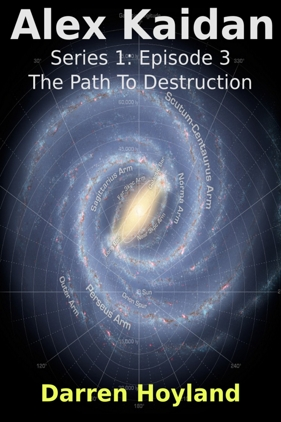

### Episode 3 of Alex Kaidan (Series 1)
# THE PATH TO DESTRUCTION
## By Darren Hoyland
### Copyright © 2014 by Darren Hoyland

*****

Dedicated to Marjan, for showing faith in me when I needed it most.

*****

*This is a work of fiction. Persons, living or dead, places or events are productions of the author’s imagination. Any resemblance is purely coincidental, which is probably for the best as it is set in the future, on several other planets and is about aliens trying to wipe out humanity. Your support and respect for the copyright of the author is appreciated.*

*****
### Previously in Alex Kaidan:

Following a successful raid on a Nedic planet, Alex Kaidan and his crew secured the data they needed, grabbed plenty of Earth plants for analysis and reinvented the art of extreme cow tipping. They also nearly got lynched by a mob of Humans and Dann got an important reminder why it is important to brush up on your orbital mechanics before attempting to chat anyone up. Educational as it may have been, nothing could prepare Alex for what he would learn from the Nedic logs: evidence that one of the Pathfinder fleets was heading towards the Un home-world and The Village.

Alex and his crew have made it their mission to find and rescue however many Humans they can that are being held captive by any of the alien races, but that will not be of any use if the ones that they have already rescued get paved by the Pathfinders...

*****

It was rare for the entire crew to be on the bridge at once. There were two reasons for this. The first was that when they were not docked or in a stable orbit, there were usually so many minor emergencies going on at any one time that it was prudent to have at least one person babysitting each of the critical systems. The second reason was that there were only three chairs. These were exceptional circumstances, however, and Alex had ordered everybody to the bridge. 

The spherical structure offered views in whichever direction they cared to look, obscured only by the occasional console, chair or person who got in the way. The feeling of floating in the void (while conveniently provided with warmth, gravity and oxygen) never lost its magic, even for Alex who spent the majority of his time here. 

The nine crew members, all standing except for Liam, were illuminated only by the faint glow of distant starlight as they arched their necks to watch the six ships as they glided silently through space. There were originally eight of the ships, but that was not too surprising - the Pathfinders liked to work in eights for some reason. One stood out purely because of its size, dwarfing the others considerably. With no obvious landmarks nearby, and no sensory data, it was impossible to deduce the incredible velocities with which they traveled. Determining their size was almost as difficult, but a rough idea could be gained by looking at the windows, which were usually easy to spot when the inside was illuminated. The Pathfinders were known to be tall, with a typical individual being about one and a half times as tall as a typical Human male, and if conventional wisdom was to be followed, the windows would be about half this size. However, in this case, the crew had decided that the ships must have lots of tiny windows otherwise the ship would be almost impossibly large. It had a disc like structure with a central cavity hollowed out that could easily accommodate the rest of the ships in the fleet ten times over. As the viewing angle changed, they could see that there was a matching cavity on the other side, so that only a thin ring of hull separated the two sides. This area of hull seemed to be coated with a black charring as if burnt in an attack by some kind of super-massive space dragon. Which was only marginally less plausible than what they were about to witness.

Surrounding the massive disc ship were two other types of ship: the first had so many armaments protruding out of its hull that it could only be a warship, and there were initially four of these. The second type, of which there were initially three, had two similar ring structures to the disc ship, located in front and behind of its relative direction of travel. These rings were detached from the main hull, held in place by pylons, and were equally as charred as the larger variety.

The fleet had left one of the smaller ring ships behind with a single warship escort before entering the first Strachan current. The crew had no idea what the purpose of leaving it behind was, and were not able to find out. All they could do was helplessly watch as the ship entered a nearby Strachan current to follow the rest of the fleet. A familiar flash of white light briefly lit the room as the ship entered the Strachan current and the stars were gone, but unusually they were replaced by the streaks of colour in a rainbow pattern which formed perfectly horizontal arcs following the curvature of the room.

“Oh, sorry,” said Alex, “I forgot to recalibrate for this.”

“What’s happening?” Reza asked Jacques.

“Huh? Oh, the image is still displaying the raw video.”

“What’s wrong with that?”

“In a stream? Everything can only travel in one direction, even light, so you get some pretty wacky images unless you compensate for it.”

“Everything can only travel in one direction...” repeated Reza slowly, as he tried to comprehend what the trainee navigator was talking about. 

“Well, that’s not entirely true. Anything travelling at the speed of light is able to stand still if it’s headed in the direct opposite direction to the stream, and we can see it when we catch it up.”

“Oh, right,” said Reza, pretending to understand.

“So that means that you can never see behind you when you’re travelling in a stream. Only what’s directly in front of you, but seeing as though you can only ever travel in one direction, that’s everything!”

“Really? That sounds like the sort of thing I'd, uh, that I'd normally.... well,  notice. How come it doesn't affect us?"

“Well you wouldn’t notice it when you're inside the field. It protects us. It’s like taking part of our universe into another one. Like, I dunno, a bubble of air in water, for example - You’re, like, skimming the boundary between two universes.”

Reza did not like the sound of that, “I hope there’s no risk that it might pop.”

“Only if you stay too long,” said Jacques. Then he smiled, and said, “I bet I know what you’re thinking now.”

“Um...”

“If everything can only travel in one direction, where’s the light coming from? Right?” he said gleefully in answer to his own question, eyebrows raised.

“No, I... er... hadn’t got that far.”

Jacques continued, unabated, “It’s one of the mysteries Strachan could never solve. The field somehow generates energy. Almost as much as you put in. It’s how we charge the batteries that power the field generators. Some of that energy is picked up by matter within the field and it gets emitted as light.”

“Right, thanks for that,” said Reza with no enthusiasm.

Jacques was a little dismayed by his lack of interest, but shrugged it off.

Meanwhile, Alex tweaked the settings sufficiently to offer up something resembling what they would see in normal space. It took him a few moments, because normally such calibration was handled automatically, but in this brief time, the fleet seemed to be further away than he would have expected. This was confirmed in the following few minutes as the distance increased. Alex was unsure what kind of technology the Pathfinders were using to do this - and to be fair, even if they sat him down and explained it to him using crayons, he would probably be no closer to understanding - but the acceleration within the stream was a real effect.

“Dr Islam, can you explain this? They seem to be getting away! I didn’t think you could do that?”

“Um, no, I can’t. That’s not supposed to be possible!” Christian replied, sounding mildly panicked. In the dim light, Alex heard the distinctive sound of someone manically tapping on a wrist console, “Our current theories suggest that any matter within a Strachan current can only ever travel at a... at a particular velocity... if the word velocity is even applicable in this context, that is...”

“So the theories are wrong?”

It took a while for him to respond, and when he did so he sounded almost annoyed at being disturbed, “Hmm? Sorry, what? Oh, yes, it would certainly look that way. Excuse me, I have to... do some... calculations.” 

Alex sighed and returned to watching the fleet. Once they exited the Strachan current, they proceeded a little further in normal space before fortuitously finding another Strachan current close by and entering that. The pursuing ship was able to follow it into this presumably uncharted stream by repeating the fleets’ manoeuvres exactly. This process of stream travel followed by a brief journey through normal space and then finding another very close stream was repeated seven times in total. Each time they did so, the gap widened slightly. 

“How are they able to find so many currents?” asked Jacques.

“I’m sure the captain could find just as many... if he wanted to,” said Liam, but no one was listening.

The direction in which the fleet was travelling seemed random at first. Convoluted. But after watching for several minutes, Alex began to see the logic. With no navigational data to hand, he could not confirm it, but he suspected that the fleet did have a destination in mind after all. It was as if they were playing Dann’s favourite game: snakes and ladders, but rather than try to maximise the distance traveled to reach the end, they were deliberately trying to hit the snakes so that they ended up on a specific part of the board. 

The gap was now so large that the Pathfinder fleet had exited the stream several minutes before its pursuer, and it started to look as if there was going to be nothing more to see. But once back in normal space, it became apparent that the fleet had come to a standstill, with two exceptions. There were now only four ships in the fleet, with another of the smaller ships having gone on ahead, accompanied by an escort of its own. Shortly thereafter, these ships found an appropriate Strachan current and disappeared, leaving the rest of the fleet in position.

There they remained for some time. The crew, who were not exactly renowned for their long attention span under normal circumstances, waited patiently, just watching. Some stared at the massive ship, marveling at the scale or the ramifications of a race such as this who seemed to want nothing more than the annihilation of every last Human. The two engineers whispered to each other, comparing notes as they attempted to glean what they could from a visual inspection of its engines and exhaust ports. Alex just wondered if they had managed to come up with a name for their ship, before recalling that the naming of ships was a distinctly Human characteristic. They probably referred to it as ‘big scary ship with a dent in the middle’. Christian, meanwhile, had taken the opportunity to continue on with his calculations. Fortunately, the fleet was now positioned directly ahead of them so that they no longer had to crane their necks to see. It was also a lot closer and the details of the massive disc ship could now be made out much more easily. Their initial estimation using the windows as a guide would have been correct: this single disc ship would probably be larger than all of the Un's space-stations if someone glued them together. The efforts involved in its construction must have been immense. Even the smaller ships would under any other circumstances be considered colossal.

As the ships drifted relative to one another, their viewing angle gently changed and Alex noticed some markings on the disc ship. Alex quickly consulted his wrist console to find that they were Pathfinder symbols denoting the numerals “2” and “1”. The ship did have a name after all. It was called “2.1”. The “2” probably referred to it being part of the second fleet - he already knew that from the Nedic logs - and so the “1” must have meant that this was the flagship. No surprise there. He kept a lookout for markings on the other ships that might confirm his theory. 

Then, without warning, the Pathfinder vessel “2.1” began to pitch in the opposite direction much more quickly. It continued to rotate until one of its cavities was tilted directly towards the direction in which they had left the first of the smaller ships, where it settled. It took the crew a few moments to work this out, because this was not the same direction as where all of the ships had exited the stream. Strachan currents could lead anywhere in normal space so much so that it was theoretically possible to travel in one direction, enter a stream and then exit it directly behind the starting location, with the net result being travel in completely opposite direction. Strachan currents usually tended to be relatively local, astronomically speaking, but other than that, they could lead anywhere. Trying to apply any kind of logic or common sense to an artefact caused by the overlap between two different universes was a sure-fire method of getting nothing more than a headache and Alex already had one of those. 

The thin area of hull at the bottom of the cavity retracted to reveal an opaque, pinkish glow within the ring. As soon as this had completed, the glow became more intense and then suddenly a cylinder of light shot towards it from the direction of the first ship. 

“Whoa!” exclaimed Dann and most of the rest of the crew jumped in shock as the beam passed close to where they were viewing from, with the only exception being Alex. It speared through the ring and continued out in the opposite direction.

“Okay, that’s... odd,” said Gino.

The beam remained in place, glowing with the same intensity.

“Odd?!” replied Ava, “Odd is a bit of an understatement - what the hell is that?!”

“It’s must be a path!” said Jacques, quietly.

“It’s... erm.. pinky light,” said Dann.

“Pinky l...” she began, before dismissing the notion, “- never mind, Dr Islam, what do you make of that?”

He did not look up from his console.

“Dr Islam?” she repeated, then said more forcefully, “Christian!”

“Huh? wha?” he said, obviously distracted, “Oh, I dunno. Erm, look, I have some work to do - I’m onto something here. Sorry. I’ll review it later, if necessary."

With that he abruptly headed for the door. Light streamed in from the corridor as he left the bridge, causing everyone to shield their eyes or blink for a few moments. 

"Christian, I'd like you to stay and watch th-," began Alex, but he was already out of the door.

“Also odd,” said Rhyna, once the door had closed behind him.

“Captain, have you ever seen pinky light like that before?” asked Liam, before Alex's eyes had readjusted back to the dark.

“No, I haven’t,” said Alex, “Should we even be calling it light?”

“It’s got to be a p-” began Jacques, until Ava drowned him out.

“Good point, Alex - can we all please stop calling it pinky light?” said Ava.

“No, I mean, ‘light’ - I don’t think it is light at all,” said Alex.

“How is it that we can even see it?” said Jacques, loudly, trying a different approach.

“Well, it’s glowing, isn’t it?” said Dann, in answer to Alex's question and completely ignoring Jacques, "I’d call that light.”

“Did you see the way it seemed to slow down as it approached the big disc ship?" said Alex, "It was almost at a crawl as passed through but by the time it had gone through the ring and out the other side, it seemed to have accelerated again.”

“We’re assuming that it came from the first of the smaller ships they left behind, right?” asked Gino.

“Oh, er, that's what I was thinking, yes,” Alex lied.

“Right. ‘Cos if it did, then there’s no way it could have traveled through normal space unless it was going faster than the speed of light.”

This time, Jacques spoke very loudly and clearly for everyone to hear, “Why is it you think we see it?”

“What do you mean?” asked Reza, who the only person to acknowledge him. Reza was interested in what was happening, but felt slightly out of his depth, so was more reluctant to join in the main conversation.

“It’s a path. They’re making a path!" ranted Jacques, "It’s clearly not travelling directly towards the camera, so if it’s a beam of light then why is it that the camera picks it up?”

Dann, who overheard the sub-conversation going on next to him decided that it would back up his own point, “Jacques is right,” he said loudly so that everyone looked at him, “it must be light if we can see it!”

“No, that’s not what I meant, Dann!" Jacques protested, although he was grateful at least to now have the attention of the whole group, “What I’m trying to tell you all is that it’s blatantly a path. They’re called the Pathfinders because they make paths. This must be a path. Think about it - why is it that it was even picked up by the camera at all if it was just a beam of 'pinky' light? Light normally travels in a straight line in space. Look -," he gestured wildly to the view of the beam on the screen, “- it’s clearly going over in that direction, not towards us, so that suggests that its not a beam of light, but something else that’s emitting light perpendicular to it, what else could that be other than a path?” he was aware that he was almost ranting now, so he lowered his voice before concluding his argument, “Light isn't supposed to travel faster than the speed of light, is it?! So... well, it’s got to be a path... that’s all.” 

Alex was surprised that most of them had not yet realised that it was indeed a path, but he was temporarily too distracted to confirm Jacques' theory as he was in the process of quickly jotting down the word ‘perpendicular’ in order to remember to use it the next time he spoke to Juliana.

Instead, Gino spoke, “But it’s a vacuum, what is there to emit the light? You need to excite particles along the way so that they emit photons, and their aren’t any in a vacuum, so where do you suppose the pinky light is coming from?”

“Enough of the ‘pinky light’ already!” said Ava.

Jacques shrugged, “Another universe?”

“That’s your answer for everything,” said Alex, sarcastically, as he rejoined the conversation.

“Actually that would make sense,” said Rhyna, “wasn’t a pinky light reported from the survivors of Earth before it was fully paved?”

The crew looked at one another vacantly, and a couple of them shrugged, until Rhyna said, “Trust me, it was.”

“I’m quite certain that they wouldn’t have used the phrase ‘pinky light’ though,” said Ava.

“Okay,” said Alex, “well all I remember from school is that that the path didn't destroy the Earth instantly. I think it was supposed to have taken a while to...um... build, I guess. In that time, the Un were able to rescue a cargo hold's worth of Humans - that must have taken them at least half an hour. They would have had to land, load up with people and escape the region of space being paved. Couldn’t have taken less that half an hour, surely? So why don’t we just watch and see how long this one stays up for?”

While they waited, the crew talked amongst themselves. It was not long before Reza saw an opportunity to ask a few questions about the basics, “So, just so I get my terminology right here... What’s the difference between a path and a Strachan current? And while we’re at it, is a stream and a Strachan current the same thing or different?”

As the closest thing they had to a navigator, and because their only actual expert on Strachan currents had left the bridge, Jacques took it upon himself to answer the question, “Stream is the English translation for the Un word for what we call Strachan currents, so yeah, they’re just different names for the same thing. A path is a bit different, but we don’t know much about them. We’ve never used one because they’re in Pathfinder territory, but the Un have provided us with a bit of info. They’re artificial streams, but we have no idea how they make them, well, we didn’t until now anyway,” for good measure he then added, “because that's definitely a path.”

“So are they’re always pink and glowing like that?”

“No, I don’t think so,” said Jacques, staring at the cylinder of light on the console screen, “I’ve never seen this before. It’s probably part of the paving process. If it is, then it will probably fade and just look like normal space when it’s finished.”

“And you can use them like a normal stream or current or whatever?”

“Yes,” said Jacques, although he sounded less confident about this point, “The other thing about paths is that they’re permanent - I don’t know if they reinforce them every so often or something like that, but they’re supposed to stick around after they’re built. Normal streams dissipate or shift after a few weeks.”

“I see.”

“Oh yeah, and they also tend to make the paths in straight lines, no matter what’s in their way,” his manner darkened as he quietly added, “even Earth.”

“So they just built it through Earth without waiting until it moved out of the way?” said Reza.

Alex entered the conversation, “It wasn’t done by accident or because Earth happened to be in the way at the time. That’s just what they told the other races. They paved Earth on purpose. They’ve done it before, and they’ll...” he paused, solemnly, “... and they’ll do it again.”

“Yeah,” said Jacques, “they targeted us for some reason. I guess they weren’t counting on there being an Un research ship in orbit to rescue a few of us.”

“But why?”

“I guess they were studying us,” he replied.

“No, not the Un. I mean why did the Pathfinders want to destroy Earth. It - we - were hardly a threat to them.”

“Hey, you’ll have to ask them if you want an answer to that,” said Alex, “although I wouldn’t advise it. They’re still intent of destroying whatever’s left of us. That’s why they’ve placed a ban on keeping Humans. They say that it’s for the best that our race dies with dignity, as we’ll never have a home, but everyone knows that they just want to wipe us out.”

“Why do the other races even listen to them?”

“Look how powerful they are! Look at what they can do. None of the other races wants to be next,” said Jacques, looking to Alex for agreement.

Alex, however, said nothing and simply started biting his nail while looking down at the table. He muttered something to them that they did not quite hear, but then Gino suddenly exclaimed, “Hey look! Something’s happening.”

Everyone looked up to watch the disc ship as it began to reseal the ring within its hull. The beam was still present and the segment of the hull that was attempting to cover the ring began to glow a bright red. Soon, the ring was completely obscured within the massive disc ship and the beam attenuated until it had completely vanished.

“Just over twenty minutes,” announced Alex, after checking his console, "Those Un scientists must have worked fast to rescue as many Humanss they did, is all I can say.”

Then, without moving, the disc ship simply entered the path, right there where it was. The other ships followed it in.

“So you were right,” said Reza, “It must have been a path, although I’m not sure how that big one could have entered a path that it just made - it should have only have been as wide as that ring was.”

“You need to start thinking in a few more dimensions, I reckon,” said Ava, “Strachan currents don’t exactly obey the laws of physics. Not in our universe anyway.”

“Looks like we’re going in too!” said Jacques.

Alex nodded.

This time, the flash was different.

Dann was the first one to state the obvious, “It’s blue!”

“Do you realise that we’re the first Humans to have ever seen the inside of a path?!” said Gino.

Still silent, Alex simply pointed to the display as the fleet ahead of them abruptly exited the path. 

“Oh,” responded Gino, slightly confused, “That was quick.”

It took a little longer before they saw the exit point, and by the time they could see normal space once more, the fleet had already begun to move on. This time, the two ships that had made up the advance party had now been left behind and the rest of the fleet was headed onwards to start the process again. Unfortunately, these two ships were directly in front of where the exit point of the path was. 

“Uh oh,” said Dann.

"Looks like they’re firing!" said Ava.

The projectiles fired from the cannon of the warship were easy enough to see as they swiftly approached, but their main energy-based weapon was as deadly as it was invisible. Long before the projectiles struck, the crew watched ship-parts drift away and caught sight of flames from explosions from behind the hull mounted cameras.

“Anyone else feeling like we should take evasive manoeuvres or something about now?” asked Rhyna.

There were a couple of chuckles from the crew, but that all stopped as the display went completely black.

“That’s it,” said Rhyna, grimly.

“Actually, there’s more,” said Alex, “That footage was from the Nedic ship that was destroyed - obviously - but there’s some other stuff that looks like it’s from a shuttle that escaped.”

“I was wondering how this ended up in the Nedic logs.”

The display returned to its default setting of projecting sensory data from the actual ship they were on, rather than that which Alex had isolated from the Nedic logs they had captured during their last mission.

Alex hopped into his chair in the centre of the room and started to pipe in the next video using the fixed console. 

As he did so, Ava asked, “So the Nedic had stumbled across the Pathfinders doing what they do best and they just blew up the ship, without even questioning them?”

“Worse. Just watch this next one,” replied Alex, as the display loaded up the next video. The scene changed from one where the crew were floating in the space to one where they were in a docking bay surrounded by Nedic engineers and several shuttles. Alex had paused it on the first frame, “Oh yeah, I should just say that this starts a couple of minutes before the last video ended. That’s just how it came bundled with the Nedic data.”

“Sorry, before we start it, can I just ask?” said Ava, “How come we even managed to find these? Do they just have copies of everything on each ship?”

“It looks like the entire Nedic database or at least a significant proportion of it, yes. Each shuttle clearly keeps a copy of their mothership's records, and that ship has a lot of data from their planet of origin. Christian was able to find his Wikipedia data very quickly, straight from the first ship we found, although I don’t think he’s had time to get anywhere with it yet. The Nedic don’t seem to have actually bothered to protect their data in any way.”

“No locks on their ship, no encryption protecting their data...,” said Gino, shaking his head and pretending to be shocked, “Honestly, I don’t know how they’ve survived as long as they have.”

“It does seem a little trusting of them, to just leave it lying around with all their secrets on board. Are we sure this is even genuine?” said Ava. Despite using the word ‘we’, she was clearly and, once again, publicly questioning Alex’s judgement.

“They hardly left it lying around! We’ve still got that prisoner to decide what to do with, you know?!” he replied angrily. He calmed his voice and added, “By the way, has anyone fed it since we locked it up?"

There were a few shrugs from the crew, and much starting at fingernails or feet, basically meaning that he would have to go and do it himself. Fortunately, neither Alex nor any of his crew had heard of the Geneva convention.

Alex rolled his eyes, and continued, "I don’t think they’re up to anything. I think they’re just... well, dumb.”

“They’ve got an awful lot of technology to be dumb,” said Gino, in Ava’s defence.

“They’ve probably had a long time to develop it, either that or they stole it.”

“Maybe so, but where does that leave us?” said Rhyna, ”I couldn’t help but notice that they were the ones posing as some kind of overlords while us Humans were busy worshipping them!”

“Yes, it’s a bit worrying that one, by the sounds of it, isn’t it?!” said Gino.

“As I was saying,” said Alex, as he regained control of the conversation, “You can clearly see from this that the previous footage was taken from a larger Nedic ship, not a shuttle like the one we recently, um...”

“Borrowed?” suggested Reza.

“Liberated,” he replied, firmly, “And judging by the size of their docking bay and the number of shuttles, I’d hazard a guess that it was probably two or maybe even three times the size of our ship.”

This seemed to send a chill through the room. 

Liam managed to articulate it best, “Ten seconds to destroy a ship twice our size and it only took one of those ships...”

Alex felt that this would be a good time to play the video, knowing full well that there would be much more for them to contemplate once they had witnessed the full destructive power of the Pathfinders. He unpaused it and the interior of the Nedic ship’s docking bay sprang to life as the Nedic engineers resumed going about their business. Watching the Nedic at work confirmed one or two of Alex's theories. Much like the shuttle they had liberated, the Nedic ship did not seem to bother with any kind of artificial gravity. Whether this was because they had not discovered how to induce local Higgs bosons in and around the devices that the Humans of The Village had come to refer to as 'gravs', or if it was simply not required for a race with enough limbs to hold themselves in position while still being able to handle any controls, he did not know. The number of Nedic at work put Alex's crew to shame, or maybe it was the other way around as they seemed to be managing just fine with only two engineers. Using rings affixed to every surface, the aliens clambered over the walls and one or two were even on the ceiling. On closer inspection, another shuttle could be seen attached to the ceiling, hanging upside down. After a moments reorientation, the crew adjusted to the fact that it was only the ceiling from their perspective. As there was no gravity, the shuttle from which the new footage was being recorded from could have just as easily have been the upside down one. With the bridge being roughly similar in size to this shuttle, there was no stretching of the video required and so the illusion of actually being there was quite convincing. Or at least it would have been, had it not been for one Nedic who must have been doing some work on the shuttle in question, and was stood very close to one of the cameras. The result of this being projected onto the spherical walls of the bridge was that it looked as if a giant Nedic was attacking them from behind the captain's chair. The alien then disappeared from view, presumably having entered the shuttle, and it was moments later that the Pathfinder attack began.

The hull in front of the shuttle glowed briefly before melting in a straight line, exposing the docking bay to the vacuum of space. The pressure from the air forcing its way out of the tear caused the hull to rip open further, and several of the Nedic were swept out with it. Many more held on to the loops with one or more of their limbs. They may have been biologically adapted to a life in space, but Alex could not see them surviving for long once they were in a complete vacuum. The weapon, visible only by its trail of destruction, did not seem to have stopped there, however. As soon as it had melted through the hull, it continued on to hit two of the other shuttles and partially melt through an internal wall. Suddenly, as if the Nedic engineers’ prayers for air and warmth had been answered by an especially cruel deity, the internal wall exploded outwards, releasing superheated air that traversed the docking bay to egress through the tear into the emptiness of space. Alex guessed that this was probably the wall that separated the docking bay from the engineering section and that the weapon had warmed up something critical that did not particularly like being warm. Flames shot out from whatever was behind this wall, but strangely they did not stay there. The flames were detached from any surface and flew out into the void along with everything else like a fireball. A few seconds later, several more fireballs followed it. A second large explosion from somewhere deep inside the ship shook the shuttle showing them that the internal damage was enough that no further weapons fire from the Pathfinder warship was necessary, but a second wave was still coming: The projectile weapons that they had seen launched from the warship were yet to reach their target. Meanwhile, pillars of fire had now started to rise out of the various air outlets that were scattered around the docking bay, suggesting that the inside of the ship was undergoing some crisis that had caused the air itself to ignite in the heat. The lighting cut out so that the docking bay was now only illuminated by the pillars of fire from the air outlets, although these were diminishing - inevitably losing their battle against the insatiable demands of space. The other Nedic were undoubtedly now dead, still clinging on to the walls. Amidst all of this, the sole survivor in the recording shuttle took off and headed for the hull breach. The only silver lining for the pilot was that the tear was now sufficiently large for the shuttle to fit through, meaning that it would not draw the attention of the Pathfinders by opening the docking bay doors. Alex doubted that there would have been available power to do so anyway. 

The crew watched through the shuttle’s cameras, in exactly the same way as the Nedic pilot would have done. Alex had no idea if the Nedic experienced fear, loneliness or isolation, but floating amongst the junk and frozen Nedic bodies was disturbing enough for him, safe in the knowledge that he was several trillion kilometers away from where these events had occurred.

“What’s going on now?” asked Reza.

“Looks as if it’s drifting and pretending to be junk.”

“It’s not going to work,” said Ava, “Those projectiles will hit very shortly... Where are they anyway?

“Over there!” said Gino, pointing to two silver dots after briefly scanning the display. 

“Where?” she said, her eyes following the direction of Gino’s finger.

“Th-” began Gino, before he said, “oh, they’ve gone.”

“They’ve not gone anywhere," said Alex, who wondered the same thing himself the first time he saw the footage, "I think they’ve split into sub-munitions.”

“Whassat then?” said Dann.

“Ball-bearings, or something similar,” he replied, “Designed to do as much damage over as wide an area as possible.”

“It’s okay!” said Jacques, really rooting for the pilot now, “he must have seen the projectiles before they split - he’s started the engines!” 

He?” said Rhyna, “The Nedic don’t have sexes.”

“I know the feeling,” muttered Dann.

Jacques pointed out the warship on the display, “They’ve seen him - I mean, it.”

Having seen the next part in advance, Alex knew to cover his eyes. The others, accustomed to the darkness of the bridge, were not so well prepared and were suddenly and briefly exposed to a blinding light. The warship had fired its energy-based weapon a second time, hitting the shuttle. Despite the direct hit, the cameras continued to function and the shuttle continued to move.

“Why didn’t it kill us? I mean him? I mean it?” said Dann.

“I couldn’t understand that either,” confessed Alex, “something must have attenuated the beam. Wreckage from the main Nedic ship, maybe?”

Suddenly that ship began to disintegrate - the projectile sub-munitions had finally hit their target smashing it to pieces and causing whatever was left that had not exploded to explode. The shuttle remained unaffected though. 

“It was the ball-bearings,” said Gino, “It’s the only thing it could have been. The Pathfinders must have vapourised their own projectile weapons when they fired their laser weapon against the shuttle, and it must have absorbed most of the energy in return.”

“That is one lucky pilot,” said Reza.

“Hey, Ava, do you think we could make something to scatter a beam weapon like that?” mused Gino, “Some kind of mirrored dust as a counter-measure?”

“That’s not a bad idea,” replied Ava, “We’d need different mirrors for different wavelengths, but -”

Ava was interrupted by another flash. This time, it was not from a weapon, but because the shuttle had entered a stream - probably a continuation of the same one the Pathfinders used to get there initially.

“It’s going to make it!” said Jacques, over-excitedly.

“They’re not going to just let it get away,” said Dann, “are they Alex? Unless it gets ripped apart in the stream”.

“No, it couldn’t have done. How else could we be watching this?” said Jacques, “It has to make it!”

“What happens if the Pathfinders catch them up in the stream? Will they overtake it, or will they smash into them?”

“I’ve no idea,” said Alex in response to Reza's question, “Christian is the only person who might be able to answer that, but you might have to wait until he finishes doing his sums".

“Where’s this stream taking him?”

"It."

"It."

Until now, Alex was content to not answer any of their questions and allow them to see events unfold by themselves. This time, he decided to let them know in advance, “The logs state that the Strachan current it entered went past one of their military outposts that was close by."

"I told you he was lucky," said Reza

"His luck doesn't last very long, Rez. You’ll see the shuttle exit the stream close by the space station shortly, where it transmits this footage, and that from the main ship we watched earlier.”

“So it doesn’t make it?” said Jacques, devastated.

“Nope. Sorry.”

As Alex foretold, when the shuttle did exit the stream, it was destroyed by the energy-based weapon almost immediately and the display once again returned to the default.

“There’s more, several more in fact, but I won’t play them now,” Alex said, darkly, “They’re taken from the station that received the transmission and three of the ships that managed to escape. That’s three of about fifty ships, from what I can gather. You can review it in your own time if you feel so inclined, but it’s a massacre. This single Pathfinder ship tried, and nearly succeeded in annihilating them all to prevent this data from being released.”

“There must have been thousands, maybe tens of thousands of Nedic,” said Rhyna, “This was completely unprovoked!”

“One ship? Against fifty and a military station?” said Gino.

“One ship of four,“ said Alex, “And I have no idea what that disc ship is capable of.”

“All so some video footage of them building a path didn’t get out?!” asked Jacques.

“Public knowledge now,” said Dann, bluntly.

“Yeah... here’s the thing... I haven’t told you the worst part yet,” said Alex, wringing his hands together.

The crew fell completely silent, all eyes were on him. Rhyna knew already. Ava must have already have been thinking it and whispered, “No!”

“As Jacques correctly pointed out, the footage shows the Pathfinders building another path and they clearly don’t want anyone to know about it. Additional data I dug up from the logs include discussions between various high-ranking Nedic about the distances involved, the length of time taken and.... and the direction in which the path is headed.”

Ava put her hand over her mouth in shock and Gino looked at her and asked, “What?”

She asked Alex directly, “Where was this footage taken?”

Alex did not answer. 

“Where was that path headed?” Ava demanded.

“The last place we want it to go,” he said quietly, “it’s headed for the Un home-world and it will take New Earth with it.”

The atmosphere in the room changed from one of mild concern to outright panic. There were several sharp intakes of breath and at least one “Oh my god!”. Several members of the crew bombarded him with questions and simultaneously.

“Do they know about us?” asked Liam.

“How old is this footage?” said Jacques.

“When will they get there? We’ve got to warn them!” said Gino, and it was his question he responded to first.

“If the Nedics’ estimates are to be believed then they’ll reach the Un home-world in about three weeks.”

“From now or from when the footage was gathered?” said Jacques.

“From now - this was taken just under a week ago and the Nedic speculated that that’s how long it would take them to build it if they kept hopping in these set amounts as they do. I had to convert from the Nedic time and date system to ours, but that’s what it worked out to. I’ve started running some simulations to confirm it, but they’ll take a few hours to complete.”

“We should get home then. Now!” ordered Ava, “The Village needs to be warned - we can’t even wait a few hours! They’re going to need all the time they can get if they end up needing to evacuate!”

“We can’t go home!” he shouted. 

The crew fell silent once again, and they all looked up at him. Alex had never shouted at them in anger in the whole time that they had known him. Then again, they had never faced a situation like this before. The hangover probably did not help either.

“There’s no Strachan currents,” said Rhyna quietly.

“You knew?!” said Ava.

“Who do you think sobered him up?” she replied, pointing at Alex.

“We can’t get home, we can’t even get a message home via the Un in time. There’s a bottleneck in the streams between us and The Village,” he said as he changed the display once more to show the results from a basic simulation he ran earlier on, “If you look here, and here, and here, there’s a break in each of the streams that correlates with the point at which they’re making the path. It’s not obvious at first, because the point where they’re making the path keeps moving, and this sort of thing isn’t factored into our models, so it wouldn’t show up unless you’re looking for it. I don’t understand how it works but whatever they’re doing seems to be repelling the formation of any new streams that don't originate from this point in space, but encouraging new ones to form in front of them from here, and attracting the existing streams that are behind them. They just stop and then they pick up again later, but it seems that if you travel in this vicinity of them while they’re building a path, you’ll drop out of the stream right in the midst of the fleet. That must be how the Nedic ship stumbled across them in the first place.”

“Can’t we go around?” asked Gino.

“It would take too long,” said Jacques, carefully scrutinising Alex’s results, “It’s warping everything, even affecting distant streams. Oh god, we won’t reach them in time to warn them!”

“What are we going to do?” asked Rhyna. The rest of the crew looked at him expectantly.

“We’re going to think up of some ideas. Do whatever it takes. Form into groups and brainstorm, go off alone, sit on the toilet, I don’t care - do whatever you do that makes you think best. I want ideas people. I’m going to find Christian and make him understand that this is more important than whatever maths puzzle he’s currently working on and then I’ll be in my cabin. Come and see me the second you think of something, it doesn’t matter how insane. We need to warn The Village!” Alex paused for a moment and then said, “Oh, unless anyone can think of a way for us to take on the entire fleet by ourselves? No? Didn’t think so. Now MOVE!”

*****

Alex’s head was felt like it was about to burst. While the bizarre alien fruit that Rhyna had force-fed him had mopped up the excess alcohol in his stomach and had performed some kind of biochemical magic to make him completely sober on a matter of minutes, he was beginning to feel that they had somehow gone too far. If anything, the deep red juice from the fruit made him feel too sober: it was as if he had woken up in the body of an accountant. Unfortunately, there was nothing Rhyna could do about the accompanying headache other than to suggest standard analgesics and water. It probably would have made things easier if he did not have to go over the potential annihilation of The Village again, but then if people did insist on running out in the middle of meetings. Maybe he was doing it all wrong? He decided that the next time they uncovered a secret alien plot to destroy their home, he would start with that news and then make them watch the video.

As Alex suspected, Christian was holed up in the engine room, working on his new pet project. By now he had transferred the work from his wrist console onto the main engineering terminal and he had nearly screamed in surprise when Alex barged in on him.

"Captain Kaidan," he said, once he had gotten over from the shock, "I didn't expect you."

"Really?" he mocked.

"Still, I'm glad your here. I need to show you something."

"Actually, there's something -" Alex stopped talking momentarily as he noticed the bedding in the corner of the engine room. He disregarded it for now and continued with what he was saying "- something more important that you need to see."

"No, no, no, you don't understand, this new information changes everything."

"Look, Christian, I'm not sure what it is you've been working on but this is serious, you're going to need to watch the rest of the footage."

Their next sentences were spoken in unison.

Alex said, "They're going to pave The Village."

While Christian said, "Earth wasn't destroyed."

Then they repeated the feat by both replying, "What?" at the same time.

Alex was the first to recover, "Did you say Earth wasn't destroyed?"

"Yes, but what's happened to The Village?"

"Nothing yet but the video footage we acquired showed that the Pathfinders are building a path that's headed directly for the Un homeworld. How can Earth not have been destroyed? They paved it!"

"They can speed up in a Strachan current! Don't you understand?"

Alex paused for a brief moment, his eyes darting to the side as he thought. Then, looking back at Christian, he said, "Erm... No."

"Oh, right. Well it changes everything. It almost sounds blasphemous, but Strachan must have miscalculated. Or he dismissed the possibility based on what the Un thought they knew. Matter isn't converted into energy in our universe as we thought, it must be shunted into the overlapping one. I'm speculating that it must function like an anchor, which must be how they manage to keep their paths in place for so long. That means the Earth is just trapped. Trapped in exactly the same state that it went in. Even time hasn't touched it. It's retrievable!"

"Retrievable? But is a planet!"

"It's a solar system, actually."

"So how do we get it back? Does that mean if they pave the The Village we can just fish it back out afterwards?"

"Well I suppose, in theory. We've just got to find a way of overloading the entire Pathfinder network. But it will take time, and it's not something we'd be likely to be able to do without help from the Un and my colleagues. We've got to stop them from paving The Village if we want to save Earth!"

Alex shook his head in disbelief as he repeated the scientist's final two words quietly to himself, "Save. Earth."

He could not have even hoped for such a thing to be possible, but now the stakes were raised even higher. Christian had realised this too, "We need to stop that fleet. Have you had any ideas?"

"No, that's why I wanted you all to see the video footage."

"Well then," Said Christian as he loaded up the footage from the console, "I'm sorry but you're going to have to excuse me and let me get on with watching it - we're wasting time, you know!"

"Um, yes," said Alex, "Right, well I'll be going then".

But Christian did not respond, he was to busy studying the Pathfinder fleet.

*****

Alex was back in his cabin and in the process of filling a glass of water to help him swallow more of the painkillers Rhyna had given him when there was a knock on the door. He quickly took two of the pills and drank some of the water before opening it to find Gino. 

“Captain,” said the engineer, suddenly, “I’ve been thinking about the footage and I wanted to run something by you."

“Right now, I’ll take any ideas you’ve got. Please, come in.”

Gino followed Alex as he walked towards his desk. As captain, he had assigned himself the largest of the cabins, enabling half of it to be partitioned off and used as an office. In addition to the desk, there were two fixed consoles and several chairs. Choosing the largest cabin for himself was not too much of an abuse of power in this case, because all of the cabins were sizable, having been designed to cater for the much larger physiology of the Un. The only downside to this situation was that the afore mentioned Un physiology had no need for plumbing, so some creative engineering approaches were required. Or sometimes a bucket sufficed.

“I noticed that the Nedic ship that was trailing the Pathfinder fleet managed to go undetected for quite some time,” said Gino, helping himself to a chair. He immediately stood up again after realising that he had sat on an empty bottle.

Alex took it out of his hands, “Sorry about that. You were saying...?”

“The Nedic ship - the fleet didn’t pick it up until it came out of the stream right on top of them. Made me think that they weren’t able to see if before.”

“I just put that down to scale. It's difficult to determine distance with no frame of reference," said Alex, not entirely sure what he was driving at.

“No, I just checked the raw data. They were at a range that should have made them easy to spot".

“Okay, that's interesting. So why didn’t they?”

“I don’t know yet. There’s only a couple of sensible explanations I can think of. The most likely is that the Pathfinders' path laying technology is blocking their sensors somehow - which we might be able to use to our advantage."

“You think we can sneak past them to warn The Village?”

“It's possible.”

“What’s the other one?”

“Huh?” said Gino, now deep in thought.

“The other explanation? You said there were a couple you could think of."

“Oh, it’s nothing. I was just thinking that they might have some kind of technology that’s able to hide them from the sensors."

“Hmmm,” said Alex, “Well, I suppose they could have come up with a way to house the heat emissions maybe, like we have with the shuttles, but that wouldn’t do much good against EM scanners. Or occlusion for that matter."

“Like I said, the other one is the most likely explanation, although now you mention it, I do remember once hearing a rumour while I was a student that they developed invisible flying machines on Earth. I think it was called ‘stealth’ technology, but I never really believed it."

“Sounds like it could be a contender for your weapons technology you were hoping might be in Christian's wikipedia data."

"Any word on when he'll have that up and running?”

"Might be a while at this rate. He was still working on scanning through the data when I called the meeting. Then went off on this new tangent about acceleration within a Strachan current and now I've finally got him watching the footage, so don't disturb him unless it's important or he'll never finish anything!" 

Alex had decided to keep the news that Earth may not be completely lost to himself for the moment.

"We’re going to need his help, whatever we end up doing. Although..."

"What?" asked Alex.

“Did you know he's made himself a bed in the upper section of the engine room?”

“I thought that's what I saw earlier, but I was a bit preoccupied. Guess that means he didn’t like his cabin then?”

“I think he just doesn’t like to waste any time walking anywhere.”

"Is it a problem?"

"No, not really. As long as it's out of the way and not near any vents, but it is a little bit strange. Nice guy, don’t get me wrong, he's just a bit... odd."

“I know what you mean,” said Alex.

There was a short pause in conversation, suggesting that there probably was not anything left to discuss, and Alex filled it with, “...So are you headed back to engineering now?”

“Yes.”

“Good, I’ll tell you what - you've got the raw data files already, but I’ll send you what I’ve collated from the Nedic logs so far and you can have a look through to see if you can find anything that backs up your theory about the Pathfinders not having any working sensors near that disc ship. I'm reconvening the meeting in an hour or two to see what people have come up with and I'd like you to present this idea, see what the others make of it."

"Oh," said Gino, apprehensively. Suddenly, as he realised Alex may sense his nervousness, he said, "Will do, Captain!" with generous veneer of fake enthusiam and a forced smile.

The engineer stood up and Alex followed suit.

"Good," said Alex, "now I'm going to go find the others to see if they've had any similarly bright ideas."

Both men left the room. Gino made sure he went first so that Alex would not see how anxious he had suddenly become.

*****

The crew had reassembled for the second part of the meeting, this time in the main observation lounge rather than the bridge. Once again, they had left the ship at the mercy of fate with no one looking after the critical systems while the meeting took place.

"Ladies and gentlemen," announced Alex over the several independent conversations that were simultaneously going on, "thank you for coming back so soon."

"I don't know how you expect us to have come up with an idea to take on the Pathfinders and save The Village so soon. We've only had two and a half hours," snapped Ava.

Alex carried on regardless, "I've been round to talk to you all individually and we have a few suggestions already. Given our limited time frame, I thought it would be best to bounce these ideas of each other sooner rather than later so that no one is pursuing anything that isn't going to get us anywhere. Gino, would you like to start?"

He looked nervous. Unlike Ava, Gino seemed to lack confidence presenting his work like this. In a less formal setting, it was actually quite difficult to shut him up, especially when the conversation was regarding the best way to blow something up (The rest of the group often wondered if this preoccupation with meaningless destruction was some kind of repressed anger towards his wife). Gino never had a problem critiquing other people's work and liked to chip in ideas and suggestions, making him a useful and effective member of the crew. But the second that he was asked to stand alone, without the support of the others, it was as if he suddenly turned to jelly. Alex felt bad because he was still asking Gino to speak despite knowing this, however under the circumstances he still felt that this was the best way to present the ideas.

"Thank you, Captain," he began, voice wavering slightly as he stood to address the crew. He spoke slowly, deliberately and in monotone, "We've noticed that the path laying technology being used appears to be interfering with the Pathfinders' ability to detect other ships. We can't be certain, but it's possible that their sensors are being blocked as a result of their activities somehow and if so, we might be able to sneak straight passed them."

And then Gino sat down. 

Alex, who had only just sat down himself, was not expecting such an abrupt ending to Gino's talk. 

"Oh," he said, "care to expand a little?"

Gino shook his head rapidly.

"Right, well then, fair enough. What do we all think?" Alex asked.

"Are you sure they won't be able to see us?" Reza asked.

"Honestly? No, not sure at all," replied Gino, now noticeably less anxious, "but based on the information we have, that's what seems to be happening."

"Are you talking about how the Nedic ship got close enough to record them?" asked Ava, who then proceeded to answer her own question, "Well, I suppose they did go out of their way to make sure the footage didn't get out, and you'd think they wouldn't have left them recording for so long if they knew they were there."

"It's just a guess though, isn't it?" said Jacques, "Doesn't seem much to bet our lives on."

Gino shrugged and looked at Alex, who said, "Okay, let's hear the other suggestions, then we can discuss it all at the end. Christian?"

Alex had barely finished talking when Christian blurted out, "It's just a theory, but I'd imagine that the paths are at their most fragile as they are being formed, greatly more so than when they form naturally and so it's plausible that a sudden introduction of matter from this universe could disrupt the path as it's being laid, so to speak."

Christian had spoken so quickly that it took the crew a few seconds to process what he had actually said. During this time, Christian impatiently started tapping his finger on the table top.

"Okaaaay," said Alex, who had heard all of the other crew members' ideas and was now regretting not making sure he also had heard Christian's beforehand, "so what's your idea?"

"Isn't it obvious?" he replied, only to be presented with a chorus of bewildered looks, "We let The Village get paved!"

"What kind of an idea is that?" asked Rhyna.

"Well obviously we cover the entire moon, and possibly also the Un homeworld in field generators first, only then do we sit back and let them pave it. The planet and it's satellite will be encased in a field so time should proceed normally inside the path, in which case the field generators will all be programmed to simultaneously deactivate after a set period. This will result in a huge sum of matter suddenly being presented to the path which will tip the delicate equilibrium back in favour of our universe and this will produce a chain reaction that could potentially disrupt the entire Pathfinder network!"

While most of the crew were still processing just what exactly Christian was talking about, Reza quickly exclaimed, "We pop the bubble!" with possibly a little too much enthusiasm considering the nature of the rest of the idea.

"I see two fundamental flaws in your plan," said Rhyna wearily, "but first of all, may I ask if you've thought what might happen to the people unlucky enough to be on New Earth at the time?"

"Well, they'd all die, I imagine, if they're suddenly subjected to such an event. Really Dr Shin, as a woman of science, I'm surprised you had to ask."

Despite looking quite disgruntled, Rhyna said, with tact, "I asked so as to provide you with the opportunity to explain to is how you were planning to resolve the issue."

"Well we need to evacuate beforehand, clearly!"

Rhyna sighed, "In which case, I see three fundamental flaws in your plan."

Christian looked confused, so Rhyna helped him out, "How are we going to get there before the Pathfinders?"

"Oh," said Christian, uncomfortably shifting from side to side.

"And how are we going to build and deploy hundreds of field generators in the time allowed? H-"

Christian interrupted her, "Thousands is more likely, maybe tens of thousands."

Rhyna continued, "Deploy tens of thousands of field generators then? And last of all, if we could get there before the Pathfinders and evacuate, then there wouldn't be a problem in the first place."

"Right... When you put it like that... I see your point," said Christian.

Alex added, supportively, "But other than that, it's a brilliant plan".

"Is there any other way of disrupting the network?" asked Gino, far more comfortable asking about other people's ideas than he was presenting his own.

"Other than a sudden injection of a huge amount of matter into the path? No. Well maybe. Well... Actually... Possibly," Christian suddenly became much more animated as a new idea came to him, "I'm just thinking out loud here, but if we could somehow take a big enough field generator into the path and then somehow invert the field, it would effectively simulate a sudden influx of energy from the other universe which might tip the equilibrium the other way and send the network into the other universe..." 

He paused and then his enthusiasm dropped. Alex figured that he must have realised his idea would result in the destruction of Earth. Sure enough he then followed this by saying, "Oh, but that would destroy everything previously captured in the path such as E-"

"Christian!" said Alex very quickly, "Let's just focus on one thing at a time, shall we?"

"Yes, of course," he replied, "The matter at hand. Oh hang on, I know. How about if we were to temporarily swing it towards the other universe then pull it back before it got there? If we repeat that oscillation a few times, we could build a sort of momentum. But not momentum obviously. That's just an analogy. But if we do that then we might be able to swing it back into to our universe. We'd have to get the timing right. And we'd need a really powerful field generator... That might work."

"Is that something we can do from here? In the available time frame?"

"Erm, no."

"Then that's not very helpful, I'm afraid."

"Do you not have any ideas that just involve blowing something up?" asked Dann, "that was my idea".

"I like that idea too," said Gino.

"I suppose we could cause an explosion just outside the disc of that megaship just as it powers up to start the path creation process," Christian answered, "You see, a ship that size would require a very large field. The bigger the generator, the easier it is negotiate a stream, but also the easier it is to destabilise.  It wouldn't do it any major damage, but should mean they won’t be able to enter any streams for a few minutes maybe. Probably not much use."

"Okay, who's up next?" asked Alex.

Liam stood up and cleared his throat, "I am, sir."

"Oh. It's your idea," said Alex, somewhat dismissively, having already heard it, "Fine, go on then."

"Thank you, sir," he said, "My idea is that Captain Kaidan - you," he gestured to Alex, somewhat redundantly, "- go over there in a shuttle and challenge the leader of the Pathfinders to single, unarmed combat."

Several of the crew burst out laughing and Rhyna said, "I agree!"

"Any more ideas?"

"But Captain, what about my idea?"

"Any sensible ideas?"

Liam sat down quietly and, against his better judgement, Alex suddenly felt sorry for him, "I'm sorry Liam, but even if they didn't shoot me on the way over, why the hell would they suddenly agree to abandon their plans for the annihilation of Humanity?"

"But I'm certain you could beat them in a fight!"

"They're twice my size, Liam! Any other ideas? Er, Rhyna, I think yours is the last one."

"Are there any Un ships in the area?"

"No."

"That's my only idea ruined then."

"Well, that's it..." began Alex.

"Actually," said Ava, "after hearing the best ideas we can come up with, I do now have a suggestion."

"Oh really?"

"Yes, let's run away," she said, confidently.

"Run away?"

"Yes, run away. Let's take what's left of the Human race and go back to that planet the Nedic were keeping all those Humans on".

"You can't be serious?!" said Rhyna.

"What about The Village?"

"What about the Human race?" she replied, "Do you think the people in The Village would want us to throw our lives away on a suicide mission? There aren't enough of us left. We need to think about the species. We might have to restart human race!”

Alex noted that she seemed to be eyeing up Reza as she said this. The fact that Reza suddenly looked nervous suggested to him that they had not quite gotten around to it yet after all.

Ava continued, “Especially now we have the sum total of Human knowledge from before Earth got paved. We can take that with us. With this knowledge, we can be the gods there, not the Nedic. Reza, what was that pronoun for your one-eyed friend you told me the other night? Day, I mean.”

Then again, maybe they had.

“Erm,” said Reza, after gulping forcefully, “I think you mean the old proverb: In the land of the blind, the one-eyed man is king."

“Yeah, that’s it. Exactly. We can be worshipped and live like kings".

“We didn’t get a particularly kingly reception the last time we visited,” said Alex, “And based on my experience, I quite sure that over in blind land, they're currently stringing up the one-eyed man for being different."

“Plus you guys might have annoyed them a little by kidnapping their Nedic-god,” said Jacques.

“Oh, yeah,” said, Dann, “I keep forgetting we’ve still got him locked up."

"Well what's your idea then, Jacques?" snapped Ava, before Dann even finished talking.

“Oh, I, er, couldn’t think up of one in time."

Ava gave him a smug look before turning to Alex, “And yours?”

"Worst case scenario. If all else fails. Only if we’re especially desperate. I thought it might be worth trying to negotiate with them."

For once the crew were in agreement, “Nooo!” they cried, in near perfect synchrony. 

“What?” he protested.

“I think my plan was better,” muttered Liam, quietly.

“Maybe it might be worth using a little of each idea?” said Christian, before adding, “Except for the Captain’s, of course. No offense".

“None taken... well, maybe only a little bit. What are you suggesting? That we sneak passed them, cause an explosion near the disc ship to disrupt them from entering the stream and then run-away?” While Alex had initially started his sentence loaded with sarcasm, by the time he had finished it, it had actually gained enough credence to be considered as a genuine idea.

"Something like that,” he said.

Alex tilted his head to one side and put on his best pondering face, "Go on..."

“We may well be able to follow them without being detected, as Gino had quite rightly observed. In fact, I would hypothesise that as long as we're on the vicinity of the disc ship, then we will be quite well concealed. However, the number of paths in the local area is restricted and we now know that a: they only stay on one place for around twenty minutes, and b: they can travel faster than us, I'm afraid that they will inevitably catch up to us."

"What would happen if they do catch up to us in the steam?" asked Reza, who looked at Alex as a reference to their earlier conversation about overtaking, "I mean hypothetically speaking, could they ram us or something? You know, if they didn't just shoot us."

"I really have no idea," admitted Christian, "I've only just found out that acceleration within a Strachan current is even possible, so their technology is way beyond ours at the present time. But one thing I can tell you is that there wouldn't be much point in firing any kind of weapon in there. Firing a laser in any direction but directly behind you would simply reach the edge of the field and then stop - at which point your ship would catch up to it, seeing as though every direction is forward, relativity speaking, you'd effectively be shooting at yourself. Although, I suppose you could plausibly fire at someone following you. As for projectiles, they wouldn't leave the field. They'd just slow down exponentially the closer they got to the edge of the field - they'd never actually stop - but as soon as you exit the steam, they'd continue on in whichever direction they were fired."

"What about if a projectile was to carry its own field generator?" asked Gino, interest piqued.

"Well, then you'd be talking about a missile that would be the size of one of our shuttles and we're back to talking about ramming - yesterday, I would have said such a thing was impossible as there's no acceleration possible within a steam. Today? Who knows...?" 

"We're going off on a bit of a tangent here, folks," said Alex to the group. Then, looking to Christian, he asked, "So what exactly are you proposing? That we slow them down a bit by causing an explosion near the disc ship?" said Alex.

"Even then there's no guarantee of success," he replied, "All of the local streams have been influenced by this technology to run through this bottleneck. If they chose to pursue us - which is fairly likely - they'd know which way we were headed. Unfortunately, as soon as we try to pass them, they'll most likely detect us entering the path anyway. We can't outrun them so the only way I see is to disrupt their ability to enter the path or Strachan current in order to prevent them from following us. Even if it will just be for a short amount of time."

"Whoa! Hold on a minute," said Dann, "Now I like a good explosion as much as the next man-" he paused, looked at the others, "well, probably more than the next man-" he paused again, "well, unless the next man is Gino - but... Oh, I can't remember what I was going to say now."

Alex sighed, and prompted his old friend, "Explosions....?"

"Oh yeah, thanks. How are we supposed to do anything to damage a ship that big?"

"And more to the point," said Ava, "what's going to stop the smaller ships - and by smaller I mean still gargantuan but just not as massive as the disc ship - from following us."

"Gargantuan? Good w-"

"-Don't say it!" she snapped.

"Never mind," Alex said, sheepishly, "Does anyone have any ideas on how to stop the other ships?"

"We haven't worked out how we're going to cause the explosion on the big one yet!" protested Dann.

"Use the shuttles as a decoy," whispered Gino to himself, excitedly.

Liam, who was say next to Gino, seized the opportunity, "I've had an idea captain! Let's use the shuttles as a decoy."

"Didn't Gino just say that?" asked Alex, genuinely confused because he could not believe that even Liam would try to get away with that. 

"Oh, did he?" said Liam, pulling his face's best innocent impression, but being unable to hide his disappointment that the others had also heard Gino speak. 

"Maybe we could..." Alex pondered, "Maybe we could use one as some kind of decoy to get rid of the escorts - we've seen how fond they seem to be of chasing after things - and as for causing the explosion, well, wasn't there talk of ramming ships together before? Let's do that with the other one then."

"That's a big ship. We'd need to rig it with explosives. Lots of explosives. Do we even have any?"

“I suppose we could take out the charge and propellant from some of the autocannon’s ammunition?” suggested Gino, louder this time, while simultaneously scowling at Liam, “That should do the job and there’s plenty going spare.”

“I sincerely hope you weren’t relying on me to help with that,” said Ava. It sounded like a dangerous job.

“Um...”

She rolled her eyes.

“Being new to this whole space warfare business,” said Rhyna, “I hope you’ll forgive the stupid question, but surely we’re going to have to hit it somewhere... specific,” noticing the puzzled expressions on many faces around the table, she added, “Y’know, not just crashing into it anywhere, but somewhere where, I dunno, say where the field generator thingy is, maybe?”

“I was just thinking the middle of that big disk would do,” admitted Alex.

“Oh no,” said Christian, “I don’t think there’d be anything suitably fragile there. It does have a path going through it, so I image all they have there is just have something to focus the energy there before it all retracts out of the way. No, the field generator would be somewhere else, but it shouldn't be too difficult to detect... with the right equipment"

Alex noted the collective drop of shoulders that accompanied those last four words, "What kind of equipment?"

"Oh, nothing too extravagant. I'm sure Ms Mbombo and Mr Estefan can help me put something together in no time," said Christian, gesturing at the engineers, "unfortunately, for it to be effective, we're going to have to get in close."

Alex had not been aware until that moment how far dropped shoulders could go.

"How close?" he said.

The scientist shrugged, unhelpfully, "Quite close. In fact, it would probably be wise to remote pilot a shuttle with the detector on board - just to be on the safe side."

"Surely we could just program the autopilot to zoom around while your machine scans for the field generator?" said Rhyna, "I don't like the idea of hanging around if the shuttle is detected."

"If it's being remote piloted, why would anyone need to hang around at all?" asked Reza, conscious that he was once again the only one who seemed to not understand. He was not being used to being the ignorant one, and certainly not liking the idea, so was now making a concerted effort to ask as many questions as possible to remedy the situation.

"The autopilot might have difficulty reacting to any unexpected movement from the Pathfinder ships," said Alex, "A single ship would be bad enough, but with eight of them in such close proximity, I wouldn't trust it to be able to stay out of sight."

Jacques took the opportunity to chip in, before any of the more senior crew members could, "We just can't predict what the Pathfinders will do - we haven't studied them for long enough, so we can't tell the autopilot how to react because we just don't know. Even if we could, it would probably take too long to program it in."

Alex nodded in approval and finished his own explanation, "An autopilot might misinterpret a pitch, for example, and might end up going the wrong way. If that happens, it'll probably hit the ship and then it's game over. It sounds like we're only going to get one shot at this and we don't even know what we're looking for yet. Obviously a Human pilot would be best able to react, but that would be a suicide mission and we haven't got enough Humans spare."

A polite, half-hearted chuckle rippled around the room, and he continued, "In answer to Reza's question, we have to be in range of line-of-sight laser transmission if don't want the signal to be detected, and even though I keep pestering Ava, she still hasn't come up with a way to build a faster than light communication device".

Ava raised a smile in response, but it was cold and dropped as soon as Alex looked away.

Gino explained further to Reza, "If faster than light communication was possible or if there was maybe some way to communicate via the Strachan currents then we wouldn't have this problem in the first place - we could just contact The Village directly and warn them."

"Oh," said Reza, feeling quite foolish, "I see."

"Still," said Ava to Alex, cheerily, we don't need to hang around while you remote pilot the shuttle, "No point putting all of us in harms way."

Alex was taken off guard by this. He had not given this part any thought yet. Of course it should be him that did it. He was the captain and the most experienced pilot, and it was not like he could ask any one else to do it - it was his responsibility. It was just that he would have rather volunteered to do it himself. Ava's comment threw him for long enough to create a slight but noticable gap in conversation that the others would pick up on. Once again, she had undermined him in front of the crew.

"That... is what I was thinking," he said, quietly.

"Oh good," she replied.

"In the meanwhile," said Alex, reasserting himself, "I'd like you lot to go shopping."

"Eh?" came Ava's unmannerly response.

Alex grinned, mischievously, "From what we've discussed so far, if we plan to use shuttles as decoys, then we're going to need a few more. There's four ships to draw away and we need one to ram the disc ship. And that's assuming that none are destroyed straight away, which quite frankly isn't very likely. Even if we use the Nedic shuttle, that's only three, and then we'll have to remote pilot them from this ship."

"Aw," moaned Gino, pathetically, "I was looking forward to taking that apart to see if there was any technology worth stealing".

"There'll be plenty more for us to liberate."

"And just where do you expect us to get these shuttles from?"

"The graveyard!" said Jacques out loud, as he realised Alex's plan.

"The graveyard?" repeated Ava.

"Well done, Jacques - yeah, the location of the destroyed Nedic base," said Alex.

"We're calling it 'The Graveyard' now?" said Dann.

Jacques' face began to flush, "I, er, couldn't think of what else to call it."

"Seems fitting," said Rhyna, diplomatically, "So you think the Pathfinders would have just left a few shuttles floating around?"

"It was a single Pathfinder ship and it looks like it's primary mission was to guard the disc ship, so I doubt they would have hung around long enough to mop up, especially seeing as though three ships managed to escape," said Alex, "I'd wager they just left it as it was."

"I suppose it's worth checking out," admitted Ava, "The base and ships were destroyed but the chances are that there'll be a few shuttles left amongst the wreckage."

"And if there's not, there'll probably be enough bits of shuttles floating around for us to stick back together," said Gino, "it's not like they would need life support or anything - just communications and propulsion."

"Dann, you're in charge," ordered Alex, "Be careful, this is all based on guess work, but do your best. We need as many shuttles as you can fit in the ship. Or on the ship for that matter. See what you can do. Meanwhile, I'll take the two Un shuttles and you can drop me off near the Pathfinder fleet - I'll surveil the disc ship and try to locate that field generator. Any questions?"

Rhyna raised her hand slightly, "How are we going to get you back after you've finished surveying?"

"Surveilling,” said Alex, correcting her.

"Surveilling?" she replied.

“Yeah, surveilling, as in surveillance.”

"Not surveying as is survey...ing?"

"Erm... I don't know any more. What was the question?"

"How do we get you back?"

"Oh, right. Good question!" said Alex, "I guess I'll leave coordinates with Jacques. I wouldn't want to risk traversing the streams in a shuttle, so you'll have to come pick me up when you're done."

Before his sentence was finished, he thought of his former crew mates, Sara Heath and Matthias Cho, who he had abandoned to try to survive in a shuttle. If the streams had not yet destroyed it, and they had not managed to find help, they they would have suffocated to death. In space, cold and alone. 

No, not quite alone. They had each other, not to mention the body they stole. It was their choice. Sara was clearly mentally unstable, and Matthias, well Matthias had tried to kill him. He should not feel pity for them: murderer and attempted-murderer as they were. Besides, they might be fine. As he tried to reassure himself that he had done the best he could under the circumstances, he still could not shake the thought that if he were to die out there, a cruel form of justice would have been done.
 

*****

Not knowing for quite how long he would be alone in the shuttle, Alex had stocked up on food, water, oxygen cylinders and carbon dioxide scrubbers. He had also made sure to bring along plenty of the alien hangover fruit, which no doubt had a name, but one of which he had completely neglected to ask. Retrieving him again should be relatively straight-forward: All he had to do was wait until the fleet moved on and then he would broadcast his location so that the crew could just come and collect him, once they arrived in the region. It was the getting there in the first place that was the hard part. That, and surviving, of course. The crew had brought him as close to the Pathfinder fleet as they had dared, which was where the bottleneck began, and from then on the only option for further travel was via the path itself. 

While all of the Un shuttles were equipped with field generators, these were only meant to be used in emergencies and were certainly never intended for prolonged use. Alex had not ever even attempted to use one before for fear of being ripped apart in a particularly turbulent stream. However, Christian had assured him that travelling in a path was probably safer and more predictable than in a stream - although he did stretch out the word 'probably' to nearly three seconds - and he made sure to stress that this was only as long as he attached the two shuttles that he had at his disposal together for the journey and used both of them to generate the field. 

Alex thought back to the Nedic shuttle from the footage which did not seem to do so badly, so maybe there was hope for him - and a chance that Sara and Matthias survived, after all. Strangely, this seemed to give him hope. Redemption, maybe? Such distractions occupied his attention for some time, and it was not until he entered the blue shimmering path that it dawned on him that he was the first Human known ever known to have done so. The fact that this was an accomplishment that would go completely unrecognised, should he fail in this first stage of their plan to warn The Village, threw him straight back into his self-wallowing.

As the shuttle reached the point at which he planned to exit the path, Alex pulled himself together and focussed on the task at hand. The journey had gone surprisingly smoothly. So well, in fact, that he was sure as he exited the path that he would be spotted immediately and his shuttle destroyed in some kind of universal karmic debt repayment scheme. He issued the command and, with teeth gritted and eyes closed, he braced himself for the inevitable as his shuttle re-entered normal space. 

Realising that closing his eyes would probably do very little to aid him in the whole 'avoiding detection by the Pathfinders' business, he forced them open and was greeted by a view of empty space through the shuttles central window. Unlike the ship which hid it's bridge in the core, the Un had designed their shuttles as a small shell around the cabin, much more like Earth's historical nautical counterparts. As such, there was little point in any kind of armour plating as doing so effectively would triple the size of the shuttle, and do very little to protect it against any serious weaponry. Instead, they had thoughtfully placed large windows on any surface that was not covered in equipment or control panels and then relied on hull-mounted cameras for viewing space in any direction that was obscured, such as that beneath the floor.

Alex had instinctively looked up, out of the window first, and was greeted by a reassuringly ordinary star-scape. There were no Pathfinder ships in sight. He checked a second window - again, no ships. If the Pathfinders had stuck to their pattern, then they should be here somewhere, and given their size, they should be fairly easy to spot. Before he was willing to concede that they might have made a mistake, he called up the view from the camera on the underside of the shuttle onto the large console in the centre of the dashboard. The sight made him yelp in an entirely undignified manner and physically recoil from the screen for a moment. The entire screen was filled. He zoomed out as far as he could, but was still unable to capture the entire thing, which could only mean he was close. Too close.

It was definitely one of the Pathfinder ships - its mere size confirmed that, but which one? And where were the others?

It was hard to tell, but it seemed to him that the ship was getting closer still. He needed numbers to be able to tell for sure. Alex grasped around for the control panel so that he could display whatever data the shuttle had, but he seemed unable to tear his eyes off the screen. 

There was no denying it now, he was noticing features in much clearer detail than before. The shuttle was moving towards the Pathfinder ship, and was picking up speed. 

It was well-known that out in space, when a sufficient distance from any astronomical bodies, objects were drawn to each other by their gravity. The effect was especially pronounced when those objects each happened to be generating their own artificial gravity. He cursed his stupidity for leaving it on. They would be able to detect this interaction if they were looking for it. Having the significantly larger vessel, he doubted that they would feel it, but if they had the foresight to check for it, they could have easily have programmed their ship to alert them if such a tell-tale dip in momentum was picked up.

There was no point turning it off now, it was better just to move away. Alex gave up trying to work out how close he was and slammed his hand on the section of the interface that fired the thrusters for as long as he dared, then used the most subtle of controlled bursts of thrust to slowly roll the shuttle, until the Pathfinder ship came into view in the window.

Once he was confident that he had some slight momentum away from the ship, he shut down all of each of the shuttles' systems and drifted while he worked out what to do. If they had not noticed him this far, which he assumed was still the case due to the fact that they were not yet raining any kind of lethal weaponry down upon him, then (and only if Gino was right about the limited sensor ability of the Pathfinder fleet) Alex should be safe. 'Going dark' in this manner would make him less dependent on luck as a means for survival with the shuttle no longer emitting any detectable radiation. The key to this, which Alex was quite proud of, was to prevent any heat leaking out. Normally larger ships would convert any excess heat generated from the engines and equipment back into a more usable form, or in the case of smaller vessels like the shuttle, radiate the heat away. However, Alex had had his engineers develop a mechanism to store the heat in canisters inside the shuttle for a time, and to retrofit it to the shuttles' radiators. It only worked up to a point, after which the system would break down and the shuttle would become an oven with it's occupants cooked alive, but the canisters were designed to be ejected from the shuttle (ideally before such time), taking the heat with them.  

It was not long before he noticed the edge of the ship come into view through the window. This probably meant that he was drifting away too quickly now, the effect of the interaction dropping off considerably the further away he moved. Working blind like this was too risky, he had to know his distance from the ship. 

As he got further away, he began to spot the other ships. First he spotted a escort, then one of the smaller ring ships that looked slightly bluer shade of grey than the escort - such colour differentiation had strangely not been apparent in the Nedic footage. Based on this, and the layout, Alex determined that it must be one of the warships that ship that was obscuring his view. It was not long before this was confirmed when he spotted one of the many armaments on it's hull. Finally, like some terrible dawn, part of the disc ship emerged over this artificial horizon and Alex saw the infamous 'pinky light' first hand, stretching out in either direction from the disc ship. The path formation process had already started and he had no idea for how long it had been active.  

Just as the more ships he could see as he drifted further away from the closest ship, it also meant that there were more ships that could potentially see him. Ships this size must require a large complement of crew and - impaired sensors or not - it would only be a matter of time before one of them looked out the window and noticed that something was occluding the stars, and he could not stay relative to all of these ships at once. He had to act fast.

He detached from the second shuttle and, using his wrist console, ordered it to get closer to the disc ship using only minimal, intermittent bursts of thrust. This would take longer, but would reduce its chances of being seen. Meanwhile he had to remain as close to the warship as was possible, without breaking the line of sight to the second shuttle required for the laser transmission to get through. 

Alex noticed that the shuttle had not yet responded to his instructions. He sent them again, but still nothing happened. Then he remembered how the Pathfinders' sensors were thought to be affected and he wondered if the pinky light was somehow interfering with the laser which, had Christian been here, he would have probably been told was not possible. This was going to be a problem. Alex played around with the settings and pressed a few buttons randomly in an entirely unprofessional manner and eventually, the shuttle responded to his earlier commands and set off towards the disc ship as he had specified. 

It was not long before the connection then dropped again. Alex looked at his wrist console to try and figure out how he had solved the problem before. To his untrained eye, it seemed to Alex that the laser was being stretched in the same way that it would when travelling in close proximity to a massive gravitational well, such as a large star. Could it be that the nascent path was generating an immense gravitational pull? If so, the question of why none of the ships were being affected remained. Was it possible that something could generate a gravitational pull that only affected energy and not matter? 

Alex had to concede that he just did not know enough about any of this, and wild speculations aside, he still desperately instructed his console to compensate for the presence of an imaginary, massively elongated and cylindrical neutron star in the location where the path was being formed. To Alex's amazement, it worked. Although still pleased with himself, he lamented that these things never seemed to work whenever there was someone else was watching. The wrist console had built-in functions for compensating for the presence of gravity wells when sending laser pulses, and via his blatant hack of making it think that there was an impossibly shaped star close by, it did the rest. It was such a simple fix that he wondered what it was that prevented the Pathfinders for doing something similar and just why they were content to operate with limited sensory capability. 

He dismissed such thoughts and concentrated on the task at hand. He looked for a spot with the lowest concentration of windows and sensory equipment. A speedy visual inspection revealed that the area that he was already directly above had few windows and it became clear that this was the source of his luck so far: the warships did not have any view-ports or windows in the areas where there were a lot of armaments. As for sensors, he could only guess which they were, but either way, there didn't seem to be anything resembling a camera that was pointed directly at him. Even if there was, his shuttle was small enough so that as long as he did not block out any particularly obvious pattern of stars, they would have a hard time noticing him. Of course, it probably would not take too much effort to design a piece of software to constantly monitor the star field around them and flag up any regions where they became occluded in this manner, although he had to confess that neither Alex's crew nor the Un had ever bothered to write such a program themselves for such an edge-case when there were normally perfectly good sensors for checking for such things. The Pathfinders would surely think that no one in their right mind would be stupid enough to approach one of their warships in a tiny shuttle. Still, he made a mental note to have one written.

The second shuttle had already disappeared into the blackness of space, and the only clue to where it was came from his wrist console automatically working out the distance based on the delay experienced by the laser communication. Things had started to become too difficult to maintain under these conditions. If he wanted any hope of achieving his mission, he needed to know where the ships were in relation to one-another. He needed to know how close he could get the second shuttle to the disc ship so that it could carry out its task, and he needed to know how close he could get to the warship to stay hidden but not crash into it. 

He checked his wrist console for some kind of algorithm to calculate the distance using passive methods. It was not long before he found a simple software script for determining his position in space based on the pattern of stars and their luminosity, published as a thought experiment by someone in The Village's university, then he found a second algorithm that predicted the star-field of any point in the galaxy, written by an Un scientist, which he could use to work out which stars should have been there but were blocked. If he patched one into the other, he should be able to work out the size and distance of each of the ships in the fleet. Necessity really was the mother of invention. It should be relatively easy, and probably would not take long to do. Half an hour maybe. Although whenever it came to writing code, half an hour usually became two hours plus another two days to debug it. It was only then that it struck him that the he did not have time for any of this. What was he doing? The chances of detection were increasing with every passing second - doubly so now that there were two shuttles in the dim pink illumination of the forming path - and even if they did not detect either of them, the fleet was going to move on in a matter of minutes. Still, he made a second mental note to also have this written for future covert missions, but right now he could not wait. He needed to know. Now. He thought about the Nedic ship - how had they done it? Surely they must have used their standard instruments and not been detected, assuming Gino's theory held true. 

The safest method Alex could think of was a lidar pulse directed at the closest ship and the disc ship. This, along with the data he already had for the second shuttle, should yield the distances involved with the least chance of detection. Assuming, of course, that he did not hit anything important like one of the ship's sensors. 

Factoring in for the presence of the path, as before, he sent the pulses and the results were instantaneous. Finally, he knew the relative positions of each of the ships. His wrist console triangulated the distance of the shuttle from the disc ship and revealed that it was making good progress towards its destination. He began to prepare Christian's device that Gino and Ava had built and installed into the second shuttle in record time. Their plan to hit the field generator and sneak passed in the resulting confusion, depended wholly upon this device pinpointing its location. It turned out that most of the device that was going to help them save Humanity was a large box which apparently contained some relatively simple electronics. The rest of it was partially shielded and had to be welded onto the top of a spike sticking out of the front of the shuttle to reduce interference from it's engines. The device was programmed to automatically calibrate itself to the local conditions, but this did not account for the path's bizarre gravitational effect and so Alex had to do so manually. Once he had finished calibrating the device, all the while keeping one eye on his own position relative to the escort, the shuttle was close enough to the disc ship to begin its work. He had programmed it to perform it's duties automatically, but occasionally had to override it when he sensed it might risk exposing its presence. Suddenly, exactly as they had feared, the pinky light attenuated and the escort quickly pitched and turned around. The area with the least armaments, and as such the most windows, was then facing the disc ship with the shuttle in between. Alex did not risk moving it as that would make it more obvious. 

Then, Alex realised that the fleet did not seem to be preparing to move on as he would have expected. 

It was not long before Alex worked out why they were not sticking to the pattern. Eight missiles had been launched from the nearby escort. For a moment Alex thought that they must have spotted the second shuttle. He felt like something was missing where the pit of his stomach normally resided, but it was nothing compared to the feeling he experienced as soon as the ship's console began announcing that it was being bombarded by laser pulses, the source of which being the missiles. They had targeted his shuttle, not the other one, and were arcing towards him.

Disregarding the fate of the second shuttle, he reactivated his shuttle's systems and ordered it to perform some semi-random weaves and dodges as he charged the field generator. But it was too late. Within seconds, the missiles hit - each with a deafening thud. There was however, a distinct lack of an explosion. Instead, he heard a drilling shortly followed by the shuttle's main power shutting down. It was not long before he realised that the missiles were acting as tugs and propelling him towards an air-lock on the disc ship. They were bringing him in alive.

As Alex was slowly dragged towards his doom, adrenaline flowed through his body and panic began to set in. If he was an optimist, he could at least have found comfort that it had sorted out his headache much quicker than Rhyna's drugs ever did, but unfortunately he had also worked out that he was be unlikely to survive this. Clearly they could have just destroyed him instead of towing him in, so they must be curious. Uncomfortable with just hanging around and waiting for them to come in and torture information out of him, he racked his brain for an escape plan. If he died, he would never forgive himself for not trying. 

His hand shook violently as he moved it towards his wrist console. He forced himself to control his fingers long enough to be able to search for one of the less common alien races that had similar features to his own. There were not many, only one was really passable: The Chissta. They were of similar height, slightly taller maybe, were cellular and, while not being sufficiently advanced to have developed space flight themselves, they were intelligent enough to be able to pilot (and even steal) a shuttle such as this. This would be his cover-story. Even if they bought it, they might just kill him anyway, but at the very least it would keep them from knowing that there were Humans who were aware of their plan, roaming around the galaxy in their own ship. 

Going against him was the fact that, while they did indeed have two legs, the Chissta usually only used one at a time. They also did not have arms and their feeding orifice was the only thing located on what would pass as a head. The head itself was surrounded by a large coronally oriented circlet structure. Another circlet surrounded their waistline. Alex had to think fast of his plan had any hope of working. He was going to have to improvise. 

The waistline circlet was easy enough: He quickly peeled off the upper part of his suit and wrapped it around his waist, so that it was upside down with the arms dangling. The suit re-bonded to the other parts of it where it touched. Then he ripped some thin but sturdy tubing off of the shuttle's wall. It was probably doing something important but his current need was greater. This he threaded behind him and through the arms of his suit so that, once he had tied the ends of the arms together, it formed a loop with him in the middle. The problems of the absence of arms and presence of a circlet around the head resolved each other. When the time was right, Alex would simply touch his fingers together above his head, allowing his arms to make the loop. 

Alex had been so busy that he had not noticed the interaction effect gradually increase, however a sudden surge in gravity that nearly pulled him to the floor signalled that the shuttle had already made it inside the docking bay of the disc ship, and they were now increasing their gravity to bring it down onto one of the landing pads. Alex killed the mini-gravs buried under the deck of his shuttle that normally kept him comfortably rooted there, and continued working on his disguise.

He would have to draw attention to his mouth and hope they would not know enough about this obscure species to question the presence of the eyes. The Un fruit Rhyna gave him for the journey would do. It had left his fingers stained dark red from earlier on, so it could certainly be used to highlight his mouth and draw attention away from the rest of his face. However, he doubted that this alone would be enough to fool them into thinking he was not Human. He wished he had something to shave his hair off with but there was nothing handy. He racked his brain for a way to disguise his hair instead, and possibly also the rest of his head too. Then he remembered that in the medical kit was some spray on disinfectant used to sterilise wounds when out in the field. This left a white residue behind, so Alex grabbed it off the wall and then used the entire container to turn his hair and face white. He could hardly breathe by the time he was done, but he had no doubt that it would help to disguise his features. Finally, he opened the fruit and applied the red stain to his lips. It would have to do. 

The shuttle violently landed on to the deck of the Pathfinder docking-bay. It would not be long now before the docking bay was re-pressurised and then they would come. 

Now that his physical disguise was complete, he quickly changed the language setting of his galactic translator to mimic that of the Chissta. He hoped they would not notice him talking in Human-English first. He would have to mutter it quietly and turn up the volume of the speakers.

As he made the finishing touches, he noticed that the portion of the hull where the door was was beginning to bulge inwards. Suddenly a protrusion forced it's way through the centre of the door. If Alex had not seen it himself and had instead had someone had to explain it to him, they might have chosen to say that a machine resembling a tentacle had burst it's way through the door as if an angry robotic octopus wanted to get in. Of course, first they would have to explain what an octopus was, so they would probably just say 'thing'. 

The end of the tentacle 'thing' then divided equally into eight sub-tentacles which fanned out evenly onto a plane, and then the tips of each of these protruded a small but immensely powerful laser. In a matter of seconds it had simultaneously pointed each of these toward the door, and then begun to rotate as it burned a hole in the bulkhead that entirely encompassed the original Un-sized door. As soon as the lasers had finished their work, the thing pulled back with sub-tentacles still extended, taking a circular section of the hull including the door with it. The fact that the lasers were pointed outwards suggested that its masters clearly wished to gain entry to the shuttle but without without damaging anything on the inside.

Alex felt his mouth go dry as a Pathfinder entered through the hole. He was more than familiar with what the Pathfinders looked like. It was said that there were different configurations, but generally speaking, their shape tended to be bipedal with a relatively stubby torso and five arms, four of them on a plane at ninety degree angles to one another and a central arm, which also housed its communication organs. Each arm had three joints, and bifurcated at the ends with one branch containing a giant eye-like sensory organ and the other splitting into eight irregularly spaced 'fingers' towards the ends. What passed for feet also stuck out in four directions at ninety degrees to one-another, so that there was no front. Alternatively, it would be equally true to say that there were four fronts to it. The whole thing looked like it was built up from many cubes of varying sizes with curved corners. If pressed, most Humans would probably admit to having spent at least one occasion staring at the image of a generic Pathfinder on a console and cursing their very existence for what they did to Earth, and for extinguishing any chance of Humanity ever being more than a foot-note in history. Many Humans blamed the Pathfinders in some roundabout way for any and every mistake or malady to ever confront them. In truth, Humanity had had no recorded interaction with the Pathfinders since the Earth was paved. Any Human unlucky enough to meet the giants - say for example, the sole pilot of a captured Un shuttle, who was currently dressed very strangely and who had quickly looped his arms over his head and stood, poised, on one leg just before it had entered - would surely succumb to their relentless desire to eradicate the Human race. However, despite knowing all there was to know, he was still completely unprepared for how big they were close up. Two other Pathfinders were waiting outside as even the Un shuttles would have difficulty accommodating three of them. 

The imposing alien moved all of its sensory organs to look at him standing on tiptoes to make himself just that little bit taller and precariously holding his one-legged stance, arms looped overhead.

"Human!" called out the Pathfinder, aggressively and in perfect English, "I demand to know what you are doing here and why you are dressed like a ballerina?!"

Without emphasis or emotion, the speakers on Alex's helmet clearly broadcast the Chissta word for excrement.

***Alex Kaidan will return in Episode 4: “EUAN HU'S ARMY” where Alex, captured and interrogated by the Pathfinders, will come face to face with one of Earth's deadliest killers, and the fight for future of Humanity will truly begin...***

*****

*Thanks for downloading this Ebook. If you enjoyed this story, please leave a review or star rating at wherever you may have come across it. Your ratings and reviews are the lifeblood that keeps this work alive and your feedback encourages me to continue to produce more.*

*****

### About the author:
Darren Hoyland (1980-Still Going) was born and raised in the town of Grimsby on the north-east coast of England and is only slightly traumatised from the experience. He first realised he wanted to be an author when he was told off by his English teacher for writing too much. He still gets a buzz from other people reading his work. Having spent the best part of ten years at seemingly every university the country had to offer, he has acquired a BSc in Biological Sciences, a MSc in Informatics and a PhD in Computational Neuroscience, as well as a love for all things sciencey and an unmanageably large student loan. He currently lives in County Durham in the UK with his wife, son and collection of small, annoying animals. 

* Webpage: [http://darrenhoyland.info](http://darrenhoyland.info)
* Twitter: [https://twitter.com/darrenhoyland](https://twitter.com/darrenhoyland)

*****

*The pictures used for the covers are from NASA/JPL-Caltech/R. Hurt and from European Space Agency (ESA/Hubble), both of which have been released under the Creative Commons Attribution-ShareAlike 3.0 Unported (CC BY-SA 3.0; http://creativecommons.org/licenses/by-sa/3.0/deed.en).*

