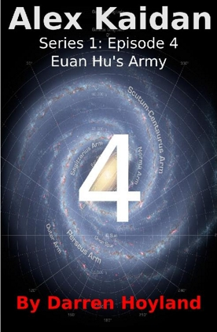

### Episode 4 of Alex Kaidan (Series 1)
# EUAN HU'S ARMY
## By Darren Hoyland
### Copyright © 2017 by Darren Hoyland

*****

Dedicated to Sam, who when I started writing this was not yet born and was still unnamed. We were far more decisive with that name than we were with your brother Ethan, who before that we were going to call Kaidan, but my parents didn't like it and before that we were going to call Alex, but your mum's parents didn't like it, and then I was stuck with two names I liked, but couldn't use, and I had to do something with them...

Anyway, this one's for Sam, who actually ended up being two by the time I'd finished it!

*****

*This is a work of fiction. Persons, living or dead, places or events are productions of the author's imagination. Any resemblance is purely coincidental, which is probably for the best as it is set in the future, on several other planets and is about aliens trying to wipe out humanity. Your support and respect for the copyright of the author is appreciated.*

*****

### Previously in Alex Kaidan:

After much careful planning, Alex Kaidan has successfully managed to achieve absolutely none of his mission objectives and get himself captured by the Pathfinders. In addition to this minor setback, he is out of contact range of his crew, one of the shuttles has had a rather large hole cut into the hull and the other shuttle has been left aimlessly floating around in space. Worst of all, Humanity's mortal enemies appear to have mistaken him for a cross-dresser. Needless to say, he is having a really bad Thursday. This is no way to save the The Village from annihilation. On the plus side, he has discovered a way to save Earth. Well, okay, he knows someone else who has discovered a way to save Earth. Look, the point is, Earth can be saved.

Assuming he lives.

Which, at this point, is all looking rather doubtful...

*****

Alex sat on the cold deck of the Pathfinder disc ship, face painted like a depressed clown and slumped against the wall. He had so little fight in him in the uncomfortably high gravity, sitting was all he seemed able to do.

He had not been this placid throughout his imprisonment.

After he had been dragged out of the shuttle, he had kicked out and thrown his fists in a blind rage at anything within reach. At one point, he managed to punch one of his captors in a nodule below its central communication organ and it had to go and sit down for a few minutes. Had Alex calmly accepted his fate, he probably would not have ended up so battered and bruised. The injuries he attained were not dispensed out of malice or aggression, but were rather a result of curiosity. They clearly found amusement in the small Human's fight and he was passed around between several of the giant Pathfinders. In the course of joint examination, Alex's injuries came from being picked up, turned upside down, his limbs pulled and body prodded. It was the type of investigation that could only be performed by those who simply had no thoughts of care for the well-being of their subject. Despite the goal of the Pathfinders being proclaimed to be to wipe out their mortal enemy: Humanity, it seemed that not many had actually seen a Human before. What was even stranger was that Alex's galactic translator did a good job of conveying that not many had even heard of Humanity either, but this was before his wrist console had been ripped off of his arm. The one exception to this was the Pathfinder that had entered the shuttle initially. It paid him little further attention, clearly having seen Humans before. Alex was still trying to work out how this Pathfinder spoke Human-English so well, not to mention just what, exactly, a 'ballerina' was.

These events took place in what could technically be described as a docking bay, however, it was more akin to a metallic cliff looking out over an unending artificial landscape that stretched out as far as the Human eye could see either side, with the inside of the hull on the other side of a huge chasm in front of him. If Alex had been paying attention, he would have seen a hive of hexagonal structures imprinted into the wall that faced the outer hull. Each side of each hexagon, including the one he had landed on generated its own local gravity field, and was designed to house up to three shuttles, although the vast majority were empty. However, most of this was lost to Alex who had not paid much attention to his surroundings as the shuttle was forced to land. He was too busy applying his cunning disguise, one which made him feel somewhat silly for trying to pull off now. It would seem that the Pathfinders were not as gullible as some of the other races. At the very least, he had not irreparably damaged his suit in the process and he was able to put it back on and partially reseal it, which helped to keep him a little warmer against the bitter cold of the room.

Once each of the aliens present had finished having look at him, they had carried him from the captured shuttle to a room not far from the docking bay. Of course, this was not until after they had spent some time carefully selecting a bag of appropriate size to shove over his head - the first three were too small and one of the aliens had to leave the room to go and get some bigger ones from elsewhere in the ship. Despite everything, Alex managed to take heart from the fact that it was not only his crew that needed to get their act together.

At this point, he had not yet quite managed to wear himself out wriggling from one of the alien's grasp, and started using up the last of his energy pacing around the brightly lit room. The only emotion that he felt to start with was anger. Anger at being examined, anger at being imprisoned, anger on behalf of his whole species for being gradually exterminated, even anger at now being ignored and left to rot. With there being no Pathfinders nearby available to pointlessly wrestle against, he had begun to punch the cell door until his fists were bruised and ached.

After this initial bout of enthusiastic self-harm, his energy began to subside and he began to plan his escape. For a while, he managed to convince himself that he had gotten himself out of worse situations before, and could get himself out of this, once he just set his mind to it. He continually scanned the room, looking for a flaw. Despite its large size and barren nature, it still somehow managed to make him feel claustrophobic. It may have had something to do with the height of the ceiling, being far taller than any room on a spaceship had any right to be. The door was equally imposing, obviously having been designed to accommodate the height of the Pathfinders. It was as solid and immobile as the walls, which were perfectly smooth to the touch and, other than the delineation of the doorway, were completely featureless. There was a dim, soft light that did not seem to emanate from any single source, and Alex wondered if it was being generated by the walls themselves. There did not seem to be any way of escaping.

Eventually, sheer panic took hold of his thoughts once more, and he almost considered asking a god for some kind of help. He wondered what he could offer in exchange for a few more years: that he would be a better person, that he would be nicer to Liam despite him being a weasel, that he would actually go and visit his fiancée next time he was back at The Village... but the realisation that he probably would never return there hit him even harder. He was not sure which god he should be asking anyway. From the sound of it, they were quite picky about only believing in one of them and not the others. Besides, he had not needed their help before and he could not help but feel that if he cashed it in now, that would make him a hypocrite, and they were probably sent to hell or something. Right now, death did not seem far away and so he did not want to mess anything up now.

Instead he slumped to the floor and ran through the actions that led him here in his mind. Had he been too careless in piloting his shuttle? Was there a better way he could have controlled the second shuttle that would have allowed him to stay out of sight? Was there anything else he could have done to escape the missiles that had been fired at him? He ran through the possibilities a hundred times, but it was all just pointless. Why had he even bothered? Why had he not taken Ava's suggestion to run away to the Nedic planet seriously? Dann certainly would have been happy there, Reza might even find his parents somewhere, and Liam would fit right in as a Nedic worshipper. Why was it that he always had to play the hero when it usually got him into life-threatening situations? He thought of Rhyna and how they met. His crew. His colleagues. His friends. He would never see them again.

As his hopes plummeted, so too did the temperature in the room, while the gravity increased rapidly, and he began to cry. Not for long though. He had to pull himself together. Whatever would the genocidal aliens think of him?

If he was going to die, he would at least do so honourably. He would not give up on his crew. If they were going to torture him, he would see how long he could hold out for. So he sat there, saving his energy to allow him to resist for as long as he could. Despite all this, there was no longer any thoughts of escape. He was in no way restrained, but the cold and intense gravitational field now all that occupied his mind and was more than enough to keep him still, curled up in a ball on the deck by the wall.

After an indefinite amount of time, he felt the gravity reduce to something more like that on the ship he was used to. The floor began to warm a little as well, nowhere near enough to be comfortable, but enough to stop him from shivering. Shortly thereafter, the doorway made a noise that could only reasonably be described as a 'clunk' as the locking mechanism was disengaged. It slid open sideways into the wall and a single Pathfinder entered the room.

Somehow, he could tell that this was the same Pathfinder as had entered his shuttle and who had spoken to him before. There was something a little different about how it held itself. Something he seemed more capable of relating to. It also seemed even taller somehow, until Alex remembered that he was still sat on the floor.

"Human!" It boomed, "Begin offering me information in exchange for us sparing your life which we will most certainly not do."

Alex tried very hard to ignore it and defiantly continued to stare at the opposing wall.

It reached down, picked him up and shook him violently, until Alex made an involuntary noise that went something like, "Gah!"

"Human! Commence information ofference."

Alex was not sure where to look, and eventually opted for the 'eye' on the arm that was currently holding him.

"Erm... no," he said. He could not even muster a "Is ofference even a word?".

"You will be tortured significantly less if you comply."

"Oh," said Alex, "Super."

It dropped him back to the floor and looked down at him with all five of its eyes. Alex slowly got to his feet. There was no psychological advantage to this as the Pathfinder was still vastly taller than he, whether sat or stood, but it was just nicer to stretch his legs after so long on the cold, hard floor.

Figuring that he was probably not going to enjoy the promised torturing part, he tried to delay it by asking, "How is your English so good?"

"You are impressed," said the Pathfinder. It was not a question.

"For an alien, I mean. It's passable."

"It is not my preferred Human language. The structure of Parsi always seemed preferable, and Korean for written. However, these other Human languages have been archived due to lack of need. We are only aware of Humans remaining that speak English and Chinese."

"Chinese?!" Could there be even more Humans than they already knew about?

"This is not of your concern."

Alex could feel his heart fill with hope, which sat oddly with his current lack of power.

The Pathfinder seemed to pick up on this and quickly moved to extinguish it, "English is the language you speak in your little village, isn't it?"

The mention of his home by this destroyer of worlds made his body tense up and eyes widen suddenly, removing any illusion of nonchalance. Alex forced the emotion down, and tried to brush it off in the presence of the Pathfinder anyway, "What Village?"

His voice betrayed him and broke with the words.

"Foolish Human. We are well aware of your small colony and are currently taking steps to eradicate it along with those statistic-obsessed Un who supported it. This is no doubt what brought you here. Agree."

This was also not a question, but Alex was momentarily preoccupied with the Pathfinder's choice of words while describing the Un. It had always struck the Humans of The Village as one of the Un's stranger quirks how they were so influenced by probabilities. They seemed to have based their whole culture around painstakingly calculating the odds of every outcome before making any kind of decision. They did not seem to have any kind of gut feeling. Still, it could well have been this that saved Humanity. As the years passed, Humans had quietly begun to speculate amongst themselves that the Un were studying them and had rescued them because they realised the chances of surviving the Pathfinders alone were slim. Of course, this may have been a gamble that was about to backfire as if the Pathfinders knew about The Village, then they would be gunning for the Un next. Still, the swipe at the Un's strange love of statistics was the first hint of emotion Alex detected from the alien.

Alex worked with it, "You're afraid of the Un."

"We are afraid of no race on this spiral arm. They once had the potential to be an inconvenience, but they have been attenuated. We will soon remove the threat entirely, as we did with your race."

"So, you are afraid of Humans too."

"Humans no longer pose a threat."

Despite feeling as if he was beginning to get the upper hand in the conversation, this made Alex lose control of his anger and fear, "A threat?! We weren't a threat to you. We'd barely ventured out of the atmosphere before you paved the entire solar system! Are you that weak?!"

"Such words will not result in regret if that is your intention. It is not what Humans were, but what you would become. Our actions then were justified to remove volatile species and prevent imbalance, as are our current actions. Now Human, you have become tedious. Tell me the level of defence in and around the Un main system and how to bypass them so that we may increase the efficiency of the process. I demand the codes to deactivate their mines, deep-space weapons arrays, electronic warfare, and anything else they may have."

Alex had spent more time than most in and around the Un primary solar system. Strachan currents were notorious for not going where you wanted them to go, so every trip back home usually ended up with them emerging somewhere close to each of the planets and moons the system had to offer. Prior to Hans Strachan's seminal work, long journeys from an exit point to a planet using standard propulsion were commonplace. It was well known that a Strachan current could lead to anywhere in space, although they did tend to stay close to regions of gravity (so while you could usually be reasonably confident that you would not end up stranded far from the galaxy, or in between the spiral arms), so Strachan currents tended to pass close to planets. The problem was that that was not necessarily the planet you wanted. These days, Alex was skilful enough to find another stream within a solar system, but it would depend on what was available and predictions were not always accurate, so he had seen his fair share of deep space too. Things were not always this way, however. Shortly after acquiring the ship, he and Dann had correctly put Yona Stev's instructions into practice to make a short journey away from the Village, but then they had been completely unable to find another Strachan current to bring the ship back home. The streams were transient by nature, but a combination of bad luck and inexperience meant that after they had exited while still within the system, they were then unable to find it again, or any other in the area. He and Dann travelled far using propulsion alone and nearly starved to death, before finally managing to find a way back home. It was then that they decided to get a bigger crew than two. The logic being that having other people dedicated to the many tasks required to keep the ship operational would free Alex up to concentrate on finding the next Strachan current. And if they weren't able to help them out of a similar situation in future, at least they could eat them.

During his travels throughout the Un primary solar system, Alex had never come across any defences other than what was normally found near a busy space port. While it was true that the Un did such have satellite- and ground-based cannons positioned on their planets and the moon which was home to the Village, as did all of the populated planets, they had nothing that could provide any resistance to what the Pathfinders were bringing. There were no weapons arrays elsewhere in the system and there were certainly no minefields.

Of course, the question was, would it be better to pretend the Un had nothing at all, thus taking the Pathfinder fleet by surprise when they encountered the meagre defences they did have? Or, should he pretend there were lots and keep them guessing?

This may mean they would be over-prepared for an attack, but it might buy the others more time to get there and warn them. In all honesty, no matter how prepared, the Pathfinder fleet would easily destroy anything the Un had anyway. Of course, he could just say nothing. But then the torture may begin. At least if he appeared to be compliant it would buy him more time as well. But in the hope of what...? A rescue? No, he was on his own.

Still, the more time he bought, the longer he would be kept alive and the more compliant he was, the less chance of being tortured. They would not know until they actually got there.

Alex thought some more. They would never believe the Un had no defences at all. All the other races had something. Better to lie about there being lots then.

In reality, not being tortured was by far the more powerful factor in the decision-making process, but Alex felt that he needed something else to justify his actions.

"Ooh, where do I start?" said Alex, "There's so many..."

"Your acquiescence is noted and will result in greatly reduced pain."

"Oh, okay. Thanks, I think. I'd rather be allowed to go free though."

"Your request will be considered."

"Really?"

"No."

"Oh. Okay, well I don't want to be tortured, so I'll tell you about the minefields first."

"There are multiple minefields?"

"Oh yes. Hundreds. Navigating the Un primary system is like... well, it's like a minefield."

*****

When Alex's imagination finally failed him and he could think of no more, he concluded with, "And that, I think, is everything we have."

The Pathfinder, who had been motionless for the previous four hours, as it patiently listened to Alex's ever more elaborate ramblings on non-existent Un weaponry, replied, "You've been very helpful, Human. I had no idea that the Un had gained the technological equivalent of what you describe as 'magic' and these dinosaur-mounted death-ray cannons sound like they might pose a challenge to security should they manage to infiltrate our ships. We will, of course, need to return to the subject of space-zombies at a later time, but to think that all this time their black-hole/neutron star generator weaponry had gone completely unnoticed is most concerning. This information will no doubt convince my superiors to increase the pace of Un annihilation."

"What? Oh." This was not the intended outcome, "Well, if you want to risk it. This is a nice ship, it would be a shame to see it burst into flames."

"This ship is invulnerable to fire. You would need the force of a star to make it 'burst into flames'."

"Well, if you want to risk it. The Un do have that power. You could, of course, simply leave them alone."

"We were happy to overlook the Un initially. They were one of the more prominent races, but they had no ambition. That was until you Humans came along. Now they are beginning to apply their skills in statistics to your scientific research and together you are starting to become a problem. This is what Humans do. It is why you must be destroyed, and we will wipe out one of the Un main system to serve as a warning to others who choose to keep such dangerous lifeforms."

"Well, they have come a long way in weapons research in a very short space of time, that's for sure!"

"There is the matter of independent validation of these details. Some of the words you have used sound familiar to me, but I will need more background information - if you will excuse me, I shall return shortly with different subunits that have also been to Earth."

"More wha-?" before Alex could finish his sentence, the Pathfinder had, without turning, walked swiftly out of the room, "Oh. Okay then."

It had left the gravity and temperature at the more comfortable level, but Alex was not sure if this was as a reward for his 'help' or if it had simply forgotten. Either way, Alex counted his blessings for the relative comfort he had been left in, but while doing so there was something nagging at him. He was about to slump back down on the floor again and maybe even take the opportunity to sleep while he still could, but that tiny something was still there, just out of his perception so that he could not quite pin it down. Like a tiny voice yelling at him, but barely making a sound.

Frustrated, he stood up and cast his eyes around the room. They settled on the only feature in the room: the door. The tiny voice became a cacophony. That was it: There had been no clunk.

Surely the Pathfinder could not have been that stupid?

Without wishing to get his hopes up he slowly moved towards the door, checking behind him just in case. In case of what, he had no idea, but he checked anyway.

He gently placed his hand flat against the door and prepared to try to slide it. Just to prove to himself that it could not be done, but it could: the door slid open with ease.

Ecstasy surged through Alex's veins and he had to shove his hand over his own mouth to stop himself from laughing out loud. It had to be a trap, surely?

But it was still worth a shot. It was not like he had anything else to do.

He slid the door open enough for him to get through, but dared not slide it open any further, and stuck his head out into a dimly lit corridor. To his right was nothing but an empty and perfectly straight corridor that seemed to stretch out to infinity. To his left, he could see the back of the Pathfinder. He quickly ducked back into the room and waited. While the Pathfinder did actually have an eye facing behind it, Alex was confident that it was not looking directly at him before he quickly retracted his head. The sudden change that accompanied his swift movement outside and back in again made him momentarily dizzy. He felt heavier inside the room, suggesting a highly localised gravity field.

He gave it a few moments, then stuck his head out of the doorway once more to see that the Pathfinder was no longer there. It must have gone into another of the rooms or turned into a different corridor.

Alex looked himself over. His suit was torn beyond repair, he was bruised all over and he really needed to pee. Well, it was as fit a state as he would ever be in, especially if the Pathfinder's promise of torture ever happened. Which it most definitely would if he was caught trying to escape. Then again, once it checked his facts, it would soon discover that he made it all up (He was particularly pleased with the concept of the "athlete's foot" biological doomsday weapon). This was his only chance and he had to take it.

He ventured out and turned the opposite way to that which the Pathfinder went and started to run. As he did so, he checked the ceiling for anything resembling a security camera. Fortunately, he had not seen any yet, or more to the point, none would have seen him. After several minutes of running in the same direction down the never-ending corridor, it became clear that he would have to turn soon enough - this would be the first place they would look for him - but how could he when every door he passed could potentially reveal a room full of Pathfinders? Eventually, the corridor split into two. He stopped just before the branching corridor and stood with his back to the wall, taking the chance to both rest and peek around the corner to see what was down there. It looked exactly the same as the corridor he was on. There were still no Pathfinders to be seen. They were big, but even they would have great difficulty filling a ship this size. The ship's corridors felt as deserted as his own.

On second inspection, he noticed that the corridor did have one difference to the current one. There was an end to it. Far in the distance: it was hard to see, but it definately was a wall. Fearing that it might be a dead-end, Alex chose to continue down the corridor he was on. He scuttled passed the other corridor and just as he began to run again, something in the distance caught his eye. Another Pathfinder had entered the same corridor as him.

Alex stopped and ran back to the other corridor. The panic seemed to be making him feel dizzy. He had no idea if it had seen him, but he had to assume it had. He turned into the corridor and ran as fast as he could.

He felt that the higher gravity was starting to take its toll. His heart pounded against his chest, his leg muscles burned and had run for so long that he began to feel nauseous, yet still he forced himself on. Finally, the end of the second corridor was in sight and he risked a look behind him. There was nothing. But what was he expecting? A gang of Pathfinders chasing him? If the other alien had seen him, it would probably report to the others, rather than chase after him. He would need to be vigilant. And he needed a better plan than running aimlessly down the corridors. Much to his relief, the wall revealed itself to be a T-junction of yet another corridor. He had no time to think about it and just turned left, constantly looking ahead and then behind him for Pathfinders.

He must have been constantly running for about ten minutes when he became so light-headed that he stumbled and tripped over his own feet, collapsing to the floor. Unable to get up, he dragged himself to the wall and just lay there, hoping it would provide a modicum more cover from any passing giant alien than if he just lay in the middle of the floor. He was cold and his skin tingled, he knew he needed to get up and run, but all he could do was sleep.

*****

Alex dreamt of the giant metallic tentacle, and how he had been powerless to stop it as it penetrated his shuttle. But this time, it did not divide into eight laser-wielding sub-tentacles to burn a hole in the door. Instead, it continued towards him and pushed up against the side of his face. His legs were covered in warm blood, was it his? He tried to push the tentacle from his face, but could do nothing stop it as it forced its way into his mouth and began to French-kiss him. The strange material from which the Pathfinders had built their robotic servant even tasted odd. It was so unpleasant that it woke him up and at that point he realised that he was sleeping with his mouth open and his tongue had begun to stick to the deck.

"I clearly need to get laid," Alex muttered to himself, as he lifted his head and looked at his surroundings.

Despite performing what could possibly be the worst tactical move in the history of Humankind since the paving of Earth, Alex was still there: On the floor, in the corridor where he had collapsed. It would also seem that he had urinated himself. The suit, which usually took care of that kind of thing, was so ruined that it had leaked out onto the floor. Had it not been for the headache that was now ten times worse than the hangover ever was, he would be quite embarrassed by the whole experience.

Alex had done dumb things before - quite often, in fact. Some may go so far as to say on a semi-regular basis - but deciding to have a nice nap in the midst of an escape was a whole new level of stupid. It was uncontrollable. Thinking about it, he did not feel so good now either. Had the Pathfinders done something to make him sleep? No, that did not make sense - surely if they were going to gas him, they would be here to collect him by now. He had been dreaming - R.E.M. sleep so that was likely to be twenty minutes, at least. How he even knew that was a mystery for another day. They had not drugged him at any point and he highly doubted that they had any airborne chemicals handy that were specific to Human physiology - they had a hard-enough time finding a bag that fit over his head.

Alex pushed himself up to standing and in doing so, realised that his finger-tips itched. He absent-mindedly looked down at his hands and noticed that they had taken on a very slight blue colour. Then he realised the answer. It was so simple that he could only blame a lack of Oxygen to his brain: There had been a lack of Oxygen to his brain!

The Pathfinders were Oxygen breathers, he knew that much, but maybe they did not need as high a concentration as Humans did? That would explain the headache. Of course, they might have deliberately cut off the Oxygen supply to the corridors, but if that was the case, he probably would not have woken up.

Alex began to lament the absence of his wrist console. It would have warned him of this and, before things got too bad, would have injected haem vesicles directly into his blood supply - this had got him out of a few scrapes in the past. Now though, without his wrist console, he just felt naked. And not 'fun naked' for that matter, either. He picked himself up and as he did so, his headache intensified to the point that he had to steady himself against the bulkhead to prevent himself from falling down again. Following a few deep breaths, the headache and dizziness subsided slightly, leaving him feeling relatively normal. Now that he knew about the low Oxygen, Alex decided he should take it easy for a while and so with this, he began walk, slowly, towards the next junction.

What was needed, he decided, was a plan. Or failing that a terminal. Not that he would be able to even read, let alone interact, with a Pathfinder terminal without his wrist console. The only way he could find it was by using the console in the shuttle. He might even get by with just that, although he doubted that it would have any of the software modules loaded onto it that would make the task of interpreting the Pathfinder language and operating system so less daunting. Still, if he could get away with just using the shuttle's, he made a mental note to remote wipe his wrist-console of the ship's authentication key codes, not to mention the embarrassing drunken photos he had on there.

As he approached another abandoned intersection, his attention was drawn to another important point: Where the hell was everyone? This was a giant Pathfinder ship, surely it should be filled with giant pathfinders?! However, there seemed to be very few on board. He looked up and around and could not see any of the typical signs of any internal sensors or cameras either. As he walked, Alex relaxed a little and one might go so far as to describe his gait as a 'leisurely meander' through the ship. It was not that he was suddenly immune to the fear of capture and torture, but he now knowing that if he over-exerted himself by running or panicking, he could end up passing out once again, and that would put him in even more danger, so he just walked, and took the opportunity to look around. It was all quite liberating really.

Three or four turns later, he saw some mysterious iconographics next to a line that started thick and tapered to a point. Alex could not be sure, but it did look very much like a sign. He had no idea what it said, but decided to treat it as an arrow and follow it. The meandering was starting to bore him by now anyway.

He was quite disappointed to find that the corridor turned into a dead end, but there were some more of the markings on the wall at the end, so he continued on to try to work out what they meant. After a few minutes of careful study, he was no closer to deciphering them. He absent-mindedly began to trace the curvature of one of them with his finger in an effort to kick-start his imagination, and as he touched it, a box around that particular set of symbols glowed a lighter shade for a moment. This was immediately followed by the section of floor he was standing on lifting up. Quickly, he leapt off the platform to the deck just before it entered a newly formed hole in the ceiling. Being unprepared, the fall twisted his ankle slightly, so he sat on the floor as he watched the hole in the ceiling reform itself and a second platform rise up into the recess left by the first in the deck. So, this must be an elevator of some kind. And the symbols were most likely destinations throughout the ship.

"Makes sense," mused Alex. Even the giant Pathfinders would not want to walk everywhere a ship this size.

Now all he had to do was work out which of the icons represented the shuttle bay or one of the field generators. Of course, he had no idea of what level he was on now. If he knew that, maybe he could use it as a Rosetta Stone (whoever she was).

Alex shrugged and just pressed the biggest one.

This time, he was prepared as the platform lifted from the floor and through the hole in the ceiling. He took careful notice that the decks were very thick, about half his height. Destroying this ship was going to be tough. He hoped he would live long enough to attempt it.

After three decks, the platform began to move horizontally along the deck. Alex had already started to feel exposed as he was paraded along the elevator's route for any passing Pathfinder to see, but when he saw the large conduits on the ceiling going off down another corridor, he jumped off the platform. He knew from his time wandering the corridors of his own ship that big conduits often led to important things, so he hobbled down the corridor to sneak a little look.

It was not long before he noticed an audible hum, and the more he followed, the louder it became until it vibrated in his chest. A glow from one of the bulkheads highlighted the presence of a window in the facing wall and Alex tip-toed closer to look through. The tiptoeing was somewhat redundant with all the noise, but he felt it appropriate.

The yellow-glow emanated from transparent pipes that weaved in and out of a metal-plated machine that was probably about three times larger than Alex's cabin. Watching the pulsating patterns of light was strangely mesmerising and Alex undoubtedly spent much longer than he should have done staring at it. He tore himself from it and turned away, directly into the leg of a Pathfinder who must have been watching him for as long as he had been watching the machine. Quickly, he turned to hobble away as fast as he could, but the Pathfinder simply scooped him up in its massive hands.

And so ended Alex Kaidan's first escape attempt.

*****

His interrogator somehow looked angry, "There's no such thing as a whirligig effluent rocket!"

Alex tried look solemnly at his feet, but there was something of a school teacher in the tone of the Pathfinder's voice.

"Are you smirking? You are smirking!"

It was strange that Alex could detect its rage. From the moment his interrogator had finally re-entered the room in which he was being interred once more, he could somehow tell that it was mad. While most races were known to express anger, the Human brain was not geared up to sense emotions of aliens without significant prior exposure to them, and it was very rare for any Human to be able to pick up on the subtle changes that displayed them so clearly to others within their respective populations. The same was true of Humans. With the exception of the Un, and only because they seemed to find pleasure in associating probabilities to everything, it would not be apparent to the other races to focus their observations on the small area in the front of the Human head and to associate the position of the visual sensory organs, the movements of the feeding orifice and the colour of the skin over time with their emotional state. However, this was different. It's emotions now seemed somehow apparent to him. Obvious, even. The Pathfinder itself seemed different. Was it even the same one as before? They all looked the same to Alex. It was, however, definitely not the one he had walked straight into because at one point, they were both in the room together.

"So, you think wasting my time is funny?"

Alex wanted to laugh at it, but he held his rebellion in check and focussed on the fact that this particular school teacher could soon be wielding torture implements.

"I was simply relaying the information that I had been passed. If it's not accurate then I apologise."

The Pathfinder turned all of its sensory organs to look at him. It seemed to relax a little and when it spoke once more, it reverted to the manner to which Alex was more accustomed to for a Pathfinder, as opposed to its previous outburst, "We find this difficult to believe. It is instead more probable that you may not have been fully compliant with us."

Alex shrugged.

"As for the matter of your escape, it is now acknowledged that keeping you in an unoccupied region of the ship is a mistake. We may also have to upgrade to a padlock in future. It was thought that your screams of terror would be a distraction to the crew. Your escape was not anticipated by the others."

"But it was by you?" asked Alex, who was genuinely curious.

"It was. I have more experience of dealing with Humans..."

There it was again. Was that pride? And since when did it start using 'I' over 'we'.

"How so?" said Alex, fishing.

But a monotone: "How did you escape?" was its only response.

"It wasn't hard. You left the door open."

One of the sensory organs looked towards the exit, "This was a mistake."

"Another mistake? That seems to be happening quite a lot these days," Alex was aware he was pushing it, but he doubted it would make his situation any worse than it already was, "I always assumed the Pathfinders were a far more professional outfit."

It did not rise to it, "We 'Pathfinders' as you seem to want to call us, are simply more used to dealing with less challenging entities. Very few of the other races would have risked attempting such an escape that would so obviously result in recapture. We will adjust our behaviour accordingly. This situation has also prompted some special measures on my part."

That sounded ominous, "Which are?"

"Tell me what you were doing in one of our field generator rooms," it said, ignoring his question, once more.

That caught Alex's attention. So, he had found the field generator. Well one of them. He refused to believe that he had been that lucky. Instead, the ship must be littered with them, "Have many of those field generator thingy rooms do you?"

Surprisingly, the Pathfinder did answer this question, "Why do you think our ship is so big?""

"Um, I dunno, compensating for something?"

"Creating our 'paths' requires a complex array of many thousands of generators to precisely shape the field and these need to be positioned in a way that is far beyond your level of understanding. To do this, we have created the largest ships in the region. You should be impressed by what you see."

There it was again. That was unmistakably the distinctly Human emotion of pride. He had no idea why it seemed to be becoming more like him, the longer it spent with him, but he might be able to use it.

"You seem to be very pleased with your ship."

"It is a marvel of engineering. I have spent so long here, but it is only now that I am starting to appreciate how magnificent it is."

"Yes, it's, erm, very nice. Why now?"

"Explain."

"You said that it's only now you've started to appreciate it - what's changed?"

The Pathfinder paused for a moment. Somehow, Alex could tell that it wanted to tell him something, but suddenly it reverted to its original state once more, "Enough! You will now repeat everything you previously told me for consistency checking. If you fail you will be tortured. And if you attempt to escape again, you will also be tortured."

"Well, okay, I promise not to try to escape aga - hey, look behind you!"

"I can already see behind me," replied the Pathfinder calmly, "I have five eyes".

"Oh yeah."

"Was that an escape attempt?"

"No," he lied.

"Yes, it was," said the giant, "you were attempting to divert my attention so that all of my eyes were looking behind me like this, and ... Human! Come back!"

But Alex was halfway down the corridor...

Alex had a plan. A plan that featured the word 'hope' quite a lot, but it was still a plan, and that's more than he had during his first escape. He had to get back to the elevator, find the landing bay, find his shuttle, hope it was not crawling with Pathfinders, hope that it had not been taken apart, use its terminal to find the location of his wrist console, then reacquire it and use it to hack into the Pathfinder network, assume control of one of their shuttles, or whatever they had, and deploy one of the pre-written general-purpose viruses and hope it was enough to screw up their weapons systems. Opening a back-door for later access to their systems once they arrived in the Un home system would probably also be helpful. Easy. Apart from his still injured ankle. And the Pathfinder currently chasing him.

He had learned something about the Pathfinders. Despite having such giant legs, they were slow. Although somewhat persistent, it would seem.

All the while the Pathfinder monotonically vocalising, "Human, this is foolish. Cease escaping immediately." as it ungracefully bounded after him. Then, in a display of emotion quite unfitting for what Alex had come to expect of the Pathfinders, it yelled, "Stop it! Stop it now!" like a child would.

He was so shocked that he almost did.

By the time that he made it to the elevator platforms, he had built up quite a gap between himself and the giant lumbering alien. Unfortunately, it was all for nothing once he realised that the platforms did not respond as they had before. They had been deactivated.

When the Pathfinder caught up with him, he was running back the way he came. It reached out and grabbed him as he tried to run past.

Neither of them said anything as he was carried back to his cell. Alex did not squirm this time. Instead he decided to save his energy for his next escape attempt. If 'look behind you' had worked, anything would. The Pathfinder left him in the room once again. This time, it made sure to lock the door.

Several hours later, during which time Alex slept, it returned. There was something very different about him this time. It was also odd that even Alex now thought of it as a him rather than an it - definitely 'him', as well. 'Her' somehow did not seem appropriate. It was all very strange.

"After much deliberation, I have decided that I admire your tenacity. You remind me of us, in a way. Maybe one day you could have learned to be like us. Not any more though." said the Pathfinder, ruefully, "Now, there are one or two other things we would like to clarify regarding the information you provided when you were asked for Un fleet tactics and standard operating manoeuvres."

"Okay...?"

"You mentioned an ordered sequence of arrangements referred to as the Proposition... which is followed by the Pole position... then Missionary position... and finally the Recovery position...?"

"Um... Yes?"

"When I asked you to describe these attack formations, you drew me this diagram." It said holding up the evidence for him to see.

"Yes, two long, parallel lines of attack vessels, forming a point, backed up by two clusters of support ships."

"And you said that this was commonly used for penetrating enemy defences."

"I believe I did, yes."

"It has since been pointed out to me that this three-dimensional arrangement of ships resembles the male genitalia of your species."

"Really? Well, I suppose it could do... if you look at it in a certain way..."

It continued, "Furthermore, our analysts inform me that there is a low probability that the Un home-world defence central command is buried four kilometres underground and encased within a giant 'bouncy castle'."

The Pathfinder sighed as it opened the case it had brought in with it and as it began to lay out the anatomically-agnostic torture implements from the case, Alex realised that he might have gone too far with that one.

"No...", he said.

"It brings me no pleasure doing this, you know. We're both intelligent beings. I mean, really, our two races are the only ones capable of advanced intelligent thought, unless you count the Un's particular skill at statistics, but that's more of an inherent trait. I see now that it is we that should have cultivated their obsession and used it to our advantage, not you. Then at least they would have been useful rather than a threat. Now we have to destroy them as well. Thanks to you. It's not easy being the bad guy, you know, but we are the responsible ones. You cannot be allowed to be a destabilising influence on the region."

Alex tried to speak again, but could not quite find the words.

"We could have just had a civilised conversation followed by your swift execution, you know, rather than all of this unpleasantness. We still can. Just tell me about the Un's defences and any security codes you may have. Also, I cannot believe you would have travelled out to us by shuttle alone, so the location of your main ship would go some way towards making up for your, quite frankly, rude behaviour up until this point."

Before Alex could speak, it continued, "I mean we treat you with respect, allow you to sleep, give you heat, increased oxygen, food-"

"There was food?"

"Well, no, but we would have done if you stayed in your cell, but you escaped. Twice. And you lied. And that's what hurts the most: the lying."

It picked up a knife the size of Alex's arm and suddenly lashed out with its other arms, pinning Alex to the floor.

"Hmm," it said as Alex fruitlessly struggled to escape its grasp, "I should have request an operating table in here. Now I have to squat."

It ungainly moved the over-sized knife until the tip was hovering above Alex's stomach.

"This is where the heart is if I remember correctly, now, tell me the truth. I want your secrets."

Deep down, he knew that once he had divulged the information, the alien would kill him. It had said as much already, but he was more afraid than he had ever before been in his life. The Pathfinder was about to cut him up. Fear kept him from thinking of a clever plan and he saw no escape. Alex could not help himself. He started to tell him everything.

"Okay, I was lying before, I'm sorry. Please, don't kill me."

"I can't believe I trusted you! The Un don't really have a love cannon at all, do they?!"

It pressed the knife slowly until it penetrated his suit and pressed against his skin.

"No, wait! It's just that I don't want to die. And I don't want you to kill me. Or even to hurt me. But I don't want you to kill any more Humans either. I'll tell you anything you want, just don't hurt me. Do you want my PIN number? It's 4392. That's all of my money. Not that I've got much, seeing as though I do this which technically isn't a job so it doesn't pay me any money, and not that you'll need it if you destroy The Village. Please don't destroy The Village. There's people down there. Good people. Well, not all of them, in fact I think the whole colony seems to be becoming increasingly conservative these days. Every time I go back, things seem to be a little bit worse. I mean the xenophobic attitude is kind of understandable what with you guys having paved the Earth and exposure to the other races potentially being a threat to our existence as they could easily go to you and tell them everything. Not that it matters as you clearly already seem to know. But do you know what the weird thing is, with the whole xenophobia thing, I mean. It's that people have started to hate the Un too. How can you hate the Un? They saved us, and all they ever talk about anyway is probabilities and outliers and all of that stuff. But it probably comes with the isolationist attitude. But it's not just aliens. The general public just seems to be getting less and less tolerant. And not just of aliens, they even seem to be turning on themselves. There's the rise of what the wing-nuts are calling 'traditional values' which just seem to be an excuse to lock women in the kitchen and beat up homosexuals. But there are good people. There's Juliana down there for a start. And Mei. I wonder why I said Jules first and not Mei?"

"Please stop talking now."

"No really, that's weird, why did I say her before the woman I'm engaged to be married to? I mean, there's nothing wrong with Mei, or the whole system of forced pairing really. I mean, it's my duty. For the integrity of future generations. Not that they'll be any if you have your way. Even if it did, there wouldn't be any future generations if I stick with Jules. I mean, she has that infertility thing going on. And she gets abuse for it from other people, like she's not good enough, like it's her fault she can contribute to the gene pool. It's not her fault. And she's a geneticist! She's probably done more to bring varied Human life into the world than any other woman could do through natural births. I mean, I'm a clone. That doesn't make me any less of a person. God, maybe us clones will be next on the hit-list of the right wingers because we're not 'traditional' enough. Never mind that we're saving the species! I'd be lucky to have Juliana. If she wants me. I don't know. Sticking with Mei just seems safer somehow. But I don't love her like I ... oh! I think I love her. Not Mei, Juliana!"

The pathfinder's grasp seemed to be loosening. Alex kept talking. He did not know if the alien was listening, but it felt good to talk. He told it all about the burden of leadership, about Sara and Matthius and whether they were alive or dead, about his new fear of lethal weaponry, and the stress of it all. As he spoke, the Pathfinder looked increasingly uncomfortable. It alternately shifted its weight amongst its feet. Four of its five sensory organs had been staring at the door for a good ten minutes, and the one looking at him seemed to have drooped further and further with each revelation.

Alex did not stop talking as it quietly said, "This has all been really helpful, thanks... I need to go and, uh, process all of this new information...."

Only the sound of the door being locked brought Alex out of his therapy session.

"Oh," he said, "You've gone."

This time, it was Alex's turn to get bored and it was not long before he fell asleep again. When he awoke, there was some water in an open container and a large cube of squishy material. By this time, Alex was very hungry and so after he bit into it and found that it did not taste too bad, he quickly devoured the rest of it. As he ate, he thought of the Nedic on his own ship and suddenly felt quite sorry for it. He vowed to release in the unlikely event that he should ever manage to get back to his ship. Meanwhile, there was no sign of the Pathfinder. It was many hours before it finally did return. When it did, he was almost pleased to see it.

"Before you say anything!" It said, quickly as it entered the room, "I have to demand that you give me far more specific answers to the questions from this point forward... please."

"You seem different," said Alex.

"Ah, I was wondering how long it would take you to notice my subtle transition."

"Um... Yeah, subtle."

"It has shown that much of what you have divulged is not accurate. This was anticipated and in an effort to better maximise our information extraction efficiency, I have taken it upon myself to source and incorporate an increasing number of subunits familiar with your home planet."

"Subunits?" said Alex, hoping to move the attention away from the fact that he had been feeding the Pathfinder misinformation.

"Unlike Humans, we are multicellular organisms."

Alex could just imagine Rhyna rolling her eyes at this statement, but he decided not to interrupt the Pathfinder when he was not trying to torture him.

It continued, "We do not naturally exist in this glorious form you see before you. We evolved as a collection of cells in a symbiotic relationship - the smallest number of cells that can act in this way is known to us as a sub-unit. Each has enough cells of each kind to exist independently, containing specialised sensory, structural, respiration and propulsion abilities as well as basic cognitive and memory functions. This is one thing that was never satisfactorily explained: We get smarter the more of us there are. With Humans, it tends to be the other way around."

"We call that group-think, and we're actually very proud of it..."

"Our modularity allows us to rearrange configurations and exchange subunits between us. Some of our kind went to your planet to conduct reconnaissance. We took on passable Human forms and walked among you to observe you in your natural environment. These individuals have since been redistributed amongst our population."

"You've been to Earth?"

"No, I have not been... only some of my sub-units have seen Earth... well, most of them, now, actually. So yes, technically, I have been, I suppose."

"What was it like?"

"It was interesting. As any other planet would be. I always liked your sky. I remember that. I like planets with clear skies that allow you to see for long distances. Your mountain-ranges were.... nice. In many ways, it reminded me of our own home, before the Izurth sent us here."

Izurth. Alex would need to remember that to ask it later.

"You were there for a long time, weren't you? Did you spend time amongst us?" probed Alex, "Did you enjoy being Human?"

"I was never quite... I was always impressed by how different any two Humans could be. You can be given the same information to any two Humans and they would come to different conclusions based on inherent beliefs. It was amazing - as if they were different species to one another. You're cultures actually also had several interesting ideas which might have benefited our society. I may even suggest that we implement them," It paused, deep in thought, "We... may have already suggested it. These subunits are what is left from the many of us that went. Yes, we made suggestions, but our leadership disagreed. They felt that it was a good thing that we redistributed our sub-units, so that we all share a common purpose, but you Humans all went in different directions. And yet still you managed to progress swifter than any race we had encountered in this region of space. It made us think that this could work for us. We felt that maybe we should not redistribute as often. That we become individuals. They did not respond well to the suggestion."

"And that's when they decided to have Earth destroyed?"

"I... cannot - that information is unavailable. After we destroyed your world, much of this information was deemed unimportant and so was lost in the regular cull."

"Cull?"

"The least important ten per cent of the sub-units are euthanised to keep the rest of us strong."

"Whoa! Really? Gotta purge those disruptive influences, right?" said Alex, cynically.

"Correct."

"Doesn't that make you angry?"

"No, why should it?"

"That your leadership is killing off ten percent of your population on a regular basis because they disagree with the way they're doing things? And that they split you up and redistributed you amongst the others?"

The Pathfinder said nothing.

"Do you think you learned something from us? Something that they were afraid of?"

"No."

"How do you feel?"

"What?"

"I think you're becoming more and more Human. I think you're getting Human emotions."

"You are incorrect."

"Why do you want to destroy us?"

"I have no opinion on the matter. It has been decided that you are too dangerous to be allowed to continue."

"Did we seem dangerous when you were on Earth? Did we seem like a threat to you?"

"I... that is irrelevant."

"Is it? You don't think we have a right to continue? You don't think that maybe what you did was unfair? Are you sure you're not feeling guilty for what you did to us?"

"No, no, no!" said the Pathfinder becoming visibly upset, "You cannot... It's not my fault. I didn't tell them to do it."

"But you didn't stop them."

"That's enough!"

"You're getting emotional"

"I am not!" protested the Pathfinder.

Alex softened his tone, "Let me go - at least that would go some way towards amending for what your people did to us."

"You will tell me what you know about the Un defences!"

"You're being irrational."

"Don't call me irrational! You're being mean. You're trying to use my sympathy against us! I will have to torture you."

Quickly one of the Pathfinder's arms grabbed another knife from the case it carried in another and held it up to Alex's throat.

Neither of the spoke for several seconds. Alex too afraid to move, the Pathfinder somehow visibly, emotionally torn. Then it released its grip and all of its sensory organs drooped.

"It's no good, I can't bring myself to do it. I can't do it."

Alex shifted sideways until his neck was away from the knife. Realising that the Pathfinder was not even looking any more, he continued moving sideways until he was clear of its reach, and then he proceeded to slowly and quietly walk out of the open door.

As he walked out, he heard the Pathfinder say, " I want to cry but I have no tear ducts!"

It was beginning to get embarrassing.

Alex did not make it very far. He saw that the corridor was now guarded by two other Pathfinders at either end. Giving up, he simply walked back into his cell.

*****

"Due to your subversive nature and your repeated, pointless escape attempts, I have decided that it is no longer viable to keep you alive and so you will be destroyed."

"Oh," said Alex, "I was hoping you might let me go, instead."

The Pathfinder had become far less emotional and far more 'Pathfindery'. If its earlier explanation was anything to go by, it had probably added more sub-units to counter the effect of those that had been exposed to Humanity, without losing the accumulated knowledge it had gained of Earth. It did look taller.

"You Humans are clearly brilliant military tacticians. I underestimated this previously, and for this reason alone, you are too dangerous to keep alive."

"Oh yes, my strategy of repeatedly walking out of an open door was a stroke of sheer military genius."

"Humans will bring chaos where we have brought order. You seem to be able to convince other races to follow you, yet you are resistant to our methods of doing the same. Your write complex pieces of code that have the sole purpose of breaking terminals or stealing information. Worst of all, you cannot be trusted to give sensible intelligence. I will have you moved shortly."

"Where am I going?"

"You will be executed."

"Oh."

"Seeing as though you were so interested in your people's past, I've arranged a special surprise for you. It will take some time to print, but you will meet it soon enough."

The words spoken by the Pathfinder made little sense, but the manner in which it was delivered made Alex anxious. It also led him to the conclusion that it had not fully managed to eradicate Human emotions. This one bore an uncanny resemblance to malice.

As it reversed, from Alex's perspective, back out to the doorway, he asked it a final question. It did not matter now, his death warrant had been signed, but he wanted to know.

"Who are the Izurth? Are they your leaders?"

The Pathfinder stopped, "If you are trying to subvert my cognitive processes once again, it will not work anymore."

Alex shook his head.

"No, the Izurth are not our leaders. We have our own leadership. They are merely a distant memory for my people. A dark time, during which we knew only war. They are the reason we are here and they are the reason you must be destroyed. They sent us from the other side of the galaxy to help them find a way here, so that they could open another front in their unending war against their enemy. The closest translation would probably be 'Guardians'. When we got here, we found only primitive races and we chose to disobey our gods and stay here instead. In this region, we became the dominant force. This was a place in which we could impose the order. This became our home. There will come a time when they will reach here. If not them, then the Guardians. It makes no difference: They are equal and opposite. When they arrive, they will bring their war, and on that day, we will go. We will leave this galaxy entirely."

"You can do that? Well, you should. I've seen one. Um... Last week, in fact," said Alex, somewhat desperately, "You should all go. Quickly."

"I see elements of them in you, as we have seen in many other races that were deemed too dangerous to continue. Your lies only highlight this. For the stability of the region, you will not be allowed to become like them and we will not allow ourselves to ever be dragged into such a thing ever again."

It made a high-pitched clicking noise, which Alex assumed was its own language as the two other Pathfinders from the corridor entered the room. Such a squeaky language coming from such a monstrous killing machine would under any other circumstance make Alex laugh, but he was scared. He had failed to outsmart it or to bargain with it. It had tired of him, and now he was going to be killed.

"I don't suppose I can challenge you to single unarmed combat instead?"

"I have something much more interesting in mind for you," it said as the other Pathfinders picked him up and dragged him out of the room.

*****

Alex had been deposited into a much larger room which had windows near the top, clearly for his captors to watch what was going to happen inside. There was no one there yet, so all Alex could do was sit and wait. Confusingly, this new observation room was comfortably warm and his first few breaths on arrival filled him with euphoria, suggesting the oxygen content was much higher in here. He doubted that it was for his benefit. The walls were once again barren with the exception of the door he entered by and a second much smaller door, no taller than his knee, on the facing wall.

After a very long time, he heard the Pathfinder speak, although the voice did not seem to emanate from anywhere in particular. He looked up and saw it in the window, looking back down at him.

"You wanted to know about your home planet? Well, it's finally ready."

"What's ready?"

"I'm so glad - yes, glad - that you asked... Before its demise, your planet was home to many other forms of life. Unlike my own species, you Humans were not sensible enough to not completely eradicate your competition. And so, after a small but significant amount of personal effort, I have arranged for you to meet one of your former native species."

"What? You kept one alive all this time in case you ran into a Human?!"

"No. This is something I have recreated using our printing technology, just for you."

"Is it a cow? I know cows."

"I could not see it at first, before the other sub-units were incorporated, and then it took me some time to understand, but you have 'annoyed' me. You have annoyed me and as a result, I will put you to death in the most..." he paused, and when he resumed, placed great emphasis on the first word, "...inhumane way possible."

"It's not going to be a cow, is it?"

"We Pathfinders are always learning. There is much to learn from nature. Your planet had four billion years of life."

"What a shame you destroyed it" said Alex, bitterly.

"Four billion years of evolution can produce some wonderfully violent predators. We used to record several of each species being killed horribly by its natural predator so we can study the most efficient ways in which to fight them. It became something of a tradition. However, as we have never needed to engage in any kind of fight with any such inferior race, this practice has been stopped."

"What a shame."

"Not to worry. We still kept records from our time there so we shall see how well you fair against a selection of fauna. While I was out, I had what I believe may have been one of Humankind's most ferocious natural predators printed out. It took a few tries to get one that had its blood pumper beating, but I'm sure watching your limbs being torn from your body will make all the effort worthwhile."

"Wait!"

"What is it now?" asked the Pathfinder, impatiently.

"Um," said Alex, as he hastily scanned the room for something to talk about in an effort to prolong his life, "So you have a room just for exposing Humans to predators?"

"Not just Humans, but yes. We do."

Alex was at a loss to find anything else in the otherwise empty room that he could goad the Pathfinder into talking about, but the presence of the small door had been bothering him and if he was going to die horribly, he would at the very least satiate his curiosity first, "Really?"

"We have such a redundantly large ship that there's a room for everything. Engine room, dining room, living room, dying room, laundry room, music room, torture room, gift-wrapping room, kitchen, model alien crushing room, you name it... Now, I tire of you. Time to meet your ancestral enemy."

Alex felt a chill through his body as he turned his head to look at the smaller door.

As it slowly opened, the Pathfinder talked about his recreation absent-mindedly, "I hope I got the specifications correct. There was only so much I remembered and only so much data we had retained in the archives... "

A noise came from down the small corridor behind the door. It was dark, but Alex was certain he heard the low pitch, grumbling of some soon to be revealed beast. There was nothing he could use to defend himself from it, other than his own body, so he prepared himself to give it an almighty kick in the head, assuming it had one. He inched closer and moved to the side of the tunnel entrance. He reasoned that if it was anything like Humans, and cows as he had also recently discovered, a force to the head should be effective in rendering it unconscious, if only he could land a well-placed blow.

But Alex could not bring himself to do it. Fear overcame him and he backed away from the tunnel entrance.

Eventually the savage beast entered the room. Alex first noticed the eyes. They were the eyes of a natural hunter, both facing forward, focussed into a predatory stare. He caught a glimpse of teeth, designed to rip flesh. Its ears were sharpened to a point, and it had a twisted, curled tail. It's menacingly soft, fluffy fur covered its ferociously tiny frame.

Alex backed up against the wall as the monstrously cute animal aggressively trotted towards him.

Something prevented Alex from defending himself. At first, he believed that he was paralysed by fear, but as the nightmarish creature began sniffing his leg, for some reason, he could not bring himself to kick it.

After a quick sniff, the creature lifted itself on its back paws and latched it from legs around Alex's own. Alex tried to shake it off, but it hung on and then began to rhythmically move back and forth.

"Argh!" screamed Alex, for a short while, until he realised that it was not trying to rip his foot off at all. In fact, it seemed to be doing something entirely different.

"Mwahahaha!" bellowed the Pathfinder as the miniature poodle continued to grind away.

Alex was not sure what to do. Humanity's natural enemy did not appear to be particularly difficult to fend off, should Alex choose to. It did not, however, seem to be particularly interested in devouring him after all, in fact, it seemed to be quite enjoying itself. Meanwhile, Alex could not help but notice that the small door was still open.

The manic laughter coming from the Pathfinder stopped once it noticed that Alex had begun to crawl on all fours into the tunnel, but it was in no position to stop him. It had clearly assumed that the beast would have ripped him to shreds by now. Instead the beast in question clung on to Alex's shin as he made his escape.

The tunnel led to a giant room that was filled with equipment, but had the unmistakable character of a laboratory. Directly in front of the tunnel was an open area fenced off by transparent walls that came up to Alex's hip, clearly designed to keep the Earth animal that Alex would later learn was called a 'dog' from going in any direction other than into Alex's cell. As soon as he had crawled out of the tunnel, the dog ceased its activities and suddenly became very scared. When he stood, it chose to hide in between his legs, as opposed to trying to copulate with them. Beyond the short wall were rows and rows of scientific machinery, the closest one feeding into a sliding door in the wall. If the Pathfinder was to be believed, this must have been the machine that had just printed out the dog, layer by layer. It did not sound like a particularly pleasant way to be brought into the universe, and so Alex did not blame it for being so scared by this room. Other than this biological-printer, the machines seem to be separated by type. While his eye was admittedly untrained to much of it, there were alien plants growing in this section, bubbling liquids in another and various optics scattered around a third. As he scanned the room, he noticed a Pathfinder in one of the far sections and he ducked down quickly, nearly squashing the dog.

Knowing that his time was very limited, he risked a peek to find that the Pathfinder scientist was still in the same location, although it had all of its sensory organs pointed towards the bench, and so was clearly absorbed in some experiment or other and had not yet been alerted to his presence.

With only minor difficulty, Alex pulled himself up and over the wall, and landed awkwardly on his already-injured foot. He ignored it and started to move away, but the dog began to whine and scratch at the wall. Not wanting to draw attention, he pulled himself up once more and scooped it up into his arm, in much the same way as the Pathfinders had to him earlier on, and they both dropped back onto the floor outside of the transparent walls.

Still carrying the dog, Alex bowed down low and quietly ran in the opposite direction to the Pathfinder scientist. After several minutes that felt like hours, he saw a door slightly to his left of the massive room in the distance. However, as he moved towards it, he noticed a device on the far bench that did not seem to belong there. Being unable to resist, he took a longer look. It was undoubtedly a piece of Sereti technology that had wires of more Pathfinder appearance attached to it, signalling that it must have been undergoing some kind of automated analysis. He stopped and looked around. It was not alone. There were several other 'out of place' items, and Alex realised that this was the end of a section that seemed to be devoted to the study of, or maybe just for gathering intelligence from alien artefacts.

Instead of moving towards the door, he instead turned into this section. The dog obviously did not think that this was a good idea, as it buried its head in his elbow, but Alex saw an opportunity. With no Pathfinders in sight, he perused through the items hoping to find his wrist console, or at least something that he could use. He picked up a Nedic personal terminal, hoping that his recent experience with Nedic shuttle's might help him, and to his delight, realised that there was an Un console lying underneath it. He grabbed the device and activated it. It reported that it was low on power, and that its full functionality was restricted to the owner of the device who Alex doubted was still alive to be needing it, but he could still use its guest functionality to allow him to use it to locate his own console.

He put the animal down, which chose to return to between his legs, and requested that the console try to communicate with his own, using standard frequencies. It would no doubt give away his position to anyone who cared to be listening, but it was already obvious where he was. There were not a lot of places he could be hiding: Once through the tunnel, there was nowhere else he could have gone other than this room. What was surprising was how long it was taking his captors to come and find him. It must be a very large ship, with very few Pathfinders indeed, if it was taking them this long. The scientist, possibly too absorbed in its work, must not have been interested in such pursuits.

Finally, his console replied. It was still functional. Giving his authorisation key, he activated the camera and noticed that its surroundings were very similar to his own. Deciding the risk was worth the while, he set it to produce an audible ping every five seconds in the hope that he would be able to hear it. The power on the Un device failed, but a quiet ping from not far to his left reassured him that it had managed to send this final command before it did so.

When Alex found his console, it was wired up to the Pathfinder machine in the same manner as the Sereti device had been. He was close to ripping it out, but the thought struck him that if it was plugged into their machine for analysis, they probably were not expecting it to analyse back. Sure enough, when he ran a few basic, exploratory commands through it, the Pathfinder system naively obliged. Alex thought about how the Pathfinder had implied that Humans were the only ones that wrote viruses. He certainly knew of no other race that did it. If that were the case, he imagined that there would be very little defensive programming done within their system. Unfortunately, he had already spent far too much time here, and he did not have time to craft a custom-written virus. What he could do however, was deploy a couple of his old favourites. He quickly installed a small script that would remotely grant him a back-door to the Pathfinder system through this machine and another which would analyse their network and try to work out a few commands. He left them running as he put the console back in its rightful place. It was not long before it got to work by injecting the much overdue haem vesicles into his arm.

As he detached the final wire from it, he heard high-pitched clicking between several Pathfinders. He looked at his planned escaped route, only to find that it was from that direction that four of them had entered the room. One walked differently to the other three and he could instantly tell that it was his interrogator. They had not seen him yet, so he ducked down as low as he could until he was level with the dog that was still following him, clearly deciding to take its chances with him over the alien giants.

Alex checked his console to see if the scripts had managed to find anything resembling a map. It helpfully loaded in some schematics of the ship it had found into a familiar navigation program. While the information was still incomplete, he could see fairly well how to get to the excessively large shuttle bay. He programmed in the longer, slightly convoluted route to avoid the compromised door and the bench with the scientist. He worked fast and was only distracted, briefly, when the dog started to lick his face.

"Okay, whatever you are, that's just creepy."

It wagged its tail and, when Alex started to swiftly and stealthily follow his escape route, it followed along.

Now that Alex had an idea of where he was going, he moved fast. If the Pathfinders saw him leave the room, then they could not keep up with him now that he had enough oxygen flowing through his arteries. He also had his wrist console inject an analgesic to allow him to fully ignore the pain in his leg, although the adrenaline may have done the majority of the work for him already.

His route led him through the now familiar-looking corridors down which he had previously run, but he only used the elevator platforms when he needed to change levels. He only had to stop on two occasions. The first was when he realise that the dog could not keep up without the oxygen infusion and he had to go back a few metres to pick him up. The second was when his path led him up to a door that was not as obliging as the one that led from the alien laboratory.

Alex figured that they had finally begun to implement some basic security measures and had closed and locked the doors. Unfortunately, his wrist console informed him that this particular door was the last thing that stood between him and the shuttle bay. He checked for an alternative, but found none. Instead he used his wrist console to access the machine he had compromised earlier via his back door.

As a terminal for conducting scientific analysis it had no special privileges, but the Pathfinders had given it direct access to other machines that had. Alex could only speculate on why they would do such a thing. It was probable that they had become complacent and had wanted the analysis machine to be able to upload its data to a central server, and doing this had been the easiest method. He noted that their system was more than capable of correctly securing itself, but the Pathfinders had not only ignored these security measures, but actively bypassed them for an easier life. Little did whichever one had done this know that it would be the key to Alex's escape.

He scanned through its recent actions and found what he translated to be the most likely looking command to upload data to a central server. The server's address was a sequence of octal numerals, using which Alex was then able to access the server directly. Having no idea how to ask it to open the doors, Alex ran an automated analysis script to try to find out the commands he could give it. The console took a while gather and process this information, during which time Alex had to stand there, doing nothing except to look nervous. He was so close. If he could get through this door, he had a chance of freedom. Back there was only death and the Pathfinders, while not fast, were definitely coming.

Finally, the console reported back that its analysis was complete. It had limited access to the ships systems, including internal door control. He opened the door and saw several shuttles. For some reason, he thought there might have been more, but disregarded this thought for now as he ran to the nearest shuttle. As he did so, he ordered the door that he had spent so long trying to open to be closed and locked behind him. Once again, there were no Pathfinders present.

Now that he had a wrist console, complete with analysed protocols for the Pathfinder systems, he felt confident that he could pilot one of their shuttles. Alex approached the closest one and stopped at the door. Above his head was a platform that led to the entrance to the shuttle. Presumably, there were some kind of stairs somewhere that the Pathfinders would normally use. They were big, but not this big. Alex did not have time to find them and so he simply leapt up and grabbed onto the ledge. Realising that he would need his other hand in order to pull himself up, he swung the animal up above him onto the platform. It would not be fair to refer to the manoeuvre as a throw, but the thud with which the animal landed followed by a slight whimper suggested that it was not quite the graceful and dignified placement that Alex had planned. Now that he had both hands on the ledge, he was able to pull himself up.

"Sorry about that," he said as he walked up to the open entrance way. The dog did not follow this time. Alex stopped and looked back, "You coming or what?"

The dog took a moment, presumably to be weigh up its options between giant, alien monsters and throwey-Human person, but eventually decided to give Alex the benefit of the doubt. It forgivingly trotted back to his side. Alex rolled his eyes and they both entered the shuttle.

Once inside, Alex looked for the pilot's seat to no avail. The entire shuttle was simply a single cavernous space with no chairs, windows or terminals. Presumably, they gave the shuttle commands via some kind of remote console, not too dissimilar from his wrist console. He tried it out where he stood, and he successfully managed to use it to access the shuttle's systems. Once again, he deployed the script for creating a back-door to the shuttle's systems. He already had access via the main ship which he had previously compromised, but he was planning to be out of range as quickly as possible and was not sure if the connection would need to be reverified after once this had happened. He did not like the idea of losing access to the shuttle when he was out in deep space. He might be forced to eat the dog or something. While the script ran, he did what he could with what he had. He activated the lights and sealed the door closed. That was the easy part. Increasing the temperature and oxygen concentration to something that they found more comfortable was a little harder, and as much as Alex would have liked to have corrected the gravity setting, he had no idea where to start. Besides, his script had now finished running, and he had wasted far too much time on creature comforts already.

After a brief period of time familiarising himself with the commands returned by his script, he was confident that he could fly the shuttle. He was delighted to find that the ship obliged when he requested the outer doors to open.

Alex had not yet worked out how he was going to escape the same fate he had the last time he was floating around outside a Pathfinder ship, or more likely a worse fate now that they had already decided to get rid of him, but he knew it was only a matter of time before they caught up with him and he felt the need to be mobile. He ordered the shuttle to take off and sneak towards the docking bay door, keeping the noise to a minimum like a church mouse who had recently graduated from ninja training school.

The shuttle lurched backwards and nearly reversed into the wall behind him.

"Ah, then this one must be forward then."

The dog buried its head in between its legs, and Alex tried again.

He soared out of the hexagonal bay and crossed the gulf towards the open docking bay door, and looked back to see how foolish he had been in thinking there were only a few shuttles. He now saw the hive of similar hexagonal bays and the masses of shuttles. He also saw several Pathfinders trying to set up the tentacle in completely the wrong bay. They had obviously seen him, as they gave up on the tentacle and stared up at him. They made no attempt to scramble towards the shuttles, which made Alex nervous.

If they were going to stop him, then clearly, they were going to use the disc ship's weapons or those of the other ships.

But this had given him an idea. He ordered the shuttle to hang around near the door - just in case they decided to close it - and quickly wrote a script to repeat the commands that he had made in stealing this shuttle, and then propagated it out to all of the other shuttles.

Suddenly, he was in command of a fleet of his own.

He instructed all of the shuttles to block all remote commands from any source other than himself, as he did not wish for the Pathfinders to take back control, nor did he wish for his final act of sabotage to affect the shuttles. That being done, he deployed every single virus he had in his console onto the disc ship's systems, whether it had any chance of working or not. He did not have time to select the most appropriate ones and most had some kind of built-in ability to adapt to whatever operating system onto which they were loaded anyway. Then he instructed the shuttles to follow him out of the docking bay door and form a shell around the shuttle he was in to shield him from the laser. He doubted it would last very long, but with any luck, it should get him to the nearest stream.

Now that one or more of his viruses were beginning to run amok in whatever systems it had managed to gain access to, he moved his fleet forward and out of the door. Almost instantly, his shuttle lurched and hit another in front of him, causing him to fall on the floor. From the information returned by his console, it was clear that the shuttle in front had been fired upon. The Pathfinders seemed to have noticed that somebody was borrowing their entire compliment of shuttles. It looked like it came from small weapons fire, rather than from the ship itself. That was a good sign, but the damage done was still enough to render the propulsion system of that shuttle useless.

From the position in which he fell, he ordered his fleet to advance out of the door and for one of the other shuttles to take the place of the damaged one.

He noticed with great satisfaction that he had not instantly been killed as he left the disc ship, which strongly suggested that it's weapon systems were offline. The viruses were clearly doing their job.

He thought for a moment whether 'viruses' was indeed the plural of virus. Maybe it should be 'virii'? 'Virae'? V-

His console notified him that another shuttle to his left had just disintegrated. The dog, completely oblivious to anything going on outside of the apparent safety of the shuttle let out a yelp as Alex suddenly screamed in a most unmanly fashion. Another shuttle to his left was then also hit.

He ascertained that the fire must be coming from one of the warships in the direction. He had safety in numbers, and the other shuttles were shielding him for now, but that would not last for long. Sure enough, another one disintegrated.

He quickly checked to see if there was a better place he could go to shield his mini-fleet from the line of sight of the warship. From what he could see, there did not appear to be anywhere better than where he was. The disc ship was already shielding him from the majority of the Pathfinder fleet. If he moved, the others would have a clear shot at him. If he waited any longer, the others would flank his position, or the disc ship would manage to free up their systems from his viruses. He had hoped that the viruses would eventually propagate themselves to the other ships, but that would take time and would depend on what communication protocols the Pathfinder fleet used and whether they were sensible enough to disconnect themselves from the other ships until they could purge it.

His only course of action was to scatter the shuttles in different directions and hope he could make it as far as a Strachan current. He still wanted some degree of protection, so he grouped the shuttles into fours and sent them in various directions. In total he had thirty-seven shuttles, giving him nine groups. He had one shuttle left over and was was tempted to put it in his group for the extra shielding, but decided that that would draw attention to his group and instead allocated it to one of the neighbouring groups. As his shuttle lurched forward with an unhealthy acceleration, he made sure to throw in the occasional random change of direction, to make the Pathfinder's target practice just that little bit harder.

The plan seemed to be working. The Pathfinders gave chase, but he was lucky enough to not be in a group selected by each of the seven functional Pathfinder ships.

Alex checked his console for information of the nearest Strachan current so he could make a run for it. On a hunch, he also pulled in data from the Pathfinder shuttle. It was teaming with up-to-date information on nearby Strachan currents, hundreds of them. Alex did not realise that there could be that many.

"This is incredible," he muttered to himself, "if only I knew how they generated this data...".

Amazing as the data was, he had more pressing concerns. By now, the group containing the fifth shuttle had now been destroyed and the pursuing Pathfinder would now be looking for another group to eliminate, and his group was the closest. If he hung around any longer, they would pick off each and every shuttle, including the one he was in. He was not too far from a stream - it was not going anywhere near where his crew had left him. Even so, if he made any obvious movement towards a stream then they would know which shuttle he was in. Suddenly, he had an idea: Using his new-found data, he selected a shuttle closest to a Strachan current - any Strachan current. There were so many to choose from, and he had so many shuttles available, that it was not difficult to find a shuttle that was practically on top of one. There were other candidates, but he ordered that one shuttle to enter the stream and then made all other shuttles - his own included - to stop. The shuttle entered the stream while the others were left to drift.

The Pathfinders took the bait. The four warships moved towards the point at which his decoy shuttle entered the Strachan current, and entered in pursuit. That left the three-ring ship, which were still well armed and would no doubt be clearing up the remaining shuttles.

Finally, the moment had come to make a break for it. He had come a long way in the seventeen hours that his console had informed him that he had been held captive by the Pathfinders, but he could follow the path that they had laid back to where his crew had left him. Alex sent out one final set of commands to all of his remaining shuttles: he ordered each of them to move to a different, nearby Strachan current, arriving at the same time he arrived at the path. Once they were all in place, they were all to enter simultaneously.

The shuttles all suddenly came alive and started moving in different directions. The crews of the three ring ships had presumably thought that the shuttle that was carrying Alex had escaped already, and so did not expect them to begin this mass exodus. They began firing, randomly taking out three or four shuttles before Alex entered the path.

Alex was worried. He tried not to be worried, and to push it to the back of his mind, but the path still made him nervous. There was still so much that they did not know about travelling along these stretches of deformed space-time created by the overlap between two different universes, while the Pathfinders knew so much that they were able to build their own. It should have reassured him that he was in a Pathfinder shuttle then, but traversing the streams in a shuttle had always previously meant gambling with his life. He did now know if it would make the journey any safer because he was in a path, or because the shuttle was Pathfinder technology, or if he was still in as much danger as he normally would be and he was just trying to convince himself that he would be okay because he was desperate.

The shuttle came with its own set of problems, though. In this case the shuttle was entirely empty except for himself, the dog and a volume defyingly large pile of faeces left by the dog in the corner. He had been unable to work out how to display an external projection and there were not even any windows to take his mind off things. Not that Alex would be able to see anything out of a real window while in a stream, but sometimes he just like to stare out at the black void. It was probably for the best anyway, as Alex might have been tempted to open one to let out the smell.

In its favour, he knew that Pathfinder technology would potentially allow him to travel much faster than he would in an Un-designed ship, and even to accelerate. However, he did not know if the Pathfinder shuttle also had this ability or not, and if it did, he had no idea if it he had to do something special to activate it. He wondered if this was something unique to paths or if it also applied to normal Strachan currents as well. In any case, he could not find any hint of being able to turn it on via his wrist console, so he could only hope that it was available and in use. He also hoped that it would not be necessary, but for all he knew, the Pathfinder ring ships were right behind him.

It was entirely possible that they were about to destroy him, or that they were just waiting for him to exit the path first and then and destroy him then. It was also possible that they had not worked out that he was in the shuttle that was heading back the way he came. Surely, they would have worked out by now that he would be returning the way he came to meet up with his ship? But they were alien, with a completely different set of assumptions. For instance, the shuttle seemed to be holding up very well in the path - maybe they would not think prolonged travel in a shuttle was suicide, as Alex would under normal conditions? If so, then they may have assumed that he could have been in any of the shuttles heading to one of any number of different locations? There must have been lots of confusion because Alex had successfully managed to split up their fleet and steal all of their shuttles from the disc ship, and they could not follow them all.

No, it was dangerous for Alex to think that way. For all he knew, their other ships may have had enough spare shuttles that they could send one in each direction after each of the decoy shuttles once they got their act together? He had to work on the assumption that they knew where he was headed and that they were indeed right behind him.

He clearly could not go to the rendezvous point. It was in the region of space where the Pathfinders had found him, so they would expect him to go there, and the time-frame in which he had to meet his crew had long since expired. His only chance of both surviving and finding them was to go to the Nedic graveyard. At the very least there would be things to hide behind while he waited to see if he was being followed or not.

*****

Alex exited the path with all of his sensors on. He let it get a good scan before disabling them, so as to not broadcast his position to any Pathfinder ships that may soon exit the path behind him, while he headed straight for the nearest large floaty thing, of which there were plenty. Too many, in fact: it was dangerous being so close to all of the debris from the destroyed Nedic outpost. But it was also a good place to hide. Appropriately enough, this particular large, floaty thing was a curved section of the shuttle bay of the station, and he matched his speed and rotation so as to attach his shuttle to the inside of it.

All the while, he had one eye on the region of space where the path intersected, looking out for any pursuing Pathfinders. Nothing happened for quite some time, and he risked a second scan. It was then that he noticed two intact ships, which were hastily making their way towards the path. The smaller of the two looked wonderfully familiar and could not repress a manic laugh. The dog buried its head beneath its leg once again, regretting its decision not to stay with the giant, alien monsters. Alex quickly instructed his wrist console to transmit via the stolen shuttle. He had to manually lift the collar on his suit so the microphone was close to his mouth - his suit had taken as much of a battering as he had, "Anyone in?"

There was no response for a few seconds. Alex was about to try again with something a little more descriptive when the response came, "Alex?"

On hearing Dann's voice, he was overwhelmed with emotion.

"Most of him," he replied, fighting off tears.

"It's Alex!" shouted Dann as he burst into a happy laughter, "He made it!".

"Alex?" This time it was Rhyna.

"It's so good to hear your voices. I'm the one in the Pathfinder shuttle, in case you're wondering. Any chance someone can come and pick me up?"

"Yeah, we were just about to scarper when we saw it," said Dann.

"I've got us some good information on the disc ship, but it all got a bit messy. By the look of things, they haven't followed me though. I think I got away with it."

The radio was silent for a few moments before Dann came back on, sounding slightly annoyed, this time, "Ava wants to know how we're supposed to know it's really you."

"Um, I haven't shot you, I guess."

"Good point," said Dann, then he said, "Hey Liam, you heard the man. Let's go get him."

It took Alex a while to figure out how to open the door once the shuttle had docked with the ship and the thought crossed his mind that they may have initially developed the tentacle purely out of frustration with their somewhat temperamental door mechanism.

When he did get to leave the shuttle, he was surprised to find most of the crew waiting for him. Dann and Rhyna rushed forwards and gave him a hug with the others holding back for a moment. He shook their hands and even Ava smiled at him and said, "I'm glad you made it back okay."

For the first time in as long as he remembered, he felt purely happy.

"Erm, Captain?" said Reza, "Why are you wearing lipstick?"

Alex opened his mouth to begin to explain, when suddenly, he noticed a new face in the crowd. "Who are you?" he asked, suddenly very serious.

"Oh, right, yeah," said Gino. He presented his arm towards the man, ready to make a formal introduction.

Before he could, Dann interrupted and said, with great delight, "You'd probably be better off with 'You are Hu'."

"That never gets old," said the man, shaking his head, "My name is Euan Hu."

Euan Hu was a quite a lot shorter than Alex, with a neatly trimmed, grey beard. His style of clothing was dated by at least a generation, despite the clothes themselves looking brand new. Alex had no idea when the last time he had seen a fellow Human was, but never the less, he had a commanding presence that belied his short stature.

"Okay, Mr. Hu, it's a pleasure to meet you, but how exactly did you find yourself a passenger on my ship?"

"Oh, I'm just visiting," replied Euan Hu, nonchalantly.

Puzzled, Alex looked at his crew. Rhyna responded, "We found Euan in the Nedic graveyard. He has a rather large ship of his own and has offered to help us."

"I'm sorry to have to tell you that I have laid claim to the area of space that your crew seems to refer to as 'the graveyard', and as I got there first, all salvage rights are mine," he said, but in good humour, "However, after hearing that The Village is in danger, I have decided that my services and my ship, 'The Jialiu' are at your full disposal."

"Euan is from The Village, explained Rhyna, "He still has family there."

"Yes, The Jialiu is actually named after my two beautiful daughters."

"Really?" said Alex, "I've never heard of anyone else leaving, let alone having their own ship."

Euan shrugged, "Once I'd done my duty and raised my children past the age of fifteen, I saw no need to stay. I hitched a lift from an Un with whom I had befriended and we sought adventure among the stars.

"But your daughters don't live with you on The Jia... um, on your ship now?"

"My daughters still reside in The Village. They are the reason why I have offered my assistance."

"Oh. Right. Okay then, you'll all have to bring me up to speed on that one, but for now we shouldn't hang around here for too long. I managed to steal a few shuttles and sent them off in different directions"

"You had the opportunity to sneak passed, and you came back here?" asked Reza, surprised.

"I didn't have much time to think about it, but I wasn't going to get far in a shuttle anyway."

"So, can we sneak passed now?"

"There's no telling when the escorts will get back. Those decoy shuttles wouldn't keep the smaller Pathfinder ships occupied for long. We're still going to need to cause a diversion and stop them from following us."

"Great. You've done it already, so they're not going to fall for the decoy plan again. We're back to where we started then." said Ava.

"Not quite, I got the data we needed. It should tell us precisely where the field generators are located. Actually, Christian, would you take a look at these schematics please," said Alex as he sent a copy from his wrist console to Christian, "See if you can work out the best place to hit them."

Alex continued, "Jacques, I've also got a little present for you too. That path forms a bottle neck - there's no way around it. That much we knew. What we didn't know is that it also means there are squillions more streams away from that point in space than normal. Here's some data I extracted from the Pathfinder systems - I don't know how they do it, but they've mapped all of them. Their models are way more accurate than ours - I used it to escape so I know it's accurate. Plug it into our models and find us the best through there with the least chance of contact. Use what we know about their typical formation in the model. I also want you to have four or five alternatives handy."

"You got captured?" asked Ava, mainly cynically, but also part concerned.

"Oh, yeah, I got captured by that big disc ship. But I escaped too, so it's okay. I managed to plant a few viruses on my way out which seems to have disabled it for now."

Gino said, "The disc ship is disabled? It's disabled and unguarded right now?"

"Yeah, as far as I know. That's how we got away. I don't know how long it will take them to regain control of their systems though. But like I said, the others could be back by now or could come back at any second," he said.

"We?" asked Rhyna.

Alex was about to tell them about the dog that had fallen asleep during the time it took him to open the door and was still on-board the shuttle, when Gino said, "This could be the best opportunity that we're going to get."

"The best opportunity for what?" said Alex.

Euan nodded, "We should return to my ship as soon as possible."

"First, I want to show Alex what we've got," Gino smiled at Alex, "You're gonna love this."

*****

All Alex wanted to do was sleep. He was exhausted, his entire body ached, and he undoubtedly had some emotional issues that would need to be resolved at some point, but none of that mattered right now, because if his two engineers and their new friend were right, then what stood in front of him was the key to saving The Village.

He laid his hand on its shell and it beeped at him offensively. He quickly pulled back his hand.

"What do you call them?" he asked.

"This one's called Barbara," said Gino.

Euan quickly interjected, "Drones. They're called drones."

"Where did you get them?"

Gino gestured to Euan, who replied, "I make them, on The Jialiu. It's a factory ship, all completely automated," said Euan, "That's what I do. I'm in the salvage business. I find derelicts and use these drones to identify and remove valuable components, then there's a different type of drone that chops up whatever's left and separates it into different materials. They then drag these parts back to my ship to be melted down ready to be sold. The components will usually go for a good price if I sell them to the less developed races, and there's always a buyer for raw materials if I take it to the smaller, more remote stations where they don't have their own mining facilities. Alternatively, I can use it to make more drones to replace damaged ones."

Then Gino chipped in, "But we want to use them for something else."

Alex began to see their logic, "You were planning to use them to finish what we started, right?"

"Right. Before we ran into you, we were going to use these ones to get some recon data," said Gino, pointing at the five multi-armed, self-propelled robots in front of him. Each was so large they nearly could not fit through the Un-sized doors, "Not that we're going to need it now we have the data from your console. Good work with that, by the way. I had no idea there'd be so many field generators. Damaging any one of them should be enough to knock it offline long enough for us to get passed, I reckon."

"So, you think that strapping some of the ammunition from the Nedic graveyard to these drones will do the trick?"

"Should do," said Ava, "There's enough ordinance there for ten times the detonation Christian thinks we need."

Gino nodded eagerly.

"That place is a goldmine," said Euan, "but I'll gladly give it all up for the chance to save my daughters."

Alex made a mental note to ask him why he left his children behind at a more appropriate time.

"How many of these have we got?"

"I can make as many as we need, but right now we have close to two hundred," said Euan, "I have most of those out in amongst the Nedic debris, harvesting more material. The factory has been in overdrive for most of the day: I've never had so many drones!"

Gino explained, "Those clouds of sub-munitions would wipe out most of them, but we reckoned it would take about four hundred of them just to stand a chance of getting one into position, double that to be sure. We've had some ideas for counter-measures against this weapon, and their laser weapons too, but that will time, and more data."

"If you need data, I have data from a fleet of shuttles that we're on the receiving end of both weapons."

"I'd certainly like to take a look at that," said Gino, "but it's still more likely to take days or weeks rather than hours, even with The Jialiu's advanced manufacturing facilities."

"I figured as much," said Alex, "right now, what we need to do is get passed them. Euan, how long will it take to get as much material to make these drones?"

"My bays are already full. Right now, it's making new drones as fast as it can. It's the processing of the materials that takes the time. The drones are just topping up the cargo bay by replacing the raw material as it gets used."

"So we could move now?"

"Shouldn't we wait?" asked Ava, "If this data has what we need, and it sounds like it does, then we could build an army of these things all equipped with defences against the Pathfinders' weaponry."

"Shouldn't that be a navy? Anyway, look, these drones are great, but we don't have enough stuff that goes bang to take out eight Pathfinder ships, even with all the ordinance from the Nedic graveyard. The field generators are close to the surface of the disc ship, so we can use it to disrupt their ability to enter a stream, like we planned, but it's not going enough to do any damage. That thing is virtually empty on the inside and all of the sensitive stuff is buried deep in the middle." Alex paused for breath, then directed his next question to Euan, "I'm assuming that the rest of these drones would just do what they normally do?"

"They strip the target ship apart, piece by piece. Your colleagues showed me the footage of the disc ship: It would take a long time take it apart"

"I'm afraid we can't wait then. It's a great idea - it really is, and believe me, I'd much rather do this more prepared, but we're going to need a lot more drones, a lot more time and a lot more help. Otherwise, they're just going to get shot, one-by-one. The Pathfinders fleet is scheduled to hit The Village in less than three weeks. We need to stick with the original plan and get back home to warn everybody. There will be a chance to use this army, but the time is not now."

Suddenly, Ava and Gino froze and then looked at him expectantly.

"What?" asked Alex.

"Oh, your transmitter's broken," Gino said, "it's Jacques on the bridge. He says a Pathfinder warship is here"

"Then we're out of time, they must be following every single shuttle. Euan: can you control your drones from here?"

"Yes, and my ship"

"Good, shut your drones down quickly to make them look like they're just more debris. Then get ready. Here's your chance to test them out on a single Pathfinder warship."

"There's not enough of them yet!" he protested.

"We're not going to be able to outrun this thing now, our only chance is a surprise attack."

"Gino: tell Jacques I'm on my way to the bridge, and tell him to take us over to the other side of the graveyard to get us as much cover as he can. Euan: You should probably get your ship to do the same," then, as Alex ran out of the door towards the bridge, he shouted "and stay in here so I can contact you!"

*****

"It took me three minutes to get here, why aren't we dead yet?" barked Alex as he burst onto the bridge.

"It's seen us and it fired its ball-bearing death cloud at us, but it didn't follow us when we moved away. I found us a big chunk of the hull of the Nedic station to hide behind, but we still took some damage."

"Anything major?"

"I don't think so"

"Well done, Jacques," said Alex. His wrist console pinged, but he instinctively dismissed it while he focussed on the task at hand.

"Good work - I bet they're scanning for the shuttle. When they don't find it, they're going to work out that we've got it."

"Shall we shove it out the docking bay?" asked Dann, who was also on the bridge.

"No, they'll be certain to destroy us as soon as they find it. Where are they now?"

"There," said Dann, pointing to the projection on the spherical bridge wall. He had already had the image enhanced with a yellow outline to further distinguish it from the background.

"Okay, they haven't moved yet," said Alex, mainly to himself, as he got into his seat.

Using the bridge's transmitter, he contacted the bay where he had just come from, "Euan: you there?"

"Receiving."

"We need to lure them into the debris field. Can you get one of your drones to mimic a shuttle somehow?"

"I can do that, but they'll just shoot it."

"Not if you pick one that's on the far side of the graveyard, the one with the most debris between it and the warship."

"Okay, I'll get one to make a run for it."

"Keep it in cover as much as you can, don't let them get a clear scan of it."

It wasn't long before Jacques said, "It's working, Captain! They're moving."

The console pinged again.

"No, it's not", said Dann, "they're not headed for the graveyard. They're going around it."

"They're not daft," said Alex, "Well, not this lot anyway. Euan: can you keep moving the drone so that there's always debris in between it and the Pathfinders?"

"Already doing it. Eventually they'll get bored and will have to come in."

"Agreed, I'll wager they want to get a good look at it before they disintegrate it to make sure it's the one that saw their operation."

"Shame it's not though," said Dann, bluntly.

"Assuming they take the bait, where on the hull shall I order the drones to?" asked Euan.

"Good question. Go for the laser weapons first," said Alex, "Hang on, I'm just drawing up the analysis we did from the Nedic footage."

He lifted his wrist out of habit, before he realised he was in his chair and instead used the main console in front of him, "There we go, we counted sixteen lasers per warship. Four on the top, four underneath and eight around the centre.

"That's six drones per laser," said Euan, Alex took his word for it, "but they won't all reach it at the same time, and one shot from the sub-munitions weapon - if they get a chance to fire that then we might lose the lot."

"It will keep them occupied while we make a break for it."

"To where, they'll just follow! And then we'll have no drones."

"I'm sorry Alex, this just isn't a good plan."

Alex ignored the comment, and asked, "Is the Pathfinder moving into the debris field yet? I can't tell".

"It's patiently trying to out-manoeuvre it by staying on the outside," said Jacques, "I think they know something's going on."

Alex's wrist console pinged again. Frustrated, he moved to dismiss it and it was only then that he saw the message.

"Okay. The Pathfinder is moving in."

"Alex, it's nearly in position, do you want me to send in the drones?" asked Euan.

When Alex did not reply, Dann looked up at him, "Alex?"

But he was engrossed in his wrist console.

"Alex?" said Euan, "Shall I send in the drones?"

"Captain Kaidan! They're close enough to scan the drone!"

"They're going to fire!" shouted Dann.

"No, they're not," replied Alex casually. His demeanour had suddenly changed and his was visibly more relaxed. He also now had a big grin on his face, "You might as well send in the drones now, Euan. No rush."

"What?" said Euan, clearly panicked, "What about the sub-munitions weapon?!"

Alex laid back in his chair and put his feet up on the console as he often did when things were quiet, "I think we're calling that the death cloud from now on, aren't we, Jacques?"

"Um, yessir, but the warship..."

"It's got a nice ring to it, that: 'death cloud'. Yeah, I like it."

"What's going on, Captain?" demanded Euan, "Why hasn't it fired yet?"

"Oh, that would be one of those viruses I planted earlier. Nasty little thing: floods the system with constantly regenerating, random nonsense data posing as genuine system commands. I've always found it to be a bit unwieldy though as it not only requires hand-holding for the final step, but it also needs someone to manually run it on the target system. I guess someone on board got curious. Oh, that reminds me, if the Pathfinder ship sends you a message, please don't open it! I'll send you the immunity code as soon as we've dealt with this little situation."

"Your telling me that it's been infected and you just activated the virus?"

"Yep."

"So it's completely incapacitated now?"

"Until they work out how to launch their shuttles, yes I'd say so."

"And you knew this all along?"

"Nope - just found out now. When you're ready then, Euan"

"Sending in the drones!" said Euan, laughing.

*****

Alex and his crew watched from the bridge as the warship was taken apart, weapons first. Euan had returned to his ship to oversee the decommissioning of the warship, but not before Gino had made him hand over one or the lasers and the death cloud weapons for him to study.

"What about the crew?" asked Rhyna.

"I was afraid that you might ask that," said Alex.

"Well?"

"You are, of course, referring to the crew of giant psychopaths that tortured me and that are too big to put in our brig?"

"Tortured you? You don't have a mark on you!"

"I do!" protested Alex, lifting the top of his tattered suit, "look at this!"

"What?"

He pointed to the small cut on his stomach left by the knife-wielding Pathfinder. It had now fully scabbed over.

Ignoring him, she said, "We should hand them over to the Nedic. You can hand that one you're keeping captive back at the same time."

"Captiv- Ohhh, yeah. I forgot about him... er, it."

"Maybe the Nedic will put them on trial for the destruction of their space-station?" said Rhyna

"Or maybe they'll hand them back to the Pathfinders along with full details of the people that turned them over," said Ava.

"I agree with Ava," said Alex.

"Really?" said Rhyna and Ava together.

"We can't risk it. The Nedic will just hand them back, and as soon as the Pathfinders work out it was Humans that destroyed one of their ships, they won't even bother with the pretence of paving New Earth. They'll just attack it outright."

The others nodded solemnly, mainly for Rhyna's benefit. Most would gladly throw them into space, given the chance.

"I'm sorry, Rhyna. I've already discussed this with Euan. The best we can do is leave them here in a half-broken ship."

"That's just sentencing them to a slow and painful death"

"Actually, they're not like us - they're kind of bacterial or something. I think they could even survive in space."

"What?"

"Seriously, they're made up of these individual bricks filled with bugs."

"Where did you hear that?"

"This crazy, emotional Pathfinder told me-"

"-While he was torturing you"

"Yes," said Alex, "while he was-"

"Captain," said Liam, "sorry to interrupt, your story was fascinating, but-"

"What do you want, Liam?"

"The drones aren't actually stopping."

Alex looked up at the projected image, then walked over to his main console and communicated to the factory ship, "Euan? I think it's sufficiently crippled now."

"Just a little bit left to salvage, Alex."

"They don't have any weapons or propulsion. All that's left is the parts that the crew will be in. You're going to kill them at this rate."

"That's the idea," he replied.

Alex's tone lowered, "I thought we agreed to leave them here."

"Sorry Alex, you're captain of your ship, but I'm in command over here. I've thought about it some more and, well, I changed my mind. They know that Humans did this to them. If someone finds them, or they manage to work around your virus and get a message out, then the Pathfinders will send everything they've got at The Village. I'm doing this for my daughters, and for you."

"For me?"

"You have people that look up to you. You shouldn't have to lose your humanity when there's no one over here but me and some drones, and they don't judge my actions."

"Eua-"

"It's too late, Alex," said Rhyna. They've torn it apart.

"Before you say anything, I think now would be an appropriate time for us to part ways. I am transferring control of my drones to you. It's not enough to destroy the fleet, but when used in conjunction with your viruses, I have every confidence that it will be enough for you to get passed it."

Before Alex could say anything, he continued, "As for myself, I will find a quiet place to build an army of drones, Gino has given me the data you collected and the plans for his countermeasures. In 420 hours, I will follow the path to find the new bottleneck the Pathfinders have created. With any luck, they will still be stranded where you left them and my job will be easy."

"I don't think that is going to be the case, Euan."

"No, me neither. Still, I would be delighted if you would accompany me with whatever support you can bring." He lifted a portable console, not a wrist console as was popular in The Village now, but an older, tablet style model, "I'm starting a countdown for 420 hours, starting... now."

Alex did the same on his own console.

"Good luck, Captain Hu," said Alex, remorsefully.

"And you, Captain Kaidan. You have a resourceful and capable crew there, I wish you luck."

*****

The Jialiu did not hang around for much longer. Whether or not Euan had enough raw material to build his drone army, Alex did not know, but he clearly wanted to leave the scene of the crime.

"How many drones is that now?" asked Alex.

"Twenty one, so far, but it's getting pretty crowded in here," replied Dann.

"Can we put them somewhere other than the docking bay?"

"Not if you want us to deploy them quickly - we're going to have to do it manually," said Gino.

"Captain, I'd like to recommend leaving the other drones here," said Ava, "I'm sure Euan will find more use for them than we do - especially if we die horribly."

Alex wondered if the 'horribly' part was strictly necessary, but ignored it, "Yeah, fair enough. Can you revert them back to Euan's control just in case he comes back here to harvest more debris."

"Yeah, that's what I was thinking," said Ava, "I can do that from here. Shouldn't take a minute."

On the bridge with Alex were Jacques and Liam at the console stations, with Reza who was observing, and Christian, who was here in anticipation to see the Pathfinder fleet up close.

"So once Ava has done that, I think we're ready then."

"Ready here, Alex," said Dann, in the docking bay.

"Medical bay is on standby," said Rhyna, although I really think you should get some sleep before risking all of our lives effectively running a blockade."

"Believe me, Rhyna, I'd like to, but we've wasted enough time as it is. We've seen that at least one of the warships have been infected - we have to hope the others are too, but the longer we wait the more chance they have of purging the virii from their system."

"I think you'll find the word is viruses."

"Whatever."

"Okay, I'm done here, Alex," said Ava.

"Right, then Liam, take us into the path."

The journey was relatively brief, with most of it being spent in personal reflection.

Jacques announced, "We should be exiting the path at the last known coordinates of the fleet in 10, 9, 8..."

"Okay, get ready to shut everything down as we leave the path," Alex said, somewhat redundantly.

"Is this going to work, Alex?" asked Reza quietly, while Jacques counted down.

"I guess we're about to find out," he replied.

"3, 2, 1 - entering normal space"

Before Alex had even had a chance to take in the surroundings, Liam said, "I'm detecting weapons fire - it's from one of the warships."

"Power us up!"

"I haven't even shut us down yet!"

"Good, which one is it coming from?" asked Alex.

"That one," said Liam, pointing it out to Alex.

"What's that one doing firing a death cloud from there? We can easily dodge it"

"I've plotted a course out of its path," said Jacques.

"Liam, follow Jacques course."

"Why aren't they firing their laser weapon?" asked Christian.

"They're firing again!" said Liam, "and again. It's coming from the same ship."

"Jacques-"

"Working on it, Captain!"

"How many ships are out there? I count four, no five."

"Yeah, five," said Liam, shortly followed by "Jacques, I can't follow this route."

"You're going to have to, it's the only way to dodge those clouds."

"Where are the other two?" asked Christian

"Don't know, but this one is firing again!"

"It's the only one firing, the others must be disabled by the viruses," said Alex, "Jacques, did you factor that into your route."

"No, I assumed they were all hostile."

"They are, but it looks like they can't fire, get us behind one of those other ships."

"I can get us to that ring ship before the cloud reaches us," he said hands frantically waving around in the console.

The ship abruptly changed course and headed for cover.

"We're not going to be able to dodge it completely," said Jacques, "I think we're going to catch the tail end of the first wave."

"That doesn't sound good," said Gino.

"Gino, Dann, Ava," get yourselves further inside the ship. I don't want you close to the hull when that hits."

"Move, move, move!" shouted Dann as he ushered the engineers out of the docking bay.

"Here it comes"

The ball-bearings crashed into the hull of the ship, each making a deafening thud and sending it spinning. They careered towards the cover offered by the Pathfinder ring ship but regained control prior to actually crashing into it.

"Multiple hits, but nothing critical. Minimal structural damage, I reckon," said Gino, "There's a few air leaks, but we've got it contained. No damage to the docking bay, fortunately."

Christian said, "That must have been a very sparse cloud"

Alex replied, "That doesn't fit with what we've seen from them before. It's almost as if they widely scattered it so they'd be sure to hit something."

"You think their targeting systems are malfunctioning?"

"What else can it be? Their sensors are clearly working as they've saw us as soon as we got here-"

Christian quickly added, "Better than before, I'd wager, seeing as though they are not engaged in any path laying activity that could interfere with it."

"So, they're not laying a path, and none of these other ships are firing with either. Or moving. And there are two ships unaccounted for, which might be stranded somewhere for all we know. It's looking very much like the viruses are doing the job."

"They're not moving either - no one is trying to ram us."

"Maybe we don't need to skip passed them at all," said Alex, "maybe we could finish them off h-"

"That warship is launching shuttles!" said Liam.

"How many?"

"Three, no four... I mean five. Definitely five."

"Is the auto-cannon working?"

"It's working alright. Still plenty of ammo too."

"Who wants to shoot?" asked Alex, mischievously.

"Me, me, me!" screamed Gino through Alex's recently replaced headset.

"Sorry, Gino, I need you and Ava to get the drones ready for a little something I've just thought of. Next time. Dann, you're shooting."

"You did that on purpose," sulked Gino.

"Don't worry, Gino, this will be fun too. Jacques, can you get us next to a field generator on the disc ship?"

"Yes, I can get us there if we hop between ships to keep cover, but why do we even need to do it? They're not laying a path and they're clearly not going to follow us in this condition anyway. I've got us an escape route ready. Let's just go!"

"You're not just planning to destabilise the field generator at all now, are you?" said Christian, "You're going to steal it."

"Liberate it!" said Alex proudly, "Now plot that course and get it to Liam."

"Oh goody," said Christian.

"What? Why are we 'liberating' a Pathfinder field generator?" demanded Ava.

"Because Christian is going to need it. I'll brief you all when we get through this. For now, Ava, I need you and Gino to launch all of the drones the second we reach the disc ship and then get them to extract it - in one piece please."

"Course plotted, captain, but another death cloud has been fired."

"We should be able to clear that," replied Jacques.

"Here they come!" shouted Dann, shortly followed by the sound of manic laughter and the rumble of the auto-cannon as it fired.

"Auto-cannon is pushing the ship off course," shouted Liam above it all.

"I can compensate - new course plotted. Can we at least try to fire in the same direction, maybe?"

"Only if the Pathfinders stop moving!" came the reply.

The ship weaved and dodged between the ships as rounds burst from the auto-cannon in roughly the direction of where Alex anticipated the Pathfinder shuttles to be, forcing them to adjust course and denying them the opportunity to fire. As the ship reached the disc ship, the drones propelled themselves out of the docking bay and towards their prize.

Alex checked his wrist console, "These shuttles don't seem to be infected, so the Pathfinders on the warship must have finally worked it out and shut down their network. The good news is that that means they're not being remotely piloted. So there's a Pathfinder in each of those, and that means that they're going to be cautious. Dann, keep them on their toes."

Alex linked to the Pathfinder shuttle they had on board and got it to broadcast a virus-loaded message using its standard protocols.

"Ha, another one just fell for it!" he exclaimed, "It's willing accepted my infectious package!"

"You might want to keep that one to yourself next time, Alex," said Rhyna.

"You know what I mean."

"Whoa, we just lost telemetry from the port side of the ship. Those shuttles must have lasers."

"You're supposed to be keeping them busy Dann!"

"Doing my best Alex!"

"Get us out of here, Liam" said Alex, calmly.

"Where to?" asked Liam.

"Behind the disc ship"

"Where those death clouds are?!"

"They won't risk shooting at their own flagship with no targeting... probably. Move!"

Liam did as he was told and Alex took the opportunity to speak with his engineers, "Ava can we spare any of those drones - the ones with explosives on them?"

"They're nearly done, we've got a few sitting idle, yeah."

"Good, send them to attack the shuttles"

"If you say so."

Alex's wrist console pinged. This time, he knew better than to ignore it, "I've got root access to one of their shuttles! Gino, here's your chance to do some shooting. I'm routing control of it to you. I'll keep hacking to make sure the Pathfinder doesn't regain control, you shoot the other shuttles."

The Pathfinder shuttles were already having to deal with randomly exploding drones, the auto-cannon, and several untargeted death clouds, when one of their own started firing at them. Gino managed to destroy one of them, and then the other three broke off their pursuit.

By the time the ship had returned to the drones, they had fully extracted the field generator and were dragging it out into space.

"Gino, do me a favour and give me back control of that shuttle will you," said Alex, shortly followed by "Thanks, now let's get that field generator on board and get the hell out of here."

As soon as they had the field generator in the docking bay, Liam took them to the point in space where there was a Strachan current headed where they needed to go. Just before they entered the path, Alex set the Pathfinder shuttle on a collision course with approximately where he thought he was held captive. He liked to think that his interrogator was stood at the window, waiving its four arms at him analogous to shaking a fist at him, as the shuttle swiftly descended upon him, bringing fiery death.

But the chances were that as the shuttle crashed into the massive ship, it would have just hit an empty room.

*****

After having safely left the path that led away from the bottleneck, they randomly entered another couple of streams so the Pathfinders would not be able to locate them if they suddenly regained full control of their ships and followed them, then they emerging into normal space to assess the damage. While Ava and Gino were conducting essential repairs, Alex, Dann and Christian took the opportunity to inspect the field generator in the now considerably less crowded docking bay. Rhyna had also joined them at Alex's request.

"Is this a big enough field generator for you to perform that oscillating path thing extraction trick?" Alex asked Christian.

"I don't believe I ever referred to the idea as an oscillating path thing extraction trick, but yes, I believe I can work with this," he replied.

"Oh, by the way..." said Alex, walking towards the Pathfinder shuttle, "I got us something else from the disc ship".

With that, he climbed up onto the Pathfinder shuttle that he escaped in and disappeared inside for a few seconds.

Rhyna looked at Dann, who shrugged back at her in reply.

When he emerged, he was carrying the dog who had spent the whole time sleeping in the Pathfinder shuttle, completely oblivious to the danger they had just been through.

"That's a dog!" said Rhyna.

"Is it?" he asked as he leaned down and handed it to Dann, "well I'm calling it Bernadette."

"Hello, Bernadette, I'm Dann," said he.

"You can't call it Bernadette" said Rhyna.

"Why not?"

"Mainly because Bernadette is a boy."

"How do you know?"

"Trust me, I'm a doctor."

"Okay then," said Alex, "Leonard it is then."

"Leonard?"

"Yeah, Leonard. And I'll call the ship Bernadette."

"Alex, you're not calling our ship Bernadette."

"What? Why not? Euan named his ship after his daughters, even Gino's been naming the drones. I want my ship to have a name."

"So do we, if only to stop you from going on about it, but you can't call the ship Bernadette!"

"Too late."

"Aren't ships supposed to start with 'the'," said Christian, "I think it needs to be 'The...' something."

"The...," said Alex dramatically, shortly followed by "Bernadette."

"'The Bernadette'?" said Dann.

"No way," said Rhyna.

"I've been tortured, I'll do what I like. And I like the name Bernadette, so that's what I'm calling the ship," said Alex, defiantly.

"You haven't been tortured," she replied, "they've barely touched you."

"I have a wound!"

"You have a scratch."

"I have been tortured and imprisoned and beaten up and have barely slept and despite all of this, I have managed to captain this ship through two space battles, while even managing to keep my humanity, apparently, so I'm calling it The Bernadette and now I'm going to bed."

Rhyna turned to Christian, "Don't worry, he's obviously delirious."

"I quite like the name actually."

"Oh, speaking of humanity: That reminds me..." said Alex as he switched on his transmitter to broadcast to the whole crew, "Hi everyone, Alex here, did anyone feed the Nedic while I was gone?"

The only reply he was given was silence. The members of the crew present stared at their fingernails or feet.

"Typical. Ava, does the ship still go?"

"It'll get us home," she responded.

"Well then, Jacques..." Alex pointed vaguely towards the space in front of him, even though Jacques could in no way see him, "Make it go."

With that, the good ship 'The Bernadette' began to limp back towards The Village.

*****

***Alex Kaidan will return in Episode 5: “A Five Minute Conversation” where he must convince the Un and The Village that the threat is real, but will they listen? Will they treat him as a hero, or a criminal?

Alex will discover that dealing with Pathfinders is much easier than trying to tell his own people what they do not want to hear. His actions will reveal divisions within Human society, and Alex will have to face the consequences of his actions in this life and the last...***

*****

*Thanks for downloading this Ebook. If you enjoyed this story, please leave a review or star rating at wherever you may have come across it. Your ratings and reviews are the lifeblood that keeps this work alive and your feedback encourages me to continue to produce more.*

*****

### About the author:

Darren Hoyland (1980-Still Going) was born and raised in the now infamous town of Grimsby, England and is only slightly traumatised from the experience. He first realised he wanted to be an author when he was told off by his English teacher for writing too much. He still gets a buzz from other people reading his work. Having spent the best part of ten years at seemingly every university the country had to offer, he has acquired a BSc in Biological Sciences, a MSc in Informatics and a PhD in Computational Neuroscience, as well as a love for all things sciencey and an unmanageably large student loan. 

* Webpage: [http://darrenhoyland.info](http://darrenhoyland.info)
* Twitter: [https://twitter.com/darrenhoyland](https://twitter.com/darrenhoyland)

*****

*The pictures used for the covers are from NASA/JPL-Caltech/R. Hurt and from European Space Agency (ESA/Hubble), both of which have been released under the Creative Commons Attribution-ShareAlike 3.0 Unported (CC BY-SA 3.0; http://creativecommons.org/licenses/by-sa/3.0/deed.en).*

